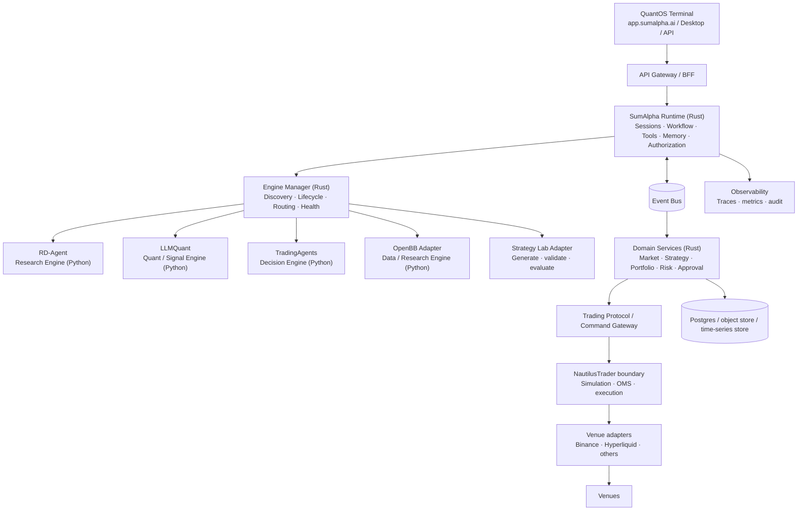
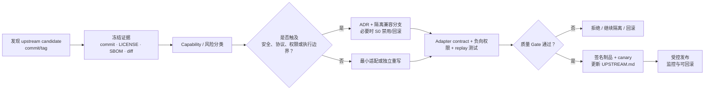
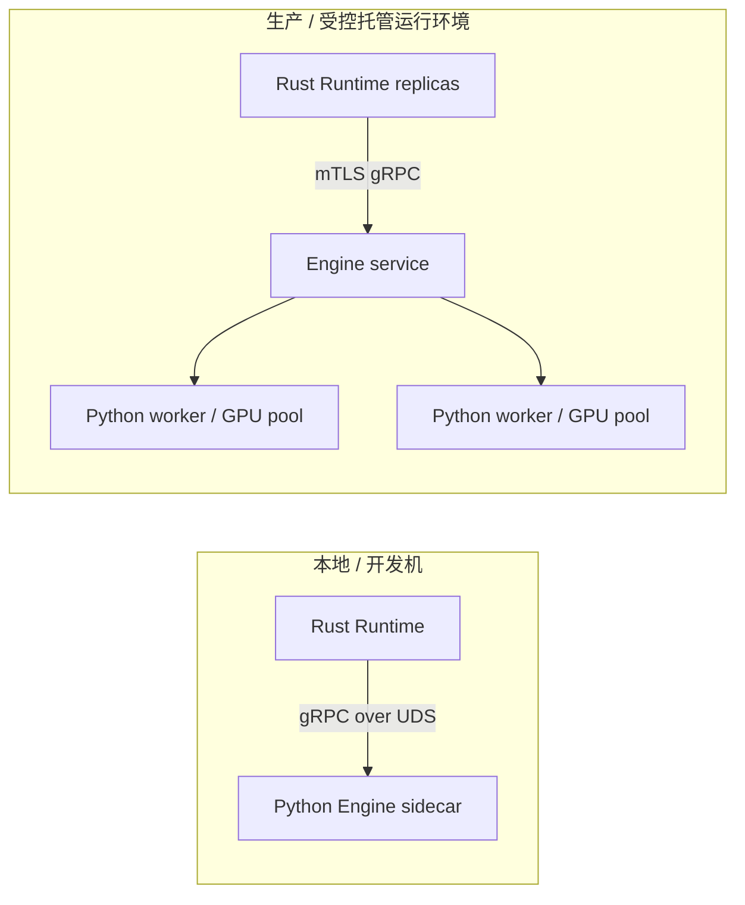

# SumAlpha QuantOS：最佳实践技术架构

> 版本：1.2（已冻结实施架构基线）\
> 日期：2026-07-30\
> 定位：AI-native operating system for quantitative research and trading

## 1. 摘要

**SumAlpha QuantOS** 是面向专业团队的 AI 原生量化研究与交易平台，不是“让 LLM 直接下单”的交易机器人。它将研究、因子与策略生产、投资决策、风险审批、订单执行及审计拆为独立且可替换的能力层。

平台以 **Rust** 负责高可靠的运行时、领域模型、权限、事件、协议与产品服务；以隔离的 **Python Engines** 复用成熟的 AI/量化开源生态。所有可能改变资金风险的动作必须经由确定性风控和交易内核处理；Agent 只能提出可审计的建议或命令，不能绕过边界直接接入交易所。

### 一句话架构

```text
AI agents propose → deterministic policy approves → trading kernel executes → event log proves
```

### 当前项目范围、长期路线图与非目标

| 层级 | 内容 |
| --- | --- |
| 当前项目范围 | 加密货币现货与永续合约；单主租户、单主工作区、单优先 venue 与有限订单意图；交付可审计的 Paper + Shadow Beta，并完成 Assisted Live 上线评审准备。 |
| 长期路线图 | 在 M5 的安全、合规、运营 Gate 通过并获单独业务批准后，评估小额逐笔人工审批的 Assisted Live；随后才可评估经治理的 Guarded Live、多租户和更多 venue。 |
| 明确非目标 | 无控制上线的全自动实盘、面向大众的投资建议或收益承诺、以自然语言绕过风控执行订单、以宣传承诺所有交易所或所有订单类型。 |

> 合规提示：本文件是工程方案，不是法律、合规或投资意见。上线实盘前应完成目标司法辖区的牌照、市场准入、KYC/AML、数据许可、模型治理与第三方许可证审查。

***

## 2. 品牌与命名

| 层级      | 名称                                                                   | 用途               |
| ------- | -------------------------------------------------------------------- | ---------------- |
| 品牌 / 组织 | **SumAlpha**                                                         | 公司、开源组织、生态品牌     |
| 主项目     | **SumAlpha QuantOS**                                                 | AI 原生量化研究与交易操作系统 |
| 主张      | **AI-native operating system for quantitative research and trading** | README、官网与演示中的定位 |
| 子产品     | QuantOS Terminal / Runtime / Protocol / SDK / Cloud                  | 产品与仓库内模块命名       |

“QuantOS”把 Quant 明确写入名称；“AI-native operating system for quantitative research and trading”作为副标题，直接表达 AI、量化与交易三项核心价值，避免把产品误解为通用操作系统或单一交易 Bot。

***

## 3. 架构原则与关键决策

1. **一个平台骨架，一个 Agent Runtime。** 不同时运行 Vibe-Trading、nautilus\_agents、OpenClaw 等多个 Runtime。SumAlpha Runtime 是唯一的会话、工作流、权限、追踪与恢复控制面。
2. **Agent 提议、确定性系统执行。** LLM 输出必须是结构化 `TradeProposal`；风险策略、审批、限额、幂等性与订单路由由非 LLM 的确定性组件处理。
3. **研究、决策、执行严格分层。** 回测成功不等于可部署；决策同意不等于可下单；下单成功不等于成交。
4. **协议优先、实现可替换。** Rust Runtime 不 import Python，也不嵌入 Python 解释器；通过版本化的 Engine Protocol 调用本地 sidecar 或远程服务。
5. **事件优先、状态可重建。** 市场、策略、风险、订单和 Agent 事件全部带关联 ID 写入不可篡改审计轨迹；读模型可重建。
6. **最小权限与默认拒绝。** 凭证仅由执行边界持有；研究 Engine 没有交易所密钥；生产外网访问、工具权限、实盘权限均默认关闭。
7. **把第三方工程当领域能力，不当产品骨架。** 上游项目由适配器封装，内部领域模型不泄露其类型与 API。
8. **同一策略语义贯穿研究、仿真与实盘。** 策略版本、数据版本、参数、风险配置和部署版本共同构成不可变发布物。

### 为什么选 Cargo Workspace + Polyglot Monorepo

Cargo Workspace 让 Rust 核心库、服务、插件 SDK、协议与文档在同一变更中演进，减少跨仓库版本矩阵。Python 并不进入 Cargo 编译图：每个 Engine 保持独立 `pyproject.toml` 与锁文件，由 `uv` 管理。Monorepo 提供原子提交与统一治理，进程边界保留 Python 的依赖、GPU 与生命周期隔离。

***

## 4. 总体架构



### 控制面与数据面

| 平面            | 责任                                     | 示例                                         |
| ------------- | -------------------------------------- | ------------------------------------------ |
| Control plane | 身份、授权、Agent/Engine 生命周期、工作流、配置、版本发布、审批 | Runtime、Engine Manager、Policy Service      |
| Data plane    | 行情摄取、特征、回测、风险计算、订单命令与执行回报              | Market Service、NautilusTrader 边界、Event Bus |
| Audit plane   | 不可抵赖的追踪、配置快照、Artifact、订单与审批证据          | WORM/append-only event ledger、对象存储         |

***

## 5. 责任边界与上游项目策略

### 5.1 采用、封装或仅参考

| 工程                                                                   | 定位                               | 策略                                                   | 不应承担                       |
| -------------------------------------------------------------------- | -------------------------------- | ---------------------------------------------------- | -------------------------- |
| Vibe-Trading                                                         | Agent 工作流、工具、MCP、记忆与研究 UX 的参考/起点 | **Fork 后裁剪并以适配层吸收**；先做 capability inventory，再迁移可复用部分 | 唯一平台状态源、实盘执行器              |
| RD-Agent                                                             | 自动化研究、实验与候选发现                    | Python Research Engine；只输出研究 Artifact                | 实盘决策或下单                    |
| LLMQuant                                                             | 特征、因子、模型、信号                      | Python Quant Engine；输出已版本化的 signal / model artifact  | OMS、交易所访问                  |
| TradingAgents                                                        | 多 Agent 分析与投资委员会模式               | Python Decision Engine；输出 `TradeProposal` 与证据包       | 风控放行、订单提交                  |
| OpenBB                                                               | 研究/金融数据统一访问                      | 作为隔离的数据适配服务；仅暴露自有 Data Contract                      | 交易内核或核心业务依赖                |
| VibeTradingLabs/vibetrading                                          | 自然语言策略开发流水线                      | 作为 Strategy Lab 的参考/适配候选；引入前单独评估许可证、质量与数据/部署边界       | 生产 OMS                     |
| NautilusTrader                                                       | 确定性事件驱动的研究、仿真与执行内核               | 独立进程/服务边界集成；适配层将内部协议翻译为其 API                         | Agent Runtime、租户/权限系统      |
| Qlib / TrendRadar / ValueCell / OpenStock / nautilus\_agents / Loong | 数据集/实验、趋势、投研、UI、协议或 Runtime 思路   | **按需参考设计，不列为 Day-1 生产依赖**                            | 第二套 Quant Core、第二套 Runtime |

### 5.2 Vibe-Trading 集成路线

不建议把 Vibe-Trading 当成不可替换的“平台 Runtime”。推荐建立 `vibe_adapter` 边界，并分三阶段推进：

1. **评估（只读）**：映射其 workflow、skills、MCP、memory、session、backtest 与 UI 能力，列出依赖、许可证、数据源条款、测试覆盖与安全模型。
2. **吸收（受控 Fork）**：保留确有价值的 workflow/skill/tool/streaming 设计与可独立测试模块；将会话、权限、事件、审计和执行接口替换为 QuantOS 的接口。Fork 保持明确的上游同步策略和 `UPSTREAM.md`。
3. **替换（长期）**：QuantOS Runtime 对外只暴露自己的 trait/protocol。未来可以替换 Vibe-derived 组件，不影响业务工作流和交易领域服务。

禁止的耦合：将 Vibe 的内部数据模型保存为平台主数据、让其工具直接持有交易密钥、或让其工作流直接触发订单 API。

### 5.3 Vibe-Trading 上游同步、借鉴与演进策略

本节将“Fork 后裁剪 + 适配层吸收”落实为可持续同步机制。目标不是让 QuantOS 跟随上游代码演进，而是**有选择地吸收经验证的能力，同时保持 QuantOS Runtime、协议、权限、审计和执行边界的独立性**。

#### 5.3.1 当前集成基线

| 基线项 | 统一决策 |
| --- | --- |
| 上游定位 | Vibe-Trading 是研究工作流、工具、MCP、记忆和研究 UX 的能力来源，不是 QuantOS 的平台 Runtime、状态源或交易执行器。 |
| 本地边界 | 所有上游调用经 `vibe_adapter` 进入；Adapter 只依赖 `quantos-protocol`、Artifact API 和经授权的工具接口。 |
| 主数据 | session、任务、工作流状态、身份、权限、审计、策略、订单和仓位只由 QuantOS 领域服务持有。 |
| 能力输出 | 上游能力只能返回 ResearchArtifact、结构化研究事件、受控工具结果或 UX 片段；不得返回/提交 TradeCommand。 |
| 安全边界 | Vibe-derived 进程无 venue/API 密钥，无 Execution Gateway 网络能力，无权读取未授权数据或绕过 Policy Service。 |
| 同步单位 | 每次同步以固定 upstream commit/tag 为最小单位；不追踪浮动分支，不以“最新 main”作为生产输入。 |
| 可替换性 | 任何 Vibe-derived 模块都必须可由 mock 或自研实现替换，且替换不改变业务工作流、协议或审计语义。 |

建议的仓库布局：

```text
third_party/
  vibe-trading/                  # 只读上游副本或 git submodule；固定 commit
forks/
  vibe-trading/                  # QuantOS 受控 fork；保留上游 remote 与同步分支
engines/
  vibe-adapter/                  # 可部署 adapter/sidecar；唯一运行时接入点
crates/
  quantos-vibe-contract-test/    # fixture、mock、兼容性与负向权限测试
docs/upstream/
  vibe-trading/
    UPSTREAM.md                  # commit、差异、许可证、升级与回滚记录
    capability-inventory.md
    sync-decisions/              # 每次同步的 ADR/风险评估
```

`third_party/vibe-trading` 不进入生产构建图；`forks/vibe-trading` 仅作为补丁和可复现构建来源；生产制品只从 `engines/vibe-adapter` 的锁定依赖和已批准制品构建。

#### 5.3.2 上游监测与同步分级

| 同步级别 | 触发条件 | 处理时限 | 允许操作 | 禁止操作 |
| --- | --- | --- | --- | --- |
| S0 安全响应 | 上游披露影响已使用组件的高危漏洞、密钥泄露或供应链事件 | 1 个工作日内隔离，修复/回滚优先 | 禁用 capability、撤销已发布制品、升级或回滚锁定 commit | 为保留功能跳过安全/回归 Gate |
| S1 兼容性响应 | 上游 API、依赖、许可证、数据条款或协议变化可能破坏 adapter | 5 个工作日内完成影响分析 | 建立兼容分支、更新 adapter、增加迁移/回归用例 | 直接合并到主干或修改核心协议迁就上游 |
| S2 计划同步 | 新 tag/release、稳定 bugfix、可验证性能/质量改进 | 每月评估窗口 | capability inventory、选择性 cherry-pick/重写、shadow benchmark | “全量 merge upstream/main” |
| S3 研究借鉴 | 新 workflow、skill、MCP、memory 或 UX 思路 | 每季度或按需 | ADR、原型、独立实现、实验 fixture | 引入未经评估的运行时依赖 |

监测由自动任务完成：每天抓取已固定 remote 的 release/tag、默认分支 commit、LICENSE/NOTICE、依赖清单和安全公告摘要；仅产生 `upstream-candidate` 记录，不自动更新任何锁文件、制品或生产分支。

#### 5.3.3 标准同步流程



每次同步必须执行以下步骤：

1. **冻结候选。** 记录 repository URL、上游 commit/tag、父 commit、发布时间、LICENSE/NOTICE hash、依赖锁 hash 和 diff 统计；创建只读 `upstream/<tag-or-sha>` 引用。
2. **分类差异。** 将变更标记为安全、许可证/条款、构建依赖、协议/API、工作流/工具、记忆/状态、UX、性能或测试；一个变更可有多个标签。
3. **评估能力。** 更新 capability inventory，明确输入、输出、副作用、网络域、数据分类、秘密访问、资源上限、失败模式与可替换性。
4. **选择吸收方式。** 只允许下列三种方式：最小 cherry-pick 到 fork、在 adapter 中重写等价逻辑、仅提取设计/测试思路。默认选择 adapter 重写或借鉴，不复制上游主数据模型。
5. **隔离实现。** 在 `sync/<upstream-sha>` 分支完成；不得直接向 `main` merge upstream，不得修改 `quantos-core`、`quantos-protocol` 或执行边界来适配上游内部类型。
6. **验证与发布。** 通过第 5.3.5 节质量 Gate 后，构建签名制品，先以禁用状态或 canary capability 发布；更新 `UPSTREAM.md`、SBOM、NOTICE、ADR 和回滚指针。
7. **观察与回滚。** 将 adapter 的错误率、延迟、工具拒绝率、资源消耗、Artifact 成功率和策略拒绝率纳入监控；超过阈值立即禁用 capability 并回滚到上一个批准制品。

#### 5.3.4 冲突分类与处理决策

| 冲突场景 | 默认决策 | 可执行处理 | 放行条件 |
| --- | --- | --- | --- |
| 上游 session/memory 模型与 QuantOS Runtime 不同 | QuantOS 优先 | 在 adapter 中转换为显式 context/Artifact/checkpoint；不迁移上游 session 主数据 | Runtime 重启/恢复测试不依赖 Vibe 内部存储 |
| 上游工具可访问任意网络、文件或 shell | 默认拒绝 | 映射到 QuantOS 已批准 tool capability；未映射工具永久禁用 | 负向权限测试证明无法访问 venue、secret、未允许网络域 |
| 上游 workflow 直接产生订单/交易动作 | 拒绝该路径 | 删除/屏蔽工具；最多映射为不可执行 Proposal 或研究 Artifact | DOM/API/日志中无 Order/TradeCommand 下游调用 |
| 上游类型/API 破坏 adapter | 不污染核心协议 | 在版本化 adapter translator 中兼容；必要时同时保留 vN/vN+1 adapter | 新旧 fixture 与 contract test 均通过，弃用期有迁移文档 |
| 上游依赖与 Python/系统依赖冲突 | 进程隔离优先 | 独立 `pyproject.toml`、`uv.lock`、运行环境与资源限制；不并入 Runtime 解释器 | `pip/uv` lock 可复现，制品 digest 固定，运行无依赖泄漏 |
| 上游许可证/数据条款变更 | 法律/供应链 Gate 优先 | 停止升级；保留上一个批准制品或改为自研/替代实现 | 新结论、NOTICE/SBOM、发布范围均已更新；未结论不得发布 |
| 上游修复与 QuantOS 本地补丁冲突 | 最小补丁优先 | `git range-diff` 标识重叠；优先重写小补丁或上游贡献；保留不可自动合并的人工决策 | fork patch 队列可重放，差异有测试覆盖 |
| 上游 UX 与 Terminal 设计规范冲突 | QuantOS 设计系统优先 | 仅借鉴信息架构/交互意图，在 `packages/domain-ui` 重实现 | 不引入上游 CSS/状态管理实现；Web/Desktop 视觉回归通过 |
| 上游性能改善但引入不明副作用 | 性能不覆盖安全 | 在隔离 benchmark 对比 CPU、内存、P95、失败率 | 相比基线无安全退化，关键路径 P95 不变差超过 10% |
| 上游紧急安全修复无法干净合并 | 先隔离后修复 | 禁用受影响 capability、回滚安全制品、创建最小 backport | 漏洞扫描/攻击 fixture 通过后再恢复 capability |

**冲突裁决优先级：** 资金安全与权限边界 > 许可证/数据条款 > 协议兼容性与审计可重建 > 可用性 > 性能 > 上游代码复用率。任何较低优先级收益不得覆盖更高优先级约束。

#### 5.3.5 同步质量 Gate 与自动化验证

| 类别 | 强制检查 | 通过标准 |
| --- | --- | --- |
| 可复现性 | 固定 commit/tag、`uv.lock`、制品 digest、SBOM、构建 provenance | 连续 3 次独立构建得到相同依赖 lock 与制品 digest；上游版本可由 `UPSTREAM.md` 完整追溯 |
| 许可证与供应链 | LICENSE/NOTICE diff、SCA/CVE、secret scan、依赖许可策略 | 无未处理高危漏洞、秘密或禁止许可证；任何条款变化阻断发布直至形成明确决策 |
| Adapter contract | Metadata/Health/Execute/StreamExecute/Cancel、错误码、deadline、idempotency、schema | 100% contract fixture 通过；未知 capability/版本/输入 100% 返回稳定错误码 |
| 安全负向测试 | secret、venue、任意 shell/文件、未授权网络、执行命令、跨 tenant 数据 | 至少 100 个负向 fixture 全部被拒并审计；进程 egress 仅允许 manifest allowlist |
| 功能回归 | workflow、tool、streaming、Artifact、checkpoint、取消、恢复 | 20 个代表性上游能力 fixture 与 QuantOS 期望输出一致；取消在 ≤2 秒确认；重启无重复 Artifact |
| 性能与资源 | 冷启动、P95 接收延迟、CPU/内存、队列积压、GPU（若适用） | 健康响应 P95 <200ms；Execute 受理 P95 <1s；相对批准基线 P95/内存退化不超过 10%，否则需例外记录 |
| 审计与可观测性 | trace、metric、日志、correlation/causation、版本与 input hash | 100% 请求含 engine/adaptor/upstream version 与 correlation ID；无敏感字段进入日志 |
| 客户端兼容性 | Terminal Research 页面、错误状态、Artifact 证据链 | Web 与桌面端共享 E2E 通过；上游故障只能显示受控错误，不泄露内部堆栈 |
| 回滚 | capability 禁用、旧制品恢复、in-flight 请求处置 | 演练在 ≤5 分钟内恢复上一个批准制品；in-flight 请求被取消或可重试且不丢审计 |

未满足任一强制检查的同步只能保留在隔离分支或被标记为“仅借鉴”；不得进入 release manifest、默认 capability registry 或生产制品。

#### 5.3.6 可执行演进路线图

| 阶段 | 任务 | 具体动作 | 交付物 | 完成/放行标准 |
| --- | --- | --- | --- | --- |
| V0 建基线 | V01 上游只读副本与记录 | 建立 remote、只读副本、fork、分支保护、`UPSTREAM.md` 模板和自动变更监测 | 目录、监测 workflow、初始 SBOM/NOTICE、固定 baseline SHA | 新 tag/commit 仅创建 candidate 记录，不更新生产依赖；baseline 可重建 |
| V0 建基线 | V02 capability inventory | 枚举 workflow、skill、MCP、memory、tool、streaming、UX 及副作用；映射 QuantOS 边界 | capability matrix、threat model、禁止耦合清单 | 每项能力有输入/输出/副作用/权限/替换策略；交易/秘密路径全部标为拒绝 |
| V1 最小适配 | V03 adapter skeleton | 实现 Engine manifest、UDS gRPC、Artifact API、context translator、工具 allowlist 和 mock | `engines/vibe-adapter`、contract tests、mock fixtures | 五个 Engine RPC 100% 通过；无未授权 egress、secret 或 venue capability |
| V1 最小适配 | V04 选择性吸收 | 只迁移通过 inventory 的研究 workflow/streaming 设计；替换 session/审计/权限调用 | 最小 fork patch 队列、adapter modules、ADR | 20 个 fixture 可重放；移除 Vibe adapter 后 Runtime 仍可运行其他 workflow |
| V2 受控同步 | V05 同步自动化 | 实现 S0–S3 分级、diff/range-diff、许可证/依赖 diff、candidate issue 和质量流水线 | `sync-vibe` 工具、CI workflow、decision record | 模拟 API 破坏、许可证变更、CVE 和本地 patch 冲突均生成正确分级与阻断结果 |
| V2 受控同步 | V06 canary 与回滚 | capability flag、影子任务、监控阈值、签名制品和一键禁用/回滚 | dashboards、alert rules、rollback runbook | canary 运行 7 天无未解释 P1；回滚演练 ≤5 分钟，审计完整 |
| V3 演进 | V07 上游贡献/脱钩 | 将通用 bugfix 回馈上游；逐步以 QuantOS-native trait/protocol 替换 fork 内耦合模块 | upstream PR 记录、deprecation plan、替换测试 | 不依赖 fork 内部类型；任一模块可替换且业务协议不变 |

同步节奏由事件驱动而非强制日历驱动：S0 立即响应，S1 在影响分析完成前冻结，S2 在月度窗口处理，S3 在季度架构评审处理。每次升级必须能通过 `upstream SHA → fork patch set → adapter image digest → release manifest` 的链路反向追溯。

### 5.4 许可证与供应链门槛

MIT（如 RD-Agent、Vibe-Trading）和 Apache-2.0（如 TradingAgents）通常适合受控复用；但仍需保留归属、许可证文本和 NOTICE（若适用）。NautilusTrader 当前为 LGPL-3.0，应尽量独立服务化、避免修改核心并在发行/部署前进行专业法律复核。OpenBB Platform 当前声明 AGPL-3.0-only，**服务化并不自动消除 AGPL 义务**；在任何产品分发或网络提供前，必须由法律顾问决定是否采用、购买商业许可或改用自研/其他数据供应商。

所有上游项目均应：锁定 commit/tag、生成 SBOM、做漏洞扫描、维护 `THIRD_PARTY_NOTICES.md`、审查模型/数据供应商条款、并建立升级与回滚演练。

***

## 6. Rust Cargo Workspace 与目录布局

```text
sumalpha-quantos/
├── Cargo.toml                     # workspace manifest + lint/profile policy
├── Cargo.lock
├── rust-toolchain.toml
├── README.md
├── LICENSE
├── THIRD_PARTY_NOTICES.md
├── .github/workflows/
├── proto/                          # protobuf / Buf modules; source of contract truth
│   ├── engine/v1/
│   ├── trading/v1/
│   └── events/v1/
├── crates/
│   ├── quantos-core/               # IDs, errors, clock, domain primitives
│   ├── quantos-protocol/           # generated/handwritten contract types
│   ├── quantos-event/              # envelopes, schemas, outbox/inbox
│   ├── quantos-runtime/            # session/workflow/tool execution kernel
│   ├── quantos-engine-manager/     # registry, sidecars, routing, supervision
│   ├── quantos-policy/             # authorization + deterministic policies
│   ├── quantos-market/             # market contracts, ingest abstractions
│   ├── quantos-strategy/           # immutable strategy releases
│   ├── quantos-portfolio/          # positions, valuation, exposure view
│   ├── quantos-risk/               # pre/post-trade rules and limits
│   ├── quantos-execution/          # command gateway and idempotency
│   ├── quantos-plugin-sdk/         # stable plugin traits + manifests
│   ├── quantos-storage/            # repositories / migrations abstractions
│   ├── quantos-auth/               # tenancy, identities, secrets references
│   ├── quantos-telemetry/          # telemetry and audit helpers
│   └── quantos-testkit/            # fixtures, contract-test harness
├── services/
│   ├── gateway/                    # BFF/API edge
│   ├── runtime/                    # runtime worker/API
│   ├── scheduler/                  # durable schedules and triggers
│   ├── market/                     # market data ingestion/normalization
│   ├── risk/                       # policy evaluation / approvals
│   ├── execution-gateway/          # protocol-to-kernel boundary
│   └── notifier/                   # alerts, webhooks, messaging
├── apps/
│   ├── website/                    # sumalpha.ai：品牌、文档与访问申请
│   ├── terminal/                   # app.sumalpha.ai 与桌面端共用的 React 应用
│   └── terminal-desktop/           # Tauri 壳；不复制业务页面或领域逻辑
├── packages/
│   ├── ui/                         # design tokens 与通用可访问组件
│   ├── domain-ui/                  # Research/Strategy/Risk/Orders/Audit 领域组件与工作流
│   ├── api-client/                 # 类型化 Gateway/BFF 客户端
│   ├── platform/                   # 浏览器/Tauri 平台能力适配接口
│   └── config/                     # 共享构建、国际化和 feature-flag 配置
├── engines/                        # independently lockable Python projects
│   ├── vibe-adapter/                # Vibe-Trading 受控 adapter/sidecar
│   ├── rd-agent/
│   ├── llmquant/
│   ├── trading-agents/
│   ├── openbb-adapter/
│   ├── strategy-lab/
│   └── common-sdk/                 # generated Engine SDK + test utilities
├── plugins/
│   ├── venues/binance/
│   ├── venues/hyperliquid/
│   ├── data/
│   ├── tools/
│   └── notifications/
├── deploy/
│   └── README.md                   # future remote deployment assets placeholder
├── docs/
│   ├── adr/                        # Architecture Decision Records
│   ├── architecture/
│   ├── runbooks/
│   └── threat-model/
├── examples/
└── tools/                          # codegen, release, SBOM, policy checks
```

### 依赖方向

```text
apps → services → domain crates → protocol/core
plugins → plugin-sdk + protocol/core
engines ↔ generated Engine SDK/proto
```

禁止 `core` 依赖业务域、Runtime 直接依赖 venue 插件、或领域服务依赖具体 Python 包。跨域协作通过命令、查询接口和事件完成，避免循环依赖。

### 产品表面与 Terminal 交付模型

`sumalpha.ai` 仅承担品牌、架构、安全、文档与访问申请，不承载交易工作流。`app.sumalpha.ai` 与 QuantOS Terminal 桌面端是同一 Terminal 的两个入口：两端共享 `apps/terminal`、领域组件、BFF 客户端、路由语义、权限解释与端到端验收用例；桌面端只经 `packages/platform` 的 Tauri 适配器提供多窗口、系统通知、深链、布局偏好和受控文件操作。

桌面端必须封装同一 release manifest 中构建并签名的 Terminal 制品，可通过签名更新通道更新；业务请求始终经 Gateway/BFF，禁止离线或桌面专属代码旁路权限、风控、审计、命令幂等或交易执行。离线仅允许浏览已加密缓存的非敏感只读资料和本地布局；不得创建或签发交易命令。Web 入口以受控部署、CSP 与 feature flag 灰度发布。

### 统一术语

| 术语 | 定义与关系 |
| --- | --- |
| `tenant` | 数据、权限、限额、密钥引用和审计隔离的最高业务边界；协议与事件始终携带 `tenant_id`。一期仅开放一个主租户。 |
| `workspace` | tenant 内用于组织成员、研究、策略和视图的协作空间；一期仅开放一个主工作区，不在产品导航提供多工作区切换。 |
| `account` | 可交易或模拟的账本/venue 账户，隶属 tenant，在 workspace 中按授权可见；不等同于用户登录账户。 |
| `actor` | 发起或批准动作的用户、服务主体或受控自动化身份，始终写入审计。 |
| `environment` | 部署环境（local/test/staging/production），不等同交易运行模式。 |
| `mode` | 交易运行模式：Research、Paper、Shadow、Assisted Live、Guarded Live；决定允许的领域动作。 |

***

## 7. SumAlpha Runtime 与 Engine Manager

### 7.1 Runtime：负责“Agent 如何活着”

Runtime 只负责通用 Agent 基础设施：

- 认证后的 session 与任务上下文；
- 持久工作流、取消、重试、超时、checkpoint 与恢复；
- 工具/技能注册、权限检查与人类审批挂点；
- 上下文组装、记忆检索、artifact 管理与流式输出；
- 事件订阅、事件到工作流触发器、预算/成本/速率限制；
- 统一 trace、审计关联 ID 与输出证据。

Runtime **不拥有**仓位真相、交易规则、交易所凭证或订单状态机。这些属于交易领域服务与交易内核。

### 7.2 交易扩展：负责“交易世界发生了什么”

```text
MarketEvent / NewsEvent / FundingEvent
         ↓
Runtime trigger + contextual retrieval
         ↓
Research / decision workflow
         ↓
TradeProposal (non-executable)
         ↓
deterministic policy + optional human approval
         ↓
TradeCommand (executable, signed, idempotent)
```

交易上下文必须是显式、可版本化的对象：账户、策略发布版本、市场数据时间、数据质量、仓位/暴露快照、风险限额、允许 venue、有效期和用户/服务主体。禁止把这些关键事实仅存入 LLM 对话记忆。

### 7.3 Engine Manager：负责“Engine 如何被运行与发现”

Engine Manager 是 Rust Runtime 内的控制面组件，职责包括：

- 读取签名/审核后的 Engine manifest，注册 capabilities 与版本；
- 在本地以 sidecar 启动、停止、监控并收集日志；
- 通过 health、readiness、heartbeat、资源限制和崩溃退避进行监督；
- 按 capability、租户、数据敏感度、成本、GPU 需求和 region 路由请求；
- 维护请求幂等性、deadline、熔断、重试策略和并发配额；
- 生产环境只选择已批准的远程 endpoint，绝不任意拉取/执行插件代码。

建议 manifest：

```yaml
apiVersion: quantos.sumalpha.dev/v1
kind: Engine
metadata:
  name: rd-agent
  version: 0.8.0+sumalpha.1
spec:
  transport: grpc
  mode: sidecar # sidecar | remote
  capabilities: [research.hypothesis.v1, research.experiment.v1]
  endpoint: unix:///run/quantos/rd-agent.sock
  permissions: [market-data.read, artifact.write]
  resources: { cpu: "2", memory: "8Gi", gpu: "0" }
  health: { intervalSeconds: 10, timeoutSeconds: 2 }
```

***

## 8. Python Engine 集成：gRPC 协议 + Sidecar/Service 部署

### 8.1 结论

**gRPC 是接口/传输协议，sidecar 是部署方式；两者应组合使用。**

- **本地开发与单机部署**：每个 Engine 作为 sidecar，由 Engine Manager 启动；优先用 gRPC over Unix Domain Socket。
- **生产与 GPU 工作负载**：Engine 独立部署为远程服务；采用 mTLS 的 gRPC，按负载横向扩展。
- **两种模式共享同一 proto、SDK、鉴权、幂等与 contract test**，业务代码不感知位置。

不建议用 PyO3 在 Rust Runtime 内嵌入 RD-Agent、LLMQuant 等 Python 解释器：它会耦合 GIL、Torch/CUDA、依赖锁、故障域和升级节奏，且降低恢复与水平扩展能力。

### 8.2 统一 Engine Protocol

```protobuf
service EngineService {
  rpc GetMetadata(GetMetadataRequest) returns (EngineMetadata);
  rpc Health(HealthRequest) returns (HealthResponse);
  rpc Execute(ExecuteRequest) returns (ExecuteResponse);
  rpc StreamExecute(ExecuteRequest) returns (stream EngineEvent);
  rpc Cancel(CancelRequest) returns (CancelResponse);
}
```

`ExecuteRequest` 的必填元数据：`request_id`、`idempotency_key`、`tenant_id`、`actor`、`workflow_run_id`、`deadline`、`input_schema_version`、`data_snapshot_ref`、`policy_context_ref`。每个返回都要带 `artifact_refs`、`evidence_refs`、`engine_version`、`input_hash` 与 `correlation_id`。

#### 能力契约示例

| Capability               | 输入                    | 输出                      | 允许副作用       |
| ------------------------ | --------------------- | ----------------------- | ----------- |
| `research.hypothesis.v1` | 假设范围、数据快照             | 假设、实验计划、证据              | artifact 写入 |
| `quant.signal.v1`        | strategy release、特征快照 | 信号、置信度、诊断               | artifact 写入 |
| `decision.proposal.v1`   | 研究/信号/风险快照            | `TradeProposal`、反方观点、证据 | 无交易副作用      |
| `data.query.v1`          | 标准化查询                 | 有血缘的数据响应                | 受限缓存        |
| `strategy.generate.v1`   | 自然语言规范                | 策略源码、静态检查结果             | artifact 写入 |

所有 Engine 输出使用 QuantOS 自有的 JSON Schema/Protobuf 类型，不能泄漏上游项目的 Python class 或内部数据库 ID。

### 8.3 Sidecar 到远程服务的演进



要点：sidecar 适合共同启动、调试和单用户开发；不适合把多个重型 Engine 永久绑定到每个 Runtime replica。生产中 RD-Agent/LLMQuant 等高资源作业应进入独立 worker pool 或 job queue；Runtime 保持无状态和可扩缩，但一期不在核心文档中预设具体第三方编排系统。

***

## 9. 数据、策略、决策与交易协议

### 9.1 关键领域对象

| 对象                    | 说明                                   | 不可变性              |
| --------------------- | ------------------------------------ | ----------------- |
| `DataSnapshot`        | 来源、时间窗、schema、质量、许可证、hash            | 不可变               |
| `ResearchArtifact`    | 假设、实验、结果、证据、代码/环境                    | 不可变               |
| `StrategyRelease`     | 策略源码、构建产物 hash、参数、数据、回测、审批         | 不可变               |
| `Signal`              | 方向、强度、时效、模型/策略版本、诊断                  | 不可变               |
| `TradeProposal`       | 建议动作、理由、置信度、失效时间、证据                  | 不可执行              |
| `RiskDecision`        | allow/deny/approve、规则命中、限额、签名        | 不可变               |
| `TradeCommand`        | 已批准、幂等、venue/symbol/qty/order intent | 可执行且短时有效          |
| `Order/Fill/Position` | 来自交易内核的事实事件与读模型                      | append-only event |

### 9.2 订单状态机

```text
Draft Proposal
  → Risk Evaluated
  → (Human Approved when required)
  → Command Issued
  → Submitted
  → Accepted / Rejected
  → Partially Filled / Filled / Cancelled / Expired
```

每次状态改变均记录 `causation_id` 与 `correlation_id`。执行网关在提交前必须检查：策略是否已发布、数据是否过期、账户状态、重复命令、价格/数量精度、最大名义价值、杠杆、仓位/集中度、熔断状态、venue 健康、kill switch 和审批签名。

### 9.3 风控等级

| 模式            | 可做动作            | 适用阶段       |
| ------------- | --------------- | ---------- |
| Research      | 研究、回测、报告        | 默认         |
| Paper         | 模拟订单与虚拟账本       | Alpha 验证   |
| Shadow        | 对真实行情生成对照建议，不下单 | 实盘前验证      |
| Assisted live | 人工逐笔审批后执行       | 初始实盘       |
| Guarded live  | 限额内自动执行，人工可随时中止 | 通过运行稳定性门槛后 |

无论模式，必须提供全局和账户级 **kill switch**，且该开关优先级高于 Agent、策略和排程。

***

## 10. 插件架构

插件用于外部集成，不承载核心领域真相。类型包括：venue、市场数据、新闻/研究数据、通知、工具、认证提供方和模型提供方。

### 插件规则

- Plugin SDK 是稳定的 Rust trait + 版本化 manifest；Python/其他语言通过 Engine Protocol 或 WASI/进程协议接入。
- 每个插件显式声明 capabilities、网络域、秘密引用、数据分类、权限和兼容的 SDK 版本。
- venue 插件仅由 Execution Gateway 调用；Agent 工具只能请求高层 `TradeProposal` 或受控查询。
- 插件运行在最小权限 sandbox；网络 allowlist、速率限制、secret injection、审计和签名验证是强制项。
- 插件升级使用兼容性测试与 canary；不可在生产环境动态安装未经签名的插件。

```rust
#[async_trait]
pub trait VenuePlugin: Send + Sync {
    fn manifest(&self) -> PluginManifest;
    async fn validate(&self, intent: ValidatedOrderIntent) -> Result<VenueValidation>;
    async fn submit(&self, command: SignedTradeCommand) -> Result<VenueOrderAck>;
    async fn cancel(&self, command: CancelOrderCommand) -> Result<()>;
}
```

实际接口需以 `quantos-protocol` 中的稳定类型为准；不得把交易所 SDK 类型暴露给调用方。

***

## 11. 存储、事件与可观测性

### 推荐起点

| 类别    | 建议                                   | 用途                    |
| ----- | ------------------------------------ | --------------------- |
| 事务/配置 | Supabase PostgreSQL                  | 租户、策略元数据、审批、任务、outbox |
| 事件传递  | Supabase PostgreSQL outbox/inbox + Supabase Realtime（早期默认） | outbox/inbox 可靠消费、重放；Realtime 仅用于 worker 唤醒与实时投影 |
| 时序/分析 | Supabase PostgreSQL 受控 schema、物化视图与聚合表（早期默认） | 行情、指标、P\&L、延迟分析 |
| 对象存储  | Supabase Storage                     | 数据快照、回测、模型、报告、证据 |
| 协调/瞬时通知 | Supabase Realtime + PostgreSQL advisory lock（早期默认） | worker 唤醒、投影协调、瞬时状态通知；不作为通用缓存 |
| 密钥    | Supabase Vault 与平台托管 secrets        | venue/API/模型密钥静态存储与引用；短期授权由执行边界控制 |

采用 Supabase PostgreSQL 中的 transactional outbox/inbox、schema registry、死信队列、projection checkpoint 与幂等消费者作为事件传递基线，并以 Supabase Realtime 作为 worker 唤醒和实时订阅通道；Realtime 不是可靠队列、事件真相源或唯一 worker 分发机制。早期不在核心方案中引入 Supabase 生态之外的独立事件总线、缓存系统、时序数据库或秘密基础设施。事件带 schema 版本；破坏性变更通过新事件版本迁移，不原地重解释历史事件。

### 11.1 Supabase 原生可靠消费与秘密访问约束

| 领域 | 必须实现的约束 |
| --- | --- |
| outbox | `outbox_event` 与领域写操作在同一 PostgreSQL 事务提交；至少包含 event ID、aggregate、schema version、payload、occurred_at、available_at、attempts、lease/lock、status 与 correlation/causation ID。 |
| 消费 | worker 通过数据库轮询与行级租约（例如 `FOR UPDATE SKIP LOCKED`）领取事件；Realtime 仅缩短唤醒等待，断连、漏通知或重连后必须回到数据库扫描。 |
| inbox 与重试 | `inbox_receipt` 以 consumer + event ID 去重；指数退避、最大尝试、死信、人工重放和 projection checkpoint 均持久化在 Supabase PostgreSQL。 |
| Realtime | 面向 UI 的更新使用最小投影和已授权频道；高订阅量场景优先采用 Supabase Realtime Broadcast；不得让客户端直接订阅原始 outbox、审计或秘密相关表。 |
| 协调与缓存 | advisory lock 只用于短临界区、leader election 或投影协调，并设置超时/竞争指标；服务/浏览器的短生命周期查询缓存不是领域真相，不得保存可执行命令。 |
| Vault | Vault 用于加密静态存储而非动态凭证签发器；仅 Execution Gateway 的专用受控角色可经 allowlist 函数读取指定 secret，UI、Engine、普通 BFF 角色不得访问解密视图。 |
| 短期授权 | 交易/API 密钥的短期有效性由 QuantOS 执行边界的审批上下文、secret reference、服务会话与轮换策略控制；不得将 Vault 表述为自动租约系统。 |

### 11.2 容量评审与 ADR 触发器

达到下列任一条件时，先执行索引、分区、投影、批处理或 Supabase 原生能力优化；若仍不能满足，则必须形成容量报告和 ADR 后才可引入额外基础设施：

| 信号 | 触发阈值 | 必须提供的证据 |
| --- | --- | --- |
| 可靠消费 | outbox 最老待处理事件连续 15 分钟超过 60 秒，或死信率超过 0.1% | backlog、lease、重试和消费者吞吐报告 |
| 实时投影 | 数据投影端到端延迟连续 15 分钟超过 5 秒，或连接/消息使用率超过当前 Supabase 配额的 70% | Realtime 指标、频道/RLS/消息大小分析 |
| 分析查询 | 关键风险/组合查询 P95 连续 15 分钟超过 300ms，且索引/分区/聚合优化后仍不达标 | query plan、索引、分区和负载报告 |
| 聚合新鲜度 | 风险物化视图超过 1 分钟、运营分析超过 5 分钟，连续三次违反 SLO | refresh 记录、锁等待、数据延迟报告 |
| 存储与密钥 | 对象上传/下载错误率超过 1%，或 secret 轮换/受控读取失败 | Storage 指标、轮换演练、访问审计 |

ADR 必须比较“继续 Supabase 原生优化、Supabase 原生扩展（如 PostgreSQL/Realtime/Queues 能力）和新增独立基础设施”三种方案，说明成本、迁移、回滚、数据一致性和安全边界；未完成 ADR 不得预置或启用额外系统。

### 可观测性与审计

每条用户请求到订单回报的链路应可回答：谁触发、用了哪些数据/模型/提示词、调用了哪个 Engine/版本、命中了哪些规则、谁批准、向哪个 venue 发送了什么，以及实际发生了什么。统一使用 trace、metrics、结构化日志与 append-only 审计 ledger。

必须监控：订单拒绝率、风控拒绝率、行情新鲜度、Engine 健康、队列延迟、策略漂移、模型成本、工具失败率、撤单/成交延迟、数据供应商错误与凭证异常。

***

## 12. 部署拓扑

### 本地开发

```text
Terminal Web ─┐
              ├─ Gateway / Runtime (Rust)
              ├─ Supabase PostgreSQL + Supabase Storage + Supabase Realtime + Supabase Vault
              ├─ rd-agent sidecar (UDS gRPC)
              ├─ llmquant sidecar (UDS gRPC)
              ├─ trading-agents sidecar (UDS gRPC)
              └─ OpenBB adapter sidecar (UDS gRPC)

Execution Gateway → paper/shadow kernel only
```

使用固定 Rust、uv、Node 工具链的一键引导命令启动；默认没有真实交易密钥，所有 venue adapter 指向模拟或 testnet。

### 生产

```text
Internet → WAF / API Gateway → Gateway replicas → Runtime workers
                                             │
                      ┌──────────────────────┼───────────────────┐
                      ↓                      ↓                   ↓
             Engine service pools  Outbox workers / Realtime  Risk / Execution zone
           (CPU or GPU, mTLS)                             (restricted egress)
                                                                ↓
                                                     Nautilus boundary / venues
```

生产阶段保持“Supabase 托管平台服务 + 受控应用运行环境”的最小基础设施集合，不在一期核心文档中预设 Supabase 生态之外的独立编排、缓存、时序或秘密系统。风险/执行区继续要求网络策略、最少 egress 与独立事故响应 Runbook。交易所 API 密钥不得出现在 UI、Agent 上下文、日志、构建产物或 Engine 环境之外。

***

## 13. 开发工作流与质量门禁

### 日常工作流

1. 在 `proto/` 先定义/评审契约并使用 Buf/代码生成同步 Rust、Python、TypeScript SDK。
2. 以 ADR 记录架构取舍；领域模型与事件 schema 的变更必须包含迁移和兼容性说明。
3. Rust 使用 `cargo fmt`、Clippy、nextest、deny/audit；Python Engine 各用 `uv`、Ruff、Pyright、pytest。
4. 执行 Engine contract tests，验证 `Health/Metadata/Execute/Cancel`、deadline、错误码、幂等和流式行为。
5. 用 replayable market data 做策略、风险、订单状态机的确定性集成测试；绝不以真实账户作为测试环境。
6. build SBOM、签名制品、漏洞扫描、许可证审计；对外发布前运行 egress/secret scan。

### Git 与版本策略

- Monorepo 主干开发，短分支，受保护的 `main`；每次变更均可构建。
- Rust workspace 采用统一工具链；公开 crate/SDK 可独立语义版本，但协议有兼容窗口。
- Python Engine 各自保留 `uv.lock`，运行时制品用 digest 固定。
- 上游 Fork/依赖以 tag 或 commit 固定，升级通过专属 PR；记录 `UPSTREAM.md`、差异、CVE、回滚方法。
- feature flag、配置版本与策略发布分离：代码发布不自动激活策略，也不自动开通实盘权限。

***

## 14. 分阶段路线图

| 阶段                | 目标          | 交付物                                                                                  | 完成门槛                      |
| ----------------- | ----------- | ------------------------------------------------------------------------------------ | ------------------------- |
| 0. Foundation     | 建立可演进骨架     | workspace、proto、event envelope、auth、audit、本地开发基线、paper-only                    | CI、SBOM、contract tests 绿灯 |
| 1. Research MVP   | AI 研究到可复现信号 | Engine Manager、RD-Agent/LLMQuant/TradingAgents 适配、策略 artifact、Terminal research view | 同一输入可重放，所有输出有证据           |
| 2. Strategy Lab   | 策略生成与治理     | Validator、回测、数据快照、strategy release、审批工作流                                             | 无 look-ahead、统计/成本检验、人工审核 |
| 3. Paper + Shadow | 建立执行和运营证据   | Risk service、Trading Protocol、Nautilus 边界、模拟/影子订单、订单时间线                              | 订单状态可重建、kill switch 演练成功  |
| 4. Assisted Live 上线评审准备 | 小额人工批准实盘的评审准备 | venue 适配、秘密管理、审批签名、告警、值班 Runbook；仅 testnet/演练 | 风险、延迟、对账、事故演练达标，并获单独批准才可开启实盘 |
| 5. Guarded Live（长期） | 受限自动化与多租户 | 限额自动执行、隔离、成本治理、扩缩容、插件认证 | 合规签核、SLO 达标、独立审计；不纳入当前项目计划 |

不要按“引入多少开源仓库”衡量进度；以可重放性、风险边界、数据许可、运行稳定性和可审计性作为里程碑。

***

## 15. 关键决策的理由

| 决策                     | 理由                                | 代价与缓解                                    |
| ---------------------- | --------------------------------- | ---------------------------------------- |
| Rust 为平台核心             | 类型、并发、性能、可部署性和故障隔离适合长期运行的交易控制面    | AI 生态较弱；以 Python Engine Protocol 补足      |
| Polyglot Monorepo      | 原子演进且不牺牲语言/依赖隔离                   | 工具链更多；通过统一 CI、生成 SDK、清晰 ownership 管理     |
| gRPC + sidecar/service | 本地体验与生产扩展兼得，契约可复用                 | 需维护 proto；以代码生成和 contract test 降低成本      |
| Engine Manager         | 使 Python 项目像受控能力，而非散落脚本           | 增加控制面；先实现最小 capability registry + health |
| 单一 Runtime             | 避免重复 session/memory/workflow/权限系统 | Fork 上游有维护成本；以 adapter 与稳定内部接口隔离         |
| NautilusTrader 边界      | 复用交易内核而不将其耦合为平台骨架                 | LGPL 与集成限制；服务化、法律审查、替换预案                 |
| OpenBB 隔离且可替换          | 统一数据访问的价值高，AGPL/数据条款风险也高          | 法律审查；保留 provider abstraction 与替代供应商      |
| Agent 永不直连 venue       | 可控、可审计、降低幻觉及提示注入造成的资金风险           | 增加一个审批/风控 hop；这是必要安全成本                   |

***

## 16. 落地检查清单

- [ ] 在仓库建立 Cargo Workspace、`proto/`、`engines/` 和本地开发基线。
- [ ] 定义并评审 `DataSnapshot`、`StrategyRelease`、`TradeProposal`、`RiskDecision`、`TradeCommand` v1 schema。
- [ ] 实现 Engine SDK、Engine Manager 最小版本和一个 mock Engine；先通过 contract test。
- [ ] 先接入 RD-Agent/LLMQuant/TradingAgents 的只读、无交易副作用能力。
- [ ] 建立数据血缘、artifact 存储、提示词/模型/代码版本记录。
- [ ] 仅启用 Paper 与 Shadow，完成对账、重放、kill switch、权限与审计演练。
- [ ] 在任何 live 功能前完成第三方许可、数据供应商条款、合规与安全评审。
- [ ] 完成 Assisted Live 上线评审准备；仅在 M5 Gate 与单独业务批准后，才可小额逐笔人工审批上线，再决定是否评估 Guarded Live。

***

## 17. 参考与核验起点

- [Vibe-Trading repository](https://github.com/HKUDS/Vibe-Trading)：当前 README 声明 MIT；其定位为研究、仿真与回测，不执行 live trades。
- [RD-Agent repository](https://github.com/microsoft/RD-Agent)：当前 README 声明 MIT，并明确其并非可直接用于投资建议的成品。
- [TradingAgents repository](https://github.com/TauricResearch/TradingAgents)：当前仓库列为 Apache-2.0。
- [NautilusTrader repository](https://github.com/nautechsystems/nautilus_trader)：Rust-native、事件驱动研究/仿真/执行内核；当前源代码为 LGPL-3.0。
- [OpenBB Platform configuration](https://github.com/OpenBB-finance/OpenBB/blob/develop/openbb_platform/pyproject.toml)：当前声明 AGPL-3.0-only。

许可证、交易所支持、数据来源、订单类型和 API 条款会持续变化；每次升级与上线前都应以固定 commit/tag 的原始 LICENSE、NOTICE、文档和法律审查为准。
