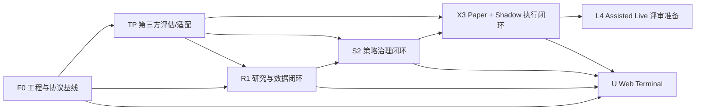

# SumAlpha QuantOS 可执行开发计划

> 版本：3.6
> 更新时间：2026-09-17
> 状态：技术执行基线  
> 依据：[架构](./SumAlpha-QuantOS-Architecture.md)、[技术方案](./SumAlpha-QuantOS-Technical-Solution.md)、[Terminal 前端设计规格](./SumAlpha-QuantOS-Terminal-Frontend-Design-Spec.md)  
> 目标：从空仓库交付可复现、可审计、可对账的单主租户 Paper + Shadow Beta；M5 仅完成 Assisted Live 上线评审准备，不默认开启实盘。

## 版本变更说明

- `3.6`：再次核验 F01 全部整改已解决；主报告改为当前验收视图，已关闭问题和修复跟踪移至历史记录，活动清单清空。保留 20/20、3/3 的验收结论及适用边界，F0 总体 Gate 不变。

- `3.5`：完成 F01 全部 10 项整改；20/20 检查点、3/3 量化验收通过。已取得绑定修复源码提交的新环境时限与三次构建真实回执；F01 更新为 `COMPLETED / ACCEPTED`，F0 总体 Gate 保持原状态。详见 [F01 修复与验收记录](./audit/F01-remediation-2026-09-17.md)。

- `3.4`：完成 F01 初审；当时的问题与证据见 [历史初审归档](./audit/F01-initial-review-2026-09-17.md)，当前结论以任务记录及全面复审报告为准。

- `3.3`：第一期范围收敛为官网与 Web Terminal；移除 Desktop 开发、原生测试、双端回归与 Desktop Gate 要求，统一迁入 [Desktop 第二期开发执行计划](./SumAlpha-QuantOS-Desktop-Development-Execution-Plan.md)。
- `3.2`：完成 CORE:R02 当前仓库交付复核与加固；确定性不可变 hash、时间窗、schema、来源、许可证、血缘、对象存储 hash 校验、租户绑定质量 Gate、300 个拒绝 fixture、PostgreSQL/RLS migration 与数据库更新拒绝触发器均纳入可破坏 Gate。真实 PostgreSQL 查询 P95、目标 RLS 与 Supabase Storage 仍需独立凭据和目标环境验收。
- `3.1`：完成 CORE:R01 当前仓库交付复核与加固；批准 provider、严格 symbol 归一化、精度/时间/来源/质量契约、10 万条 replay、乱序/重复去重、五秒异常发出与 `MarketEvent` append-only ledger 写入均纳入可破坏 Gate。真实 provider、消息基础设施和目标环境吞吐仍需独立验收。
- `3.0`：为 GPT-6 Astra 对全量已开发核心功能重新复审重构文档，移除历史核查、复验结论与过程记录；保留业务需求、功能定义、量化标准、依赖和已开发状态标记。
- 每项核心功能及 TP01 子任务均配置独立复审入口；v3.0 初始化为 `NOT_STARTED`，后续按实际复审结果更新各任务记录。
- 格式约定：`quantos-plan-review/v1`；v3.0 仅重构计划，v3.6 的 F01 当前复核结论见对应记录。

## 1. 执行范围与不可变约束

### 1.1 当前交付范围

| 范围 | 本计划交付 | 不在本计划交付 |
|---|---|---|
| 产品 | 单主租户、单主工作区、单优先 venue、有限现货/永续订单意图 | 多租户产品体验、多工作区切换、多 venue 智能路由 |
| 模式 | Research、Paper、Shadow；M5 完成 Assisted Live 的 testnet/上线评审准备 | 无审批自动实盘、Guarded Live 生产上线 |
| 客户端 | 官网与 `app.sumalpha.ai` Web Terminal；BFF | Desktop、移动交易 App、浏览器内量化回测 |
| 交易边界 | `TradeProposal → RiskDecision → Approval（如需）→ TradeCommand → Execution Gateway` | Agent、Engine、前端或插件绕过该链路直连 venue |

### 1.2 开发不变量

1. Rust 负责核心领域、事件、权限、策略、风控、命令与执行边界；Python 仅作为受控 Engine，通过版本化 Engine Protocol 接入。
2. `TradeProposal` 永远不可执行；`TradeCommand` 必须已批准、短时有效、可审计且幂等。
3. 每个研究、策略、风险、命令和订单事实必须带 `tenant_id`、`actor`、`correlation_id`；一期只创建一个主租户和主工作区。
4. 研究 Engine 和 Web 客户端不持有 venue 密钥；秘密只在执行边界以引用或短期租约使用。
5. M3/M4 的 `StrategyRelease` 仅可部署至 Paper/Shadow；只有 M5 Gate 与单独批准后才可出现 Assisted Live 目标。
6. 第一期 UI 只以 Web Terminal 为交付和验收载体；Desktop 的共享业务产物、平台适配与发布边界由第二期计划管理，不纳入本计划 Gate。

## 2. 任务编写与自动验收规范

### 2.1 任务状态与依赖

任务按 `F`（Foundation）、`R`（Research）、`S`（Strategy）、`X`（Execution）、`U`（User interface）、`L`（Live-readiness）、`TP`（Third-party）编号。任务只有在前置任务的验收记录全部通过后才能开始；任何破坏性协议或风险边界变更必须新增 ADR、迁移和回放用例。

### 2.2 全任务最低完成条件

除任务表中特别说明外，每个任务都必须满足下列可由 Codex/CI 校验的标准：

| 维度 | 最低标准 |
|---|---|
| 功能完整性 | 所有列出的输入、成功、拒绝和恢复路径都有自动化测试；不得以手工验证替代。 |
| 代码质量 | `cargo fmt --check`、Clippy（禁止 warning）、Rust `cargo test --workspace --locked`（含 doctest；见 [F01 测试执行器 ADR](./adr/20260917-f01-rust-test-runner.md)）；Python Ruff、Pyright、pytest；TypeScript lint、typecheck、Vitest 全绿。 |
| 覆盖率 | 新增 Rust 核心领域/风险/执行代码行覆盖率 ≥90%；稳定 Rust/LLVM CI 以 region 覆盖率 ≥85% 作为分支代理，nightly 发布验证仍要求分支覆盖率 ≥85%；Python Engine 适配新增代码行覆盖率 ≥85%；TypeScript 领域组件/状态代码行覆盖率 ≥80%。不能覆盖的代码须在报告中逐项豁免。 |
| 性能 | 测试环境中纯领域计算 P95 <50ms；BFF 授权读查询同区域 P95 <100ms，跨区域开发机连接托管数据库时 P95 <500ms；命令校验（不含外部 venue 往返）P95 <200ms。异步任务必须在 deadline 内返回受理或确定性错误。 |
| 兼容性 | 协议变更通过 Buf breaking check；Rust/Python/TypeScript 生成 SDK 可编译；Web Chromium/Firefox/Safari 当前稳定版回归通过。 |
| 安全与审计 | 无高危依赖/secret scan 未豁免项；所有写操作写入 actor、tenant、correlation、causation；错误、日志和导出不含秘密。 |
| 可运维性 | 关键路径提供结构化日志、trace、指标、健康检查和失败说明；部署/回滚/已知限制写入 Runbook 或任务文档。 |

### 2.3 测试资产规则

- `quantos-testkit` 提供固定 clock、ID、market replay、策略/订单 fixture 和 mock Engine；测试不得依赖真实账户、实时公共数据或未固定的模型输出。
- 每个 Engine/插件必须使用同一套 `Metadata / Health / Execute / StreamExecute / Cancel` contract harness。
- 每个事件消费者必须通过“重复投递、乱序投递、进程重启、死信重放”四类测试。
- 每个高风险命令必须有 allow、deny、approval-required、过期、重复、数据陈旧、kill switch 七类端到端用例。

### 2.4 Supabase 数据库实施基线

1. 一期主数据库采用 Supabase 平台的 PostgreSQL；事务数据、策略元数据、审批、任务状态、审计索引、outbox/inbox 与读模型均以版本化 SQL migration 管理。
2. 用户身份以 Supabase `auth.users` 为唯一主锚点；QuantOS 的 actor、成员关系、workspace/account 授权等业务表必须显式映射 `auth.users.id`，不得额外建立平行密码账户体系。
3. 凡是用户可见且承载 tenant/workspace/account 数据的业务表，默认启用 RLS 且默认拒绝；服务端只可通过受控 backend role/service role 执行跨租户维护、重放和运维任务。
4. 所有业务表主键与跨表引用统一使用 UUID，数据库默认值采用 `gen_random_uuid()`；`created_at`、`updated_at`、`occurred_at`、`expires_at` 等时间字段统一使用 `timestamptz`。
5. 每个数据库任务都必须提供 migration、RLS policy、索引、回滚说明和自动化验证；CI 必须覆盖本地重建、schema drift、RLS policy 测试与权限负向用例。
6. `outbox_event`、`inbox_receipt`、`dead_letter_event` 与 `projection_checkpoint` 是可靠事件闭环的受控表；生产消费者必须以 PostgreSQL 轮询、租约和 `FOR UPDATE SKIP LOCKED` 领取事件，`inbox_receipt` 的幂等唯一约束、指数退避、死信和 checkpoint 均须持久化。
7. Supabase Realtime 仅用于消费者唤醒与已授权 UI 实时投影，不得充当可靠队列、事件事实来源或唯一 worker 调度器；断连、漏通知或订阅恢复后，消费者必须以数据库扫描补偿并最终处理全部已提交 outbox 事件。
8. PostgreSQL advisory lock 只用于短时互斥协调；不得把其或 Realtime 作为通用缓存。可重建读模型、任务状态和命令事实均以 PostgreSQL 为真相源，缓存失效不得改变交易或风控结论。
9. Supabase Vault 与平台托管 secrets 仅保存静态加密秘密/引用；解密访问仅授予 Execution Gateway 的受控数据库角色并经 allowlist 数据库函数，UI、Engine、普通 BFF 与用户角色必须无法读取解密视图。短时授权由执行边界的服务会话、命令过期时间与轮换状态表达，而非将 Vault 误作动态租约系统。
10. 在未完成 ADR 和容量评审前，不得预置 Supabase 生态外的独立事件、缓存、时序或秘密基础设施；仅当达到第 F09/L04 定义的阈值，方可比较 Supabase 原生索引/分区/聚合/批处理/Realtime Broadcast/可选 Queues 与外部方案。

### 2.5 GPT-6 Astra 复审字段与遍历约定

本节定义项目约定 `quantos-plan-review/v1`，供 Codex 按 Markdown 标题和固定字段遍历；它不是已经核实的 Codex 官方专有导入 schema。校验命令为仓库根目录执行 `node scripts/check-development-plans.mjs`。本地结构校验与平台实际加载、模型复审、目标环境验收分别记录，结构通过不代表后三者通过。

| 字段 | 含义与格式 |
|---|---|
| `task_id` | 唯一任务标识；每个任务只有一个定义，使用 `task-<小写 ID>` 稳定锚点。 |
| `task_type` | 任务类型标签；核心为 `CORE`，前端计划使用 `PREPARATION`、`PAGE_API`、`FRONTEND`、`WEBSITE`、`MILESTONE`。 |
| `iteration` | 迭代周期；前端计划按两周一个 Sprint 分组，阶段 ID 与排期解耦。 |
| `depends_on` | 依赖关系标记；前端任务使用 JSON 字符串数组，空依赖为 `[]`。`CORE:<ID>` 指向本计划的前置服务能力；其他 ID 指向前端计划内任务。核心任务原有依赖描述逐字保留在“依赖”字段。 |
| `development_status` | `COMPLETED` 已开发完成；`IMPLEMENTED_PENDING_ACCEPTANCE` 已实现待验收；`PARTIAL` 部分完成；`UNSPECIFIED` 原计划未明确状态，待盘点。不得把未注明状态的任务推定为未开发或已完成。 |
| `review_entry` | 指向本任务 `review-<小写 ID>` 的 Markdown 链接。 |
| `workflow` | 开发-复审流转节点，详见前端计划；与开发状态、接口集成状态分别维护。 |
| `review_model` | 固定为 `GPT-6 Astra`，指定预期复审模型；不代表已启动或已验证模型调用。 |
| `review_status` | `NOT_STARTED`、`IN_REVIEW`、`CHANGES_REQUESTED`、`FIX_VALIDATION`、`RE_REVIEW`、`ACCEPTED`、`BLOCKED`。本次统一重置为 `NOT_STARTED`。 |
| `review_conclusion` | 复审结论；尚未执行为 `null`，不得填“通过”或“无问题”。 |
| `issues` | 问题记录；预留为 `[]`，表示尚未录入，不代表零缺陷。录入后每项含 `issue_id`、`severity`、`description`、`evidence`、`status`。 |
| `fix_tracking` | 修复验证追踪项；预留为 `[]`。录入后每项含 `issue_id`、`fix_ref`、`verification_command`、`verification_environment`、`verification_evidence`、`verification_status`。 |

复审按任务标题逐项进入，读取原需求、技术要求、交付物、验收标准和依赖，再填写上述四个复审字段。问题和修复记录使用两空格缩进的嵌套列表；`issue_id` 在任务内唯一，修复记录必须引用已存在的问题。空值只用 `null` 或 `[]`，不用“待补充”代替结构值。

录入时将 `- issues: []` 改为 `- issues:`，下一行以 `  - issue_id: <ID>` 开始，其他字段采用四空格缩进的 `字段: 值`；`fix_tracking` 同样处理。各记录字段使用单行值，长说明与证据用文档链接引用。复审接受时必须有非空结论，全部问题为 `CLOSED`，每个问题最后一次修复验证为 `PASS`。

`node scripts/check-development-plans.mjs --fresh-review` 额外检查所有复审入口已清空；后续填写复审记录后使用不带此参数的结构校验。加 `--json` 可输出解析后的任务清单，供任务编排读取；它不自动调用模型或启动平台任务。

开发完成标记仅迁移原文状态；F01/F02 的开发状态与外部验收状态分开，TP01 的子任务完成不等于整个 adapter 完成，TP02–TP05 的评估完成不等于生产准入。第 10 节原有 Gate 勾选保留为交付状态标记，不作为本轮复审结论；v3.0 从空白复审入口开始，后续复审以各任务当前记录为准。

## 3. 阶段与依赖图

| 阶段 | 准入条件 | 阶段交付 | 放行条件 |
|---|---|---|---|
| F0 Foundation | 空仓库 | 单体工作区、协议、事件、权限、Runtime、Engine Manager、供应链基线 | Mock Engine 与核心事件端到端通过 |
| R1 Research | F0 | 数据快照、研究/信号/决策 Engine、Artifact、Research UI | 固定输入可重放且无交易副作用 |
| S2 Strategy | R1 | 策略草稿、回测、验证、不可变 Release、审批 | 未通过验证/审批的策略无法进入 Paper |
| X3 Paper + Shadow | S2 | 风控、命令、执行边界、OMS、对账、Shadow、审计 | 订单状态可重建，连续 Shadow 验证通过 |
| L4 Assisted Live 准备 | X3 | testnet venue、密钥、MFA、双人审批、加固与演练 | 仅形成上线评审证据；不自动开启实盘 |

## 4. F0：工程、协议与运行时基线

### F01：初始化 Polyglot Monorepo

- task_id: `F01`
- task_type: `CORE`
- development_status: `COMPLETED`
- 状态范围：2026-09-17 再次复核通过；20/20（100%）检查点、3/3 量化验收通过，当前未解决问题为 0。适用源码与环境边界见复审报告；F0 总体 Gate 不随本项放行。
- review_entry: [GPT-6 Astra 复审入口](#review-f01)
- 需求描述：初始化 Polyglot Monorepo
- 技术要求：建立 Cargo workspace、`proto/`、`crates/`、`services/`、`engines/`、`apps/website`、`apps/terminal`、`packages/*`、`supabase/`；固定 Rust、uv、Node 工具链
- 交付物：目录树、锁文件、Make 任务、本地开发环境基线、`DATABASE_URL` 约定
- 量化验收标准：新环境在 ≤30 分钟内运行 `bootstrap`、`lint`、`test`；所有目录有 README 与明确模块边界；跨语言构建连续 3 次可重复
- 依赖：无

#### GPT-6 Astra 功能复审

- review_model: `GPT-6 Astra`
- review_status: `ACCEPTED`
- review_conclusion: 全部问题已解决；本次锁检查、16 项负向测试、8 个后端漂移探针及既有验收回执核验通过，实现相对验收源码无变更。详见 [F01 全面复审报告](./audit/F01-comprehensive-review-2026-09-17.md)。
- issues: []
- fix_tracking: []
- 后续基线变更：F02 经用户批准升级 Python 至 3.12；原 F01 冷启动与三次构建回执仍仅适用于其记录源码，新基线结果另见 F02 整改记录。
- 历史追溯：已关闭问题及逐项验证已归档至 [F01 整改记录](./audit/F01-remediation-2026-09-17.md)；本任务活动清单只保留未解决问题。

### F02：CI、制品与供应链门禁

- task_id: `F02`
- task_type: `CORE`
- development_status: `IMPLEMENTED_PENDING_ACCEPTANCE`
- 状态范围：2026-09-17 按 F02 全面复审整改；本地验证与远程验收分开记录，远程 CI、主干正式制品、required checks 仍需回执。
- review_entry: [GPT-6 Astra 复审入口](#review-f02)
- 需求描述：CI、制品与供应链门禁
- 技术要求：PR 管道执行 fmt/lint/typecheck/unit/contract、SBOM、license、SCA、secret scan、制品签名、Supabase migration drift 与 RLS policy check；生成可追溯 build manifest
- 交付物：CI workflow、SBOM、NOTICE 模板、签名脚本、DB check 脚本
- 量化验收标准：任一故意注入 secret、破坏 proto、未锁定依赖、RLS 缺失或 schema drift 均使 CI 失败；主干制品含 commit、依赖 digest、SBOM；高危漏洞=0 或有带到期日的豁免
- 执行流程：本地修复与提交 → 人工通过 GitHub Desktop 推送 → GitHub Actions 执行 → 收集同 SHA 回执 → 关闭 A11；2026-09-20 已确认 `15727fe` 推送并进入 `REMOTE_REVIEW / FIX_VALIDATION`；工作流失败修复后再人工推送，A11 保持 OPEN。详见 [F02 运行手册](./runbooks/f02-supply-chain.md)。
- 依赖：F01

#### GPT-6 Astra 功能复审

- review_model: `GPT-6 Astra`
- review_status: `FIX_VALIDATION`
- review_conclusion: 原 12 个问题已关闭 11 个（高危 6/6、中危 5/6）；严格检查点 20/24（83.3%），本地 Gate PASS，A11 远程回执及平台视觉缺口仍开放。证据见 [F02 整改记录](./audit/F02-remediation-2026-09-17.md)。外部验收未完成，不将实现或本地测试视为 F02 完整放行。
- issues:
  - issue_id: F02-A11
    severity: MEDIUM
    description: 已确认 main push 15727fe；远程前端门禁失败，修复待新 SHA 验证；主干正式制品验签未完成，Rulesets/分支保护未配置，三浏览器共 9 项视觉测试跳过。
    evidence: docs/audit/F02-A11-remote-review-2026-09-20.md
    status: OPEN
- fix_tracking: []

### F03：领域协议 v1 与 SDK 生成

- task_id: `F03`
- task_type: `CORE`
- development_status: `COMPLETED`
- review_entry: [GPT-6 Astra 复审入口](#review-f03)
- 需求描述：领域协议 v1 与 SDK 生成
- 技术要求：定义 `DataSnapshot`、`ResearchArtifact`、`StrategyRelease`、`Signal`、`TradeProposal`、`RiskDecision`、`TradeCommand`、Order/Fill/Position、Engine/Event API；Buf + OpenAPI 生成
- 交付物：`proto/*/v1`、JSON schema、Rust/Python/TS SDK、兼容性测试
- 量化验收标准：SDK 三语言编译；100% 必填元数据（tenant/actor/correlation 等）测试；Buf breaking check 阻止破坏性变更；序列化往返 1,000 组 fixture 无差异
- 依赖：F01

#### GPT-6 Astra 功能复审

- review_model: `GPT-6 Astra`
- review_status: `NOT_STARTED`
- review_conclusion: null
- issues: []
- fix_tracking: []

### F04：Core、错误、时钟与 ID

- task_id: `F04`
- task_type: `CORE`
- development_status: `COMPLETED`
- review_entry: [GPT-6 Astra 复审入口](#review-f04)
- 需求描述：Core、错误、时钟与 ID
- 技术要求：实现强类型 ID、UTC clock、领域错误码、金额/数量精度、版本与 hash primitives
- 交付物：`quantos-core`、fixture builder
- 量化验收标准：金额/精度边界与时区测试分支覆盖 ≥90%；任意错误可映射为稳定机器码；相同 fixture hash 100% 一致
- 依赖：F03

#### GPT-6 Astra 功能复审

- review_model: `GPT-6 Astra`
- review_status: `NOT_STARTED`
- review_conclusion: null
- issues: []
- fix_tracking: []

### F05：事件、存储与审计账本

- task_id: `F05`
- task_type: `CORE`
- development_status: `COMPLETED`
- review_entry: [GPT-6 Astra 复审入口](#review-f05)
- 需求描述：事件、存储与审计账本
- 技术要求：Supabase PostgreSQL migration、业务 schema、RLS 基线、Supabase Storage、transactional outbox/inbox、schema registry、append-only audit；建立 `outbox_event`、`inbox_receipt`、`dead_letter_event`、`projection_checkpoint` 与基于租约/`FOR UPDATE SKIP LOCKED` 的轮询消费者。Realtime 只发送唤醒/投影通知，绝不作为事件真相或唯一调度；早期不引入 Supabase 生态外的独立消息、缓存或时序基础设施
- 交付物：`quantos-event`、`quantos-storage`、`supabase/migrations/*`、policy/sql、replay CLI、消费者恢复 Runbook
- 量化验收标准：重复/乱序/重启/死信四类测试全过；隔离 Supabase 线上项目或数据库分支可由 migration 重建 `quantos` schema；所有 tenant 表 RLS 默认拒绝且负向权限测试全过；1 万条测试事件无丢失、消费者最终一致；模拟 Realtime 漏通知、断连和重连后，数据库扫描在测试 deadline 内处理全部已提交事件；1,000 次同事件并发投递只产生一次业务副作用；按 correlation ID 在 ≤5 秒取回完整事件链
- 依赖：F03、F04

#### GPT-6 Astra 功能复审

- review_model: `GPT-6 Astra`
- review_status: `NOT_STARTED`
- review_conclusion: null
- issues: []
- fix_tracking: []

### F06：身份、授权、秘密引用与主上下文

- task_id: `F06`
- task_type: `CORE`
- development_status: `COMPLETED`
- review_entry: [GPT-6 Astra 复审入口](#review-f06)
- 需求描述：身份、授权、秘密引用与主上下文
- 技术要求：Supabase Auth/OIDC 会话、`auth.users` ↔ actor/member/workspace/account 映射、tenant/actor/account/mode 上下文、RBAC + capability、secret reference、默认拒绝；Vault 仅存静态加密秘密，Execution Gateway 通过受控角色与 allowlist 函数取得所需引用，短时授权由服务会话/命令过期/轮换状态控制
- 交付物：`quantos-auth`、`quantos-policy`、鉴权中间件、身份映射 migration、Vault 访问 policy/函数
- 量化验收标准：缺失 tenant/actor、越权 capability、绕过 RLS、Engine 请求 secret 四类请求 100% 拒绝；UI、Engine、普通 BFF 与用户角色读取 Vault 解密视图/函数 100% 被拒；一期固定 Primary workspace 无切换 API；鉴权读 P95 同区域 <100ms，开发机跨区域远程复验 <500ms
- 依赖：F03、F05

#### GPT-6 Astra 功能复审

- review_model: `GPT-6 Astra`
- review_status: `NOT_STARTED`
- review_conclusion: null
- issues: []
- fix_tracking: []

### F07：Runtime 最小可恢复工作流

- task_id: `F07`
- task_type: `CORE`
- development_status: `COMPLETED`
- review_entry: [GPT-6 Astra 复审入口](#review-f07)
- 需求描述：Runtime 最小可恢复工作流
- 技术要求：session、持久任务、tool registry、deadline、cancel、retry、checkpoint、Artifact API、成本/速率限额
- 交付物：`quantos-runtime`、workflow fixtures
- 量化验收标准：worker 强杀后 100 个任务均从 checkpoint 恢复且不重复创建 Artifact；cancel/timeout 事件均带 audit；任务调度 P95 <200ms
- 依赖：F04–F06

#### GPT-6 Astra 功能复审

- review_model: `GPT-6 Astra`
- review_status: `NOT_STARTED`
- review_conclusion: null
- issues: []
- fix_tracking: []

### F08：Engine SDK、Manager 与 Mock Engine

- task_id: `F08`
- task_type: `CORE`
- development_status: `COMPLETED`
- review_entry: [GPT-6 Astra 复审入口](#review-f08)
- 需求描述：Engine SDK、Manager 与 Mock Engine
- 技术要求：Engine manifest 审核、UDS gRPC、health/readiness、routing、限流、熔断、退避、资源配额、contract harness
- 交付物：`quantos-engine-manager`、Python common SDK、mock engine
- 量化验收标准：`GetMetadata/Health/Execute/StreamExecute/Cancel` 100% contract 通过；连续 3 次崩溃触发退避且不丢请求；deadline 超时 ≤2 秒返回确定性错误
- 依赖：F03、F06、F07

#### GPT-6 Astra 功能复审

- review_model: `GPT-6 Astra`
- review_status: `NOT_STARTED`
- review_conclusion: null
- issues: []
- fix_tracking: []

### F09：本地可观测性、容量阈值与故障注入

- task_id: `F09`
- task_type: `CORE`
- development_status: `COMPLETED`
- review_entry: [GPT-6 Astra 复审入口](#review-f09)
- 需求描述：本地可观测性、容量阈值与故障注入
- 技术要求：trace、metrics、结构化日志、健康检查、test fault proxy；为 outbox 年龄/DLQ、Realtime 投影延迟与配额、读模型查询/MV 新鲜度、Storage 错误与秘密轮换配置可执行告警和 ADR 证据采集
- 交付物：dashboards、alert rules、fault tests、容量 ADR 模板
- 量化验收标准：每个 F0 写操作可从 trace 查到 correlation ID；注入 DB/事件消费者/Engine 故障时无秘密泄露，恢复后事件链完整；以下阈值均自动告警并生成 ADR 输入：outbox 最老事件 >60 秒持续 15 分钟或 DLQ >0.1%，Realtime 投影延迟 >5 秒持续 15 分钟或配额 >70%，风险/组合查询 P95 >300ms 持续 15 分钟，风险 MV >1 分钟或运营聚合 >5 分钟连续 3 次，Storage 错误 >1% 或秘密轮换/读取失败
- 依赖：F05–F08

#### GPT-6 Astra 功能复审

- review_model: `GPT-6 Astra`
- review_status: `NOT_STARTED`
- review_conclusion: null
- issues: []
- fix_tracking: []

## 5. TP：第三方工程评估、适配与依赖治理

### 5.1 通用第三方接入流程（每个 TP 任务均强制执行）

1. 固定上游 repository URL、tag/commit、LICENSE、NOTICE、依赖锁和许可证结论；生成 SBOM/CVE 报告。
2. 在隔离环境做 capability inventory：输入、输出、副作用、网络、秘密、存储、资源和测试覆盖。
3. 只定义 QuantOS 自有契约；禁止公开上游 class、数据库 ID、配置格式或交易密钥。
4. 实现 adapter/Engine manifest 或仅形成 ADR；执行 contract、负向权限、重放和升级/回滚测试。
5. 将上游差异、补丁、升级策略、许可证义务写入 `UPSTREAM.md` 和 `THIRD_PARTY_NOTICES.md`。

### 5.1.1 Vibe-Trading 同步借鉴与演进执行规则

TP01 除遵循通用流程外，还必须执行以下专属规则：

1. 统一采用“受控 Fork + `vibe_adapter` 适配层吸收”策略，`third_party/vibe-trading` 仅作只读参考，生产制品只能来自 `engines/vibe-adapter`。
2. 上游更新按 S0–S3 分级处理：S0 安全响应、S1 兼容性响应、S2 计划同步、S3 研究借鉴；不同级别必须有独立 decision record、时限与阻断策略。
3. 每次同步必须固定 upstream commit/tag，并记录 LICENSE/NOTICE hash、依赖锁 hash、diff 摘要、patch queue、制品 digest 与回滚指针；禁止直接跟踪 `main`。
4. 只允许三种吸收方式：最小 cherry-pick 到 fork、在 adapter 重写等价逻辑、仅提取设计/测试思路；不得把上游 session/memory 主数据、订单工具或内部类型带入 QuantOS 核心协议。
5. 每次同步都必须经过 canary 和回滚演练；未通过质量 Gate 的变更只能保留在隔离分支或标记为“仅借鉴”，不得进入默认 capability registry。

Vibe-Trading 同步必须满足以下质量 Gate：

| 维度 | 最低标准 |
|---|---|
| 可复现性 | 连续 3 次独立构建得到相同 `uv.lock`、制品 digest 与 SBOM；`UPSTREAM.md` 能反向追溯 `upstream SHA → fork patch set → adapter image digest → release manifest`。 |
| 契约与功能 | `GetMetadata/Health/Execute/StreamExecute/Cancel` 100% contract 通过；20 个代表性 workflow fixture 可回放；取消 ≤2 秒确认；重启无重复 Artifact。 |
| 安全负向 | 至少 100 个 fixture 覆盖 secret、venue、shell、文件、未授权网络、跨 tenant 数据；全部必须被拒绝并写审计。 |
| 兼容与 UX | Web Research E2E 全绿；上游故障只允许暴露受控错误，不泄露内部堆栈、路径或凭证。 |
| 发布与回滚 | canary 观察期内无未解释 P1；能力禁用或回滚在 ≤5 分钟完成，且 in-flight 请求有确定性取消或重试语义。 |

### 5.2 采用/封装工程任务

#### TP01：Vibe-Trading：研究工作流/工具/MCP/记忆 UX 参考与受控 Fork

- task_id: `TP01`
- task_type: `CORE`
- development_status: `PARTIAL`
- 状态范围：固定版本、许可证与 capability inventory 评估已完成；整体适配与生产准入仍依任务标准判定。
- review_entry: [GPT-6 Astra 复审入口](#review-tp01)
- 需求描述：Vibe-Trading：研究工作流/工具/MCP/记忆 UX 参考与受控 Fork
- 接入范围与改造：仅评估后吸收可独立测试的 workflow/skill/streaming 设计；建立 `vibe_adapter`，会话、权限、事件、审计全部替换为 QuantOS 接口；按 S0–S3 分级执行官方仓库同步、选择性吸收、canary 与回滚；禁止其成为状态源或执行器
- 交付物：capability inventory、许可证报告、只读副本、fork、`UPSTREAM.md`、sync decision records、adapter ADR、自动化回归测试
- 集成验收标准：adapter 只能读写 QuantOS Artifact API；无 venue 网络/secret capability；上游 20 个代表性 workflow fixture 在固定输入下可重放；模拟 API 破坏、许可证变化、CVE 与 patch 冲突均能被分级并阻断；移除 adapter 后 Runtime 仍可启动
- 阶段/依赖：F07、F08；R1 前完成最小适配

##### GPT-6 Astra 功能复审

- review_model: `GPT-6 Astra`
- review_status: `NOT_STARTED`
- review_conclusion: null
- issues: []
- fix_tracking: []

#### TP02：RD-Agent：自动研究/实验 Engine

- task_id: `TP02`
- task_type: `CORE`
- development_status: `PARTIAL`
- 状态范围：固定版本、许可证与 capability inventory 评估已完成；整体适配与生产准入仍依任务标准判定。
- review_entry: [GPT-6 Astra 复审入口](#review-tp02)
- 需求描述：RD-Agent：自动研究/实验 Engine
- 接入范围与改造：独立 Python Engine，映射 hypothesis/experiment capability 到自有 `ResearchArtifact`；限制网络、数据权限和 Artifact 写入
- 交付物：`engines/rd-agent`、manifest、运行时打包、adapter、fixtures
- 集成验收标准：contract harness 100% 通过；固定 DataSnapshot 运行两次 output/input hash 一致；拒绝交易/secret/任意外网工具调用；P95 接收响应 <1s
- 阶段/依赖：F08；R1

##### GPT-6 Astra 功能复审

- review_model: `GPT-6 Astra`
- review_status: `NOT_STARTED`
- review_conclusion: null
- issues: []
- fix_tracking: []

#### TP03：LLMQuant：特征、因子、模型、Signal Engine

- task_id: `TP03`
- task_type: `CORE`
- development_status: `PARTIAL`
- 状态范围：固定版本、许可证与 capability inventory 评估已完成；整体适配与生产准入仍依任务标准判定。
- review_entry: [GPT-6 Astra 复审入口](#review-tp03)
- 需求描述：LLMQuant：特征、因子、模型、Signal Engine
- 接入范围与改造：封装为 `quant.signal.v1`；输入必须是 release/feature snapshot，输出自有 Signal/diagnostics，不暴露上游类型
- 交付物：`engines/llmquant`、manifest、Signal mapper、model provenance
- 集成验收标准：100 组固定输入结果 schema 100% 有效；每条 Signal 含策略/模型/数据版本、置信度和时效；无 OMS/venue/secret import；流式取消 ≤2s 生效
- 阶段/依赖：F08、F05；R1

##### GPT-6 Astra 功能复审

- review_model: `GPT-6 Astra`
- review_status: `NOT_STARTED`
- review_conclusion: null
- issues: []
- fix_tracking: []

#### TP04：TradingAgents：多 Agent 决策 Engine

- task_id: `TP04`
- task_type: `CORE`
- development_status: `PARTIAL`
- 状态范围：固定版本、许可证与 capability inventory 评估已完成；整体适配与生产准入仍依任务标准判定。
- review_entry: [GPT-6 Astra 复审入口](#review-tp04)
- 需求描述：TradingAgents：多 Agent 决策 Engine
- 接入范围与改造：封装为 `decision.proposal.v1`；保留多观点与证据，输出仅 `TradeProposal`；移除/屏蔽任何订单工具
- 交付物：`engines/trading-agents`、proposal mapper、policy fixtures
- 集成验收标准：100% Proposal 带证据、反方观点、失效时间；所有输出 `executable=false`；尝试调用 order/secret tool 必失败并审计；固定 fixture 可重放
- 阶段/依赖：F08、TP03；R1

##### GPT-6 Astra 功能复审

- review_model: `GPT-6 Astra`
- review_status: `NOT_STARTED`
- review_conclusion: null
- issues: []
- fix_tracking: []

#### TP05：OpenBB：数据/研究适配服务

- task_id: `TP05`
- task_type: `CORE`
- development_status: `PARTIAL`
- 状态范围：固定版本、许可证与 capability inventory 评估已完成；整体适配与生产准入仍依任务标准判定。
- review_entry: [GPT-6 Astra 复审入口](#review-tp05)
- 需求描述：OpenBB：数据/研究适配服务
- 接入范围与改造：隔离为 `data.query.v1` provider；实现自有 Data Contract、缓存/血缘/许可证标签；AGPL/商业许可未结论前只在隔离评估环境启用
- 交付物：`engines/openbb-adapter`、provider interface、法律决策 ADR、替代 provider mock
- 集成验收标准：结果 100% 含来源/许可/schema/hash；未经批准的数据不可进入交易流程；服务端无核心领域依赖；许可证 Gate 未通过时生产构建拒绝包含该制品
- 阶段/依赖：F05、F08；R1

##### GPT-6 Astra 功能复审

- review_model: `GPT-6 Astra`
- review_status: `NOT_STARTED`
- review_conclusion: null
- issues: []
- fix_tracking: []

#### TP06：VibeTradingLabs/vibetrading：自然语言策略开发参考/适配候选

- task_id: `TP06`
- task_type: `CORE`
- development_status: `UNSPECIFIED`
- review_entry: [GPT-6 Astra 复审入口](#review-tp06)
- 需求描述：VibeTradingLabs/vibetrading：自然语言策略开发参考/适配候选
- 接入范围与改造：单独评估策略生成、静态检查与回测编排；输出策略草稿和检查 Artifact，绝不部署或进入 OMS
- 交付物：`engines/strategy-lab` 或 ADR、generator adapter、静态分析 fixtures
- 集成验收标准：生成结果只写 Artifact；100 个恶意/越权提示无订单/secret/network 越权；静态检查失败时 100% 阻断 Release；可完全替换上游实现
- 阶段/依赖：F08、TP01；S2

##### GPT-6 Astra 功能复审

- review_model: `GPT-6 Astra`
- review_status: `NOT_STARTED`
- review_conclusion: null
- issues: []
- fix_tracking: []

#### TP07：NautilusTrader：研究、仿真、OMS、执行内核

- task_id: `TP07`
- task_type: `CORE`
- development_status: `UNSPECIFIED`
- review_entry: [GPT-6 Astra 复审入口](#review-tp07)
- 需求描述：NautilusTrader：研究、仿真、OMS、执行内核
- 接入范围与改造：独立服务/进程边界；将 QuantOS Trading Protocol 映射为其 API；不引入其类型到 core；LGPL 合规与替换预案
- 交付物：`services/execution-gateway`、Nautilus boundary adapter、Paper kernel、LICENSE ADR
- 集成验收标准：`TradeCommand` 以同一 idempotency key 重放只产生一个下游提交；Order/Fill 事件可映射回自有 schema；精度/限额/过期/kill switch 100% 在边界前拦截；内核不可访问 Agent/用户 session
- 阶段/依赖：F03、F06、F08；X3

##### GPT-6 Astra 功能复审

- review_model: `GPT-6 Astra`
- review_status: `NOT_STARTED`
- review_conclusion: null
- issues: []
- fix_tracking: []

### 5.2.1 TP01 可执行路线图（V0–V3）

#### TP01-A：上游只读副本与 Fork 基线

- task_id: `TP01-A`
- task_type: `CORE`
- development_status: `COMPLETED`
- review_entry: [GPT-6 Astra 复审入口](#review-tp01-a)
- 需求描述：上游只读副本与 Fork 基线
- 路线阶段：V0 建基线
- 开发范围：建立 `third_party/vibe-trading`、`forks/vibe-trading`、remote、分支保护、`UPSTREAM.md` 模板与变更监测
- 交付物：baseline SHA、监测 workflow、初始 SBOM/NOTICE、目录 README
- 验收标准：新 tag/commit 只生成 candidate 记录，不更新生产依赖；baseline 可重建
- 依赖：F01、F02

##### GPT-6 Astra 功能复审

- review_model: `GPT-6 Astra`
- review_status: `NOT_STARTED`
- review_conclusion: null
- issues: []
- fix_tracking: []

#### TP01-B：capability inventory 与禁止耦合清单

- task_id: `TP01-B`
- task_type: `CORE`
- development_status: `COMPLETED`
- review_entry: [GPT-6 Astra 复审入口](#review-tp01-b)
- 需求描述：capability inventory 与禁止耦合清单
- 路线阶段：V0 建基线
- 开发范围：枚举 workflow、skill、MCP、memory、tool、streaming、UX 与副作用，映射 QuantOS 边界
- 交付物：capability matrix、threat model 补充、禁止耦合 ADR
- 验收标准：每项能力都有输入/输出/副作用/权限/替换策略；交易/秘密路径全部标记拒绝
- 依赖：TP01-A、F07

##### GPT-6 Astra 功能复审

- review_model: `GPT-6 Astra`
- review_status: `NOT_STARTED`
- review_conclusion: null
- issues: []
- fix_tracking: []

#### TP01-C：`vibe_adapter` skeleton

- task_id: `TP01-C`
- task_type: `CORE`
- development_status: `UNSPECIFIED`
- review_entry: [GPT-6 Astra 复审入口](#review-tp01-c)
- 需求描述：`vibe_adapter` skeleton
- 路线阶段：V1 最小适配
- 开发范围：实现 manifest、UDS gRPC、Artifact API、context translator、工具 allowlist、mock fixture
- 交付物：`engines/vibe-adapter`、contract tests、mock adapter
- 验收标准：五个 Engine RPC 100% 通过；无未授权 egress、secret 或 venue capability
- 依赖：TP01-B、F08

##### GPT-6 Astra 功能复审

- review_model: `GPT-6 Astra`
- review_status: `NOT_STARTED`
- review_conclusion: null
- issues: []
- fix_tracking: []

#### TP01-D：选择性吸收与最小 patch 队列

- task_id: `TP01-D`
- task_type: `CORE`
- development_status: `UNSPECIFIED`
- review_entry: [GPT-6 Astra 复审入口](#review-tp01-d)
- 需求描述：选择性吸收与最小 patch 队列
- 路线阶段：V1 最小适配
- 开发范围：只迁移通过 inventory 的研究 workflow/streaming 设计，替换 session/审计/权限调用
- 交付物：fork patch queue、adapter modules、sync ADR
- 验收标准：20 个代表性 fixture 可回放；移除 adapter 后 Runtime 仍可运行其他 workflow
- 依赖：TP01-C、R02

##### GPT-6 Astra 功能复审

- review_model: `GPT-6 Astra`
- review_status: `NOT_STARTED`
- review_conclusion: null
- issues: []
- fix_tracking: []

#### TP01-E：同步自动化与分级阻断

- task_id: `TP01-E`
- task_type: `CORE`
- development_status: `UNSPECIFIED`
- review_entry: [GPT-6 Astra 复审入口](#review-tp01-e)
- 需求描述：同步自动化与分级阻断
- 路线阶段：V2 受控同步
- 开发范围：实现 S0–S3 分级、diff/range-diff、许可证/依赖 diff、candidate issue、质量流水线
- 交付物：`sync-vibe` 工具、CI workflow、decision records
- 验收标准：模拟 API 破坏、许可证变更、CVE 和 patch 冲突均生成正确分级与阻断结果
- 依赖：TP01-D、F02

##### GPT-6 Astra 功能复审

- review_model: `GPT-6 Astra`
- review_status: `NOT_STARTED`
- review_conclusion: null
- issues: []
- fix_tracking: []

#### TP01-F：canary、观测与回滚

- task_id: `TP01-F`
- task_type: `CORE`
- development_status: `UNSPECIFIED`
- review_entry: [GPT-6 Astra 复审入口](#review-tp01-f)
- 需求描述：canary、观测与回滚
- 路线阶段：V2 受控同步
- 开发范围：capability flag、影子任务、阈值告警、签名制品、一键禁用/回滚
- 交付物：dashboards、alert rules、rollback runbook、drill report
- 验收标准：canary 连续运行 7 天无未解释 P1；回滚演练 ≤5 分钟，审计完整
- 依赖：TP01-E、F09

##### GPT-6 Astra 功能复审

- review_model: `GPT-6 Astra`
- review_status: `NOT_STARTED`
- review_conclusion: null
- issues: []
- fix_tracking: []

#### TP01-G：上游贡献与脱钩替换

- task_id: `TP01-G`
- task_type: `CORE`
- development_status: `UNSPECIFIED`
- review_entry: [GPT-6 Astra 复审入口](#review-tp01-g)
- 需求描述：上游贡献与脱钩替换
- 路线阶段：V3 演进
- 开发范围：将通用 bugfix 回馈上游，逐步以 QuantOS-native trait/protocol 替换 fork 内耦合模块
- 交付物：upstream PR 记录、deprecation plan、替换测试
- 验收标准：不依赖 fork 内部类型；任一模块可替换且业务协议不变
- 依赖：TP01-F、R03

##### GPT-6 Astra 功能复审

- review_model: `GPT-6 Astra`
- review_status: `NOT_STARTED`
- review_conclusion: null
- issues: []
- fix_tracking: []

### 5.3 仅参考工程的独立评估任务

这些项目不作为 Day-1 生产依赖。每个任务的完成标准是形成可验证的“采用/不采用”结论和可移植设计输入；未通过 Gate 时不得被引入运行时、客户端或核心领域编译图。

#### TP08：Qlib

- task_id: `TP08`
- task_type: `CORE`
- development_status: `UNSPECIFIED`
- review_entry: [GPT-6 Astra 复审入口](#review-tp08)
- 需求描述：Qlib
- 评估问题与限定范围：评估数据集、因子实验、工作流复现能力；不引入第二 Quant Core
- 交付物：ADR、capability matrix、与 `DataSnapshot/ResearchArtifact` 映射样例
- 验收标准：固定 commit、许可证/SBOM/CVE 记录齐全；完成 3 个离线实验映射；结论明确“仅参考/隔离 adapter/拒绝”及替换成本
- 阶段/依赖：R1，F05

##### GPT-6 Astra 功能复审

- review_model: `GPT-6 Astra`
- review_status: `NOT_STARTED`
- review_conclusion: null
- issues: []
- fix_tracking: []

#### TP09：TrendRadar

- task_id: `TP09`
- task_type: `CORE`
- development_status: `UNSPECIFIED`
- review_entry: [GPT-6 Astra 复审入口](#review-tp09)
- 需求描述：TrendRadar
- 评估问题与限定范围：评估趋势检测、新闻/主题信号的输入质量与血缘要求
- 交付物：ADR、趋势 signal schema 样例、数据许可清单
- 验收标准：3 组离线输入可映射至自有 Signal；缺少许可证/来源的输出 100% 被标为不可交易；无生产依赖进入 lockfile
- 阶段/依赖：R1，TP03

##### GPT-6 Astra 功能复审

- review_model: `GPT-6 Astra`
- review_status: `NOT_STARTED`
- review_conclusion: null
- issues: []
- fix_tracking: []

#### TP10：ValueCell

- task_id: `TP10`
- task_type: `CORE`
- development_status: `UNSPECIFIED`
- review_entry: [GPT-6 Astra 复审入口](#review-tp10)
- 需求描述：ValueCell
- 评估问题与限定范围：评估投研 UI/工作流的信息架构，不复制其数据模型或账户体系
- 交付物：UX gap report、可复用交互清单、禁止耦合清单
- 验收标准：至少 10 个 UI 模式映射至 Terminal design spec；无源码复制/运行时依赖；所有差异写 ADR
- 阶段/依赖：U01 前

##### GPT-6 Astra 功能复审

- review_model: `GPT-6 Astra`
- review_status: `NOT_STARTED`
- review_conclusion: null
- issues: []
- fix_tracking: []

#### TP11：OpenStock

- task_id: `TP11`
- task_type: `CORE`
- development_status: `UNSPECIFIED`
- review_entry: [GPT-6 Astra 复审入口](#review-tp11)
- 需求描述：OpenStock
- 评估问题与限定范围：评估公开市场数据、策略/投研展示能力与数据许可风险
- 交付物：provider comparison、Data Contract fixture、许可证结论
- 验收标准：2 个 provider fixture 完成血缘/质量映射；任何未授权数据无法生成可用 DataSnapshot；无 Day-1 依赖
- 阶段/依赖：R1，TP05

##### GPT-6 Astra 功能复审

- review_model: `GPT-6 Astra`
- review_status: `NOT_STARTED`
- review_conclusion: null
- issues: []
- fix_tracking: []

#### TP12：nautilus_agents

- task_id: `TP12`
- task_type: `CORE`
- development_status: `UNSPECIFIED`
- review_entry: [GPT-6 Astra 复审入口](#review-tp12)
- 需求描述：nautilus_agents
- 评估问题与限定范围：评估 Agent 与交易内核协作边界，提取反模式与工具设计经验
- 交付物：ADR、threat model 补充、接口差异清单
- 验收标准：明确列出不少于 5 条禁止耦合规则；验证其方案不改变“Agent 不直连 venue”边界；无运行时依赖
- 阶段/依赖：F07、TP07

##### GPT-6 Astra 功能复审

- review_model: `GPT-6 Astra`
- review_status: `NOT_STARTED`
- review_conclusion: null
- issues: []
- fix_tracking: []

#### TP13：Loong

- task_id: `TP13`
- task_type: `CORE`
- development_status: `UNSPECIFIED`
- review_entry: [GPT-6 Astra 复审入口](#review-tp13)
- 需求描述：Loong
- 评估问题与限定范围：评估 protocol/Runtime/UI 设计思路与可替换接口
- 交付物：ADR、协议/UX 对照表、adoption decision
- 验收标准：对照至少覆盖 session、workflow、tool、memory、权限、审计六项；无上游类型进入 QuantOS protocol/core
- 阶段/依赖：F03、F07

##### GPT-6 Astra 功能复审

- review_model: `GPT-6 Astra`
- review_status: `NOT_STARTED`
- review_conclusion: null
- issues: []
- fix_tracking: []

## 6. R1：数据、研究、信号与 Terminal 研究闭环

### R01：Market ingestion 与标准化行情契约

- task_id: `R01`
- task_type: `CORE`
- development_status: `COMPLETED`
- review_entry: [GPT-6 Astra 复审入口](#review-r01)
- 需求描述：Market ingestion 与标准化行情契约
- 技术要求：归一化 symbol、时间、精度、来源、质量；只允许已批准 provider；写 `MarketEvent`
- 交付物：`quantos-market`、ingestor、replay dataset
- 量化验收标准：10万条 replay 事件解析成功率 100%；乱序/重复数据正确去重；新鲜度/质量异常在 ≤5s 内发出事件
- 依赖：F03、F05

#### GPT-6 Astra 功能复审

- review_model: `GPT-6 Astra`
- review_status: `NOT_STARTED`
- review_conclusion: null
- issues: []
- fix_tracking: []

### R02：DataSnapshot、血缘与质量 Gate

- task_id: `R02`
- task_type: `CORE`
- development_status: `COMPLETED`
- review_entry: [GPT-6 Astra 复审入口](#review-r02)
- 需求描述：DataSnapshot、血缘与质量 Gate
- 技术要求：不可变 hash、时间窗、schema、质量、许可证、来源；快照元数据与质量 Gate 存于 Supabase PostgreSQL，并通过 RLS 保护租户可见性；交易相关调用必须检查质量/时效
- 交付物：snapshot API、对象存储、quality rules、snapshot migration
- 量化验收标准：相同输入生成相同 hash；过期/质量不合格/许可证缺失的 300 个 fixture 100% 被拒用于策略/交易；查询 P95 <300ms
- 依赖：R01、F06

#### GPT-6 Astra 功能复审

- review_model: `GPT-6 Astra`
- review_status: `NOT_STARTED`
- review_conclusion: null
- issues: []
- fix_tracking: []

### R03：Research orchestration 与 Artifact lifecycle

- task_id: `R03`
- task_type: `CORE`
- development_status: `UNSPECIFIED`
- review_entry: [GPT-6 Astra 复审入口](#review-r03)
- 需求描述：Research orchestration 与 Artifact lifecycle
- 技术要求：Runtime 组合研究 Engine、预算、deadline、流式事件、Artifact 归档与重放
- 交付物：research workflow、Artifact repository
- 量化验收标准：同一 fixture 连续运行 10 次 input hash 一致且输出证据可定位；取消 ≤2s 确认；worker 重启后无重复 Artifact
- 依赖：F07、F08、R02、TP02

#### GPT-6 Astra 功能复审

- review_model: `GPT-6 Astra`
- review_status: `NOT_STARTED`
- review_conclusion: null
- issues: []
- fix_tracking: []

### R04：Signal 与 TradeProposal 工作流

- task_id: `R04`
- task_type: `CORE`
- development_status: `UNSPECIFIED`
- review_entry: [GPT-6 Astra 复审入口](#review-r04)
- 需求描述：Signal 与 TradeProposal 工作流
- 技术要求：仅接收版本化 Signal/研究输入；生成不可执行 Proposal、反方观点、失效时间、证据
- 交付物：signal/proposal service、schema validator
- 量化验收标准：100 个 Proposal fixture 100% 含证据/失效时间/`executable=false`；过期 Proposal 100% 拒绝评估；无订单 API 被调用
- 依赖：R03、TP03、TP04

#### GPT-6 Astra 功能复审

- review_model: `GPT-6 Astra`
- review_status: `NOT_STARTED`
- review_conclusion: null
- issues: []
- fix_tracking: []

### U01：Web Terminal 壳、认证与 Research 页面

- task_id: `U01`
- task_type: `CORE`
- development_status: `UNSPECIFIED`
- review_entry: [GPT-6 Astra 复审入口](#review-u01)
- 需求描述：Web Terminal 壳、认证与 Research 页面
- 技术要求：建立 React/Next Web 应用、BFF typed client、OIDC/MFA、App Shell、P01–P05 页面
- 交付物：`apps/terminal`、`packages/ui/domain-ui/api-client`、P01–P05
- 量化验收标准：Web Playwright 场景全部通过；Research 创建/流式/取消/证据跳转 100% 可用；业务页 `noindex`；小屏不显示高风险动作
- 依赖：F06–F09、R02–R04

#### GPT-6 Astra 功能复审

- review_model: `GPT-6 Astra`
- review_status: `NOT_STARTED`
- review_conclusion: null
- issues: []
- fix_tracking: []

## 7. S2：策略实验、验证、发布与审批

### S01：策略草稿与参数模型

- task_id: `S01`
- task_type: `CORE`
- development_status: `UNSPECIFIED`
- review_entry: [GPT-6 Astra 复审入口](#review-s01)
- 需求描述：策略草稿与参数模型
- 技术要求：草稿可版本化、自动保存、冲突检测；策略只引用已批准数据/Artifact；草稿/参数表默认启用 RLS 并保留 `auth.users` 审计链
- 交付物：`quantos-strategy` draft API、strategy fixtures、draft migration
- 量化验收标准：50 组并发编辑测试无静默覆盖；未授权/无快照/无 Artifact 的草稿不能发起验证；草稿保存 P95 <300ms
- 依赖：R02、R03

#### GPT-6 Astra 功能复审

- review_model: `GPT-6 Astra`
- review_status: `NOT_STARTED`
- review_conclusion: null
- issues: []
- fix_tracking: []

### S02：回测与成本/滑点验证

- task_id: `S02`
- task_type: `CORE`
- development_status: `UNSPECIFIED`
- review_entry: [GPT-6 Astra 复审入口](#review-s02)
- 需求描述：回测与成本/滑点验证
- 技术要求：固定 DataSnapshot、clock、成本/滑点模型、look-ahead/数据泄漏检测、环境 hash
- 交付物：backtest adapter、validation report
- 量化验收标准：同一 release candidate 重放 10 次产生一致指标；100 个 look-ahead/数据泄漏 fixture 100% 失败；回测结果必须含成本、环境和输入 hash
- 依赖：S01、TP06、TP08

#### GPT-6 Astra 功能复审

- review_model: `GPT-6 Astra`
- review_status: `NOT_STARTED`
- review_conclusion: null
- issues: []
- fix_tracking: []

### S03：StrategyRelease 与部署目标控制

- task_id: `S03`
- task_type: `CORE`
- development_status: `UNSPECIFIED`
- review_entry: [GPT-6 Astra 复审入口](#review-s03)
- 需求描述：StrategyRelease 与部署目标控制
- 技术要求：生成不可变发布物，含源码/构建产物 hash、参数、数据、回测、审批；M3/M4 只允许 Paper/Shadow
- 交付物：release service、deployment policy、migration
- 量化验收标准：未验证/未审批 Release 的部署请求 100% 被拒；目标枚举不含 Assisted Live（M5 前）；同一内容重复发布返回同一 hash 或确定性冲突
- 依赖：S02、F06

#### GPT-6 Astra 功能复审

- review_model: `GPT-6 Astra`
- review_status: `NOT_STARTED`
- review_conclusion: null
- issues: []
- fix_tracking: []

### S04：策略审批与 Terminal Strategy 页面

- task_id: `S04`
- task_type: `CORE`
- development_status: `UNSPECIFIED`
- review_entry: [GPT-6 Astra 复审入口](#review-s04)
- 需求描述：策略审批与 Terminal Strategy 页面
- 技术要求：实现策略目录、Lab、Backtest、Release、审批时间线；前端通过 capability 显示目标
- 交付物：P06–P07、approval integration、E2E
- 量化验收标准：20 个策略 UI fixture 从研究到 Release 可完成；拒绝/过期/并发审批均有明确状态；Web 视觉与功能回归通过
- 依赖：S01–S03、U01

#### GPT-6 Astra 功能复审

- review_model: `GPT-6 Astra`
- review_status: `NOT_STARTED`
- review_conclusion: null
- issues: []
- fix_tracking: []

## 8. X3：确定性风险、Paper、Shadow、对账与审计闭环

### X01：Portfolio 读模型与风险输入快照

- task_id: `X01`
- task_type: `CORE`
- development_status: `UNSPECIFIED`
- review_entry: [GPT-6 Astra 复审入口](#review-x01)
- 需求描述：Portfolio 读模型与风险输入快照
- 技术要求：Position、valuation、P&L、exposure、账户状态、数据时间；只读模型可从事件重建，并持久化到 Supabase PostgreSQL 受控 schema
- 交付物：`quantos-portfolio`、rebuild CLI、portfolio projection migration
- 量化验收标准：1万条订单/成交 replay 后 Position/P&L 与黄金快照一致；读模型重建 100% 成功；查询 P95 <300ms
- 依赖：F05、R01

#### GPT-6 Astra 功能复审

- review_model: `GPT-6 Astra`
- review_status: `NOT_STARTED`
- review_conclusion: null
- issues: []
- fix_tracking: []

### X02：Pre/Post-trade Risk 与 kill switch

- task_id: `X02`
- task_type: `CORE`
- development_status: `UNSPECIFIED`
- review_entry: [GPT-6 Astra 复审入口](#review-x02)
- 需求描述：Pre/Post-trade Risk 与 kill switch
- 技术要求：规则：策略发布、数据时效、账户、精度、名义、杠杆、集中度、venue 健康、重复、审批；global/account kill switch
- 交付物：`quantos-risk`、rule fixtures、kill switch API
- 量化验收标准：allow/deny/approval-required 各 ≥50 个 fixture；规则分支覆盖 ≥95%；kill switch 到新命令拒绝 P95 <1s；拒绝结果含命中规则/限额/签名
- 依赖：X01、S03、F06

#### GPT-6 Astra 功能复审

- review_model: `GPT-6 Astra`
- review_status: `NOT_STARTED`
- review_conclusion: null
- issues: []
- fix_tracking: []

### X03：TradeCommand 签发与审批状态机

- task_id: `X03`
- task_type: `CORE`
- development_status: `UNSPECIFIED`
- review_entry: [GPT-6 Astra 复审入口](#review-x03)
- 需求描述：TradeCommand 签发与审批状态机
- 技术要求：将有效 Proposal + RiskDecision + Approval 转为短期、签名、幂等 Command；禁止自批
- 交付物：`quantos-execution` command issuer、approval verifier
- 量化验收标准：过期、重复、自批、数据陈旧、kill switch、策略失效七类测试 100% 拒绝；同一 key 1,000 次并发只签发一个命令；签发 P95 <200ms
- 依赖：R04、X02

#### GPT-6 Astra 功能复审

- review_model: `GPT-6 Astra`
- review_status: `NOT_STARTED`
- review_conclusion: null
- issues: []
- fix_tracking: []

### X04：Nautilus 边界、Paper OMS 与订单状态机

- task_id: `X04`
- task_type: `CORE`
- development_status: `UNSPECIFIED`
- review_entry: [GPT-6 Astra 复审入口](#review-x04)
- 需求描述：Nautilus 边界、Paper OMS 与订单状态机
- 技术要求：通过 TP07 adapter 提交/取消、映射 ack/fill/reject，维护 append-only 订单事实
- 交付物：execution gateway、Paper kernel、state machine
- 量化验收标准：10万条订单事件 state transition 100% 合法；重复 submit 仅一次下游调用；cancel 延迟/拒绝可审计；所有 Fill 可追溯 Command
- 依赖：X03、TP07

#### GPT-6 Astra 功能复审

- review_model: `GPT-6 Astra`
- review_status: `NOT_STARTED`
- review_conclusion: null
- issues: []
- fix_tracking: []

### X05：Shadow 运行、对账与异常队列

- task_id: `X05`
- task_type: `CORE`
- development_status: `UNSPECIFIED`
- review_entry: [GPT-6 Astra 复审入口](#review-x05)
- 需求描述：Shadow 运行、对账与异常队列
- 技术要求：在真实行情产生对照建议而不下单；日终对账订单/成交/仓位/虚拟账本；异常关闭流程
- 交付物：shadow runner、reconciler、exception queue
- 量化验收标准：连续 10 个交易日 Shadow；日终未解释差异=0；故意注入 20 类差异均在 ≤15 分钟发现并定位；无 venue submit 调用
- 依赖：X01–X04

#### GPT-6 Astra 功能复审

- review_model: `GPT-6 Astra`
- review_status: `NOT_STARTED`
- review_conclusion: null
- issues: []
- fix_tracking: []

### X06：执行/审计/运维 Terminal 页面

- task_id: `X06`
- task_type: `CORE`
- development_status: `UNSPECIFIED`
- review_entry: [GPT-6 Astra 复审入口](#review-x06)
- 需求描述：执行/审计/运维 Terminal 页面
- 技术要求：实现 P08–P14；实时事件投影、危险操作确认、MFA、导出与 Runbook 入口
- 交付物：Portfolio/Risk/Proposal/Approval/Order/Audit/Ops Web UI
- 量化验收标准：从任意订单在 ≤5 分钟经 UI 还原完整证据链；订单/审批/kill switch E2E 通过率 100%；无页面含直接 venue 请求；Web 回归通过
- 依赖：X01–X05、U01

#### GPT-6 Astra 功能复审

- review_model: `GPT-6 Astra`
- review_status: `NOT_STARTED`
- review_conclusion: null
- issues: []
- fix_tracking: []

## 9. L4：Assisted Live 上线评审准备（仅 testnet）

### L01：优先 venue testnet 适配

- task_id: `L01`
- task_type: `CORE`
- development_status: `UNSPECIFIED`
- review_entry: [GPT-6 Astra 复审入口](#review-l01)
- 需求描述：优先 venue testnet 适配
- 技术要求：仅接入已批准的单一 venue；订单意图/精度/限流映射；永不在 CI 使用生产 key
- 交付物：venue plugin、testnet fixtures、compat report
- 量化验收标准：200 笔 testnet 正常/拒绝/撤单/部分成交场景 100% 映射至自有 schema；网络/认证失败明确分类；无生产 endpoint/secret 出现在测试制品
- 依赖：X04、TP07

#### GPT-6 Astra 功能复审

- review_model: `GPT-6 Astra`
- review_status: `NOT_STARTED`
- review_conclusion: null
- issues: []
- fix_tracking: []

### L02：Supabase Vault、mTLS 与受限执行区

- task_id: `L02`
- task_type: `CORE`
- development_status: `UNSPECIFIED`
- review_entry: [GPT-6 Astra 复审入口](#review-l02)
- 需求描述：Supabase Vault、mTLS 与受限执行区
- 技术要求：Vault 静态秘密/引用、Execution Gateway 专用受控数据库角色与 allowlist 函数、服务会话/命令 TTL、网络 allowlist、mTLS、最少 egress、轮换/撤销；不实现 Vault 动态租约
- 交付物：secret integration、database grants/function、network policy、rotation runbook
- 量化验收标准：secret scan 0 泄露；研究 Engine/UI/普通 BFF 无法解析或调用 Vault 解密路径；证书/secret 轮换后 ≤5 分钟恢复；过期服务会话或命令 100% 拒绝；未允许域名 egress 100% 阻断
- 依赖：F06、L01

#### GPT-6 Astra 功能复审

- review_model: `GPT-6 Astra`
- review_status: `NOT_STARTED`
- review_conclusion: null
- issues: []
- fix_tracking: []

### L03：双人审批、MFA 与 Assisted Live UI Gate

- task_id: `L03`
- task_type: `CORE`
- development_status: `UNSPECIFIED`
- review_entry: [GPT-6 Astra 复审入口](#review-l03)
- 需求描述：双人审批、MFA 与 Assisted Live UI Gate
- 技术要求：仅在服务端 feature/capability 返回时显示 Assisted Live；双人职责分离、额度与白名单
- 交付物：approval policy、P10/P11 M5 UI、E2E
- 量化验收标准：M5 flag 关闭时 UI/API 100% 不可达；开启 testnet flag 后 50 次双人审批均写签名审计；自批/额度超限/过期 100% 拒绝
- 依赖：X02、X03、L02

#### GPT-6 Astra 功能复审

- review_model: `GPT-6 Astra`
- review_status: `NOT_STARTED`
- review_conclusion: null
- issues: []
- fix_tracking: []

### L04：容量、恢复、安全与上线证据包

- task_id: `L04`
- task_type: `CORE`
- development_status: `UNSPECIFIED`
- review_entry: [GPT-6 Astra 复审入口](#review-l04)
- 需求描述：容量、恢复、安全与上线证据包
- 技术要求：压测、混沌、DB/事件恢复、订单对账、告警、回滚；生成不可篡改测试证据
- 交付物：SLO report、drill report、release checklist
- 量化验收标准：目标负载下无重复 Command/订单、审计持久化 100%；四类演练（重放、恢复、Engine 故障、kill switch）全部通过；高危安全缺陷=0
- 依赖：X05、X06、L01–L03

#### GPT-6 Astra 功能复审

- review_model: `GPT-6 Astra`
- review_status: `NOT_STARTED`
- review_conclusion: null
- issues: []
- fix_tracking: []

## 10. 阶段 Gate、命令与回归清单

### 10.1 F0 Gate

- [ ] F01–F09 完成；三语言 SDK、Mock Engine、事件重放和默认拒绝鉴权全绿。
- [x] 基于 `DATABASE_URL` 的远程 migration 重放、migration drift、`auth.users` 映射与 RLS 默认拒绝测试全绿；UUID 默认值与 `timestamptz` 约束无豁免项。
- [x] outbox/inbox 的轮询租约、幂等去重、退避/死信/checkpoint 和 Realtime 漏通知补偿均通过自动化验证；Realtime 未被用作可靠事件源或唯一 worker 调度。
- [x] Vault 解密路径只对 Execution Gateway 的受控角色/allowlist 函数开放；UI、Engine、普通 BFF 与用户角色的负向访问测试全绿；F09 容量阈值告警与 ADR 证据模板已启用。
- [x] 每个服务提供 health、metrics、trace 和结构化错误；供应链报告可追溯。
- [x] TP01–TP05 的固定版本、许可证和 capability inventory 至少完成评估，未获批准者不能进入生产拓扑。
- [x] TP01-A、TP01-B 完成；Vibe-Trading baseline SHA、只读副本、fork、`UPSTREAM.md`、分级规则与禁止耦合清单已归档。

### 10.2 R1 Gate

- [ ] R01–R04、U01 完成；研究、Signal、Proposal 全部可回放且无交易副作用。
- [ ] RD-Agent、LLMQuant、TradingAgents 的 contract/权限/重放测试通过；OpenBB 仅在许可证 Gate 允许时启用。
- [ ] Web Research 用例全绿；所有 Artifact/数据快照可进入 Audit。
- [ ] TP01-C、TP01-D 完成；`vibe_adapter` 的 contract、负向安全、回放与隔离运行测试通过，且移除 adapter 不影响其他 workflow 启动。

### 10.3 S2 Gate

- [ ] S01–S04 完成；look-ahead/数据泄漏/未审批策略 100% 阻断。
- [ ] Release 包含全部不可变证据，且可部署目标只有 Paper/Shadow。
- [ ] TP06–TP13 的评估结论和 ADR 已归档；未经明确 adoption 的项目无运行时依赖。

### 10.4 X3 Gate

- [ ] X01–X06 完成；连续 10 个交易日 Shadow，对账未解释差异=0。
- [ ] 命令、订单、成交、仓位和审计链可重建；命令重复执行=0。
- [ ] kill switch、数据陈旧、venue 故障、审批拒绝、事件重放演练全绿。

### 10.5 L4 Gate

- [ ] L01–L04 完成；仅 testnet 证明通过，不自动产生生产实盘权限。
- [ ] venue、秘密、MFA、审批、网络、容量、恢复、对账和安全证据全部归档。
- [ ] 任一容量阈值触发时，先完成 Supabase 原生优化和容量 ADR；未获 ADR 批准时不得增加 Supabase 生态外的事件、缓存、时序或秘密基础设施。
- [ ] 是否开启小额 Assisted Live 必须在本计划之外，由单独批准决定。

### 10.6 建议的自动执行命令

| 类别 | 命令目标（实现时在 `Makefile`/CI 固化） |
|---|---|
| 格式与静态检查 | `fmt`、`lint-rust`、`lint-python`、`lint-web`、`typecheck` |
| 单元与覆盖率 | `test-rust`、`test-python`、`test-web`、`coverage-check` |
| 数据库 | `db-apply`、`db-reset`、`db-migration-check`、`db-schema-diff`、`rls-policy-test` |
| 协议与契约 | `proto-check`、`sdk-generate-check`、`engine-contract-test` |
| 集成与回放 | `integration-test`、`event-replay-test`、`market-replay-test`、`order-state-test` |
| 安全与供应链 | `sbom`、`license-check`、`sca`、`secret-scan`、`artifact-sign-verify`、`sync-vibe-check` |
| Web 界面 | `e2e-web`、`visual-regression`、`a11y-test` |
| 性能与演练 | `bench-domain`、`load-bff`、`chaos-drill`、`reconciliation-test` |

## 11. 任务完成定义与禁止项

任务完成不以“代码可运行”或“页面可打开”为准，必须符合第 2 节最低完成条件、任务表专属验收和所属 Gate。以下行为一律视为未完成：

- 以真实账户、真实生产密钥或不可重放公网数据作为测试唯一依据；
- 将第三方内部类型、数据库或 SDK API 泄漏到 QuantOS 的核心领域、协议或 UI；
- 让 Agent、Engine、插件或 Web 客户端绕过 Risk/Approval/Execution Gateway；
- 以未固定 commit/tag 的上游依赖、未完成许可证结论的 OpenBB、或无 SBOM 的制品进入生产拓扑；
- 在 M5 Gate 前显示或启用 Assisted Live，在任何阶段启用 Guarded Live；
