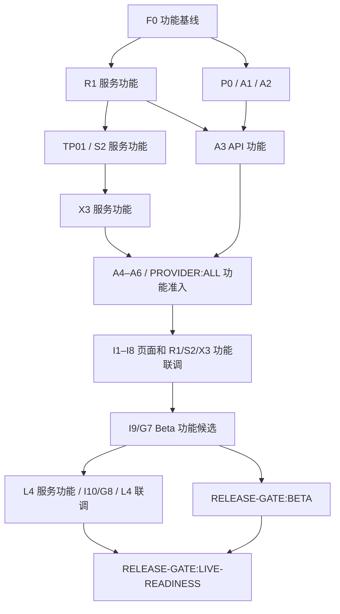

# SumAlpha QuantOS 可执行开发计划

> 2026-10-06 最新 CI 整改：补齐离线 Rust 依赖预取，精确隔离固定上游 lint/pytest；冻结 `dd8672c` 完整 87/87 PASS，22 READY，G0/FEP-0 工程 PASS、当前范围确认待办 BLOCKED。见[整改复验报告](./audit/CI-5da474e-remediation-2026-10-06.md)。


> 版本：3.29
> 更新时间：2026-10-06
> 状态：技术执行基线  
> 依据：[架构](./SumAlpha-QuantOS-Architecture.md)、[技术方案](./SumAlpha-QuantOS-Technical-Solution.md)、[Terminal 前端设计规格](./SumAlpha-QuantOS-Terminal-Frontend-Design-Spec.md)  
> 目标：从空仓库交付可复现、可审计、可对账的单主租户 Paper + Shadow Beta；M5 仅完成 Assisted Live 上线评审准备，不默认开启实盘。

## 版本变更说明

- `3.29`：修复 5da474e 的上游 Python lint 扫描和 A2 离线 Rust 缺少依赖预取，补齐失败日志归档及 pytest 归属边界；完整 87/87、G0 16/16、FEP-0 2/2 工程 PASS，A2 当前内容 READY。22 READY、2 BLOCKED（当前 G0 用户确认待办），历史原件保留，未推送、新 hosted CI 待验证。见[整改报告](./audit/CI-5da474e-remediation-2026-10-06.md)。

- `3.28`：修复 e0e9cbc 的子模块未检出及 RLS DO/FOREACH 静态识别错误，并升级 source-map-js 1.2.2 修复本轮新发现的 SCA 漏洞；固定 pin、迁移 SQL 与权限不变。冻结 `14bf36c` 完整 F0/A1 87/87、G0 16/16、FEP-0 2/2 工程 PASS；A2 本地及内容门禁 READY，已有正常目标七项摘要一致。当前 22 READY，G0/FEP-0 新范围用户确认仍 BLOCKED；历史原件保留，未推送、最新 hosted CI NOT_RUN、formal/RELEASE 不迁移。见[整改报告](./audit/CI-e0e9cbc-remediation-2026-10-06.md)。

- `3.27`：修复 f764bc6 的五类 CI 故障；冻结源码 `02f26c0` 完整执行 F0/A1 86/86 PASS、21 READY，G0 16/16 和 FEP-0 2/2 工程 PASS。A2 新 Supabase 正常目标 51 次调用覆盖 20 API、14 强断言且恢复通过，目标七项源码摘要与当前一致；本地正负/mutation 回归及严格内容门禁 READY。当前共 22 READY，G0/FEP-0 新范围确认待办为 BLOCKED；历史用户批准、原失败和旧目标回执保留，hosted CI 未推送执行，formal/RELEASE 不迁移。见[CI 整改报告](./audit/CI-f764bc6-remediation-2026-10-05.md)。

- `3.26`：项目用户完成当前 G0 功能范围确认，严格 G0/FEP-0 内容校验 READY；FEP-0 八依赖和 23 节点完整闭包 READY。F0/A1 原 86/86 实际证据绑定 `04229ce`，确认后里程碑聚合在 `a805b50` 重新执行；仅文档/确认记录变化，规范功能输入一致，历史正式与 RELEASE 不自动迁移。见[最终整改复验报告](./audit/FEP-0-remediation-2026-10-05.md)。

- `3.25`：FEP-0 整改完成当前 F0/A1 闭包的 86/86 实际检查，CORE-GATE:F0 及 11 个直接前置 READY；三次独立构建、现有 Supabase、F07 100-task 恢复、F08 实际 wheel/UDS 与四生态 SCA 均有内容绑定证据。F07 诊断 P95/管理员 Storage 不作正式批准，未重建共享库；G0/FEP-0 工程通过、当前范围用户确认待办。历史正式 ACCEPTED/source 不迁移。见[整改复验报告](./audit/FEP-0-remediation-2026-10-05.md)。

- `3.24`：FEP-0 整改新增 F02/F07/F08/F09/TP01-A/B 当前 DEVELOPMENT 功能证据及 CORE-GATE:F0 内容聚合。仅使用已配置 Supabase；F02 catalog/RLS 破坏在事务内回滚，不重建共享库。F07 保留诊断状态与临时管理员 Storage 身份，按功能范围核验，不接收其 P95/部署批准。证据输入变更后独立复评，历史正式回执保留。见[整改报告](./audit/FEP-0-remediation-2026-10-05.md)。

- `3.23`：用户确认 G0 DEVELOPMENT 当前文稿后，在 `92dddbd` 重新完整执行 65/65 上游检查；F01/F03/F04/F05/F06 等 14 个节点的阶段回执已刷新为 READY，实际使用已配置 Supabase。G0 随后 16/16 PASS / READY，见[当前验收报告](./audit/FRONTEND-GATE-G0-user-confirmed-acceptance-2026-10-05.md)。历史 formal/source/evidence 不迁移，新页面需 PROVIDER:ALL，发布验收独立完成。

- `3.22`：所有原六方/多角色项目验收改为 Codex 拟稿、项目用户单人确认；各阶段技术证据和业务权限要求不变，历史签署保留。按[统一确认流程](./gate-records/user-acceptance-confirmation-workflow.md)推进；本次策略输入变化的旧功能回执待复评。

- `3.21`：为 PROVIDER:A1 前置准入补齐 F01/F03/F04/F05/F06 内容绑定功能回执；三轮构建、覆盖率及既有 Supabase 数据/Storage/RLS/F06 通过，五项核心 DEVELOPMENT stage_gate READY。原完整轮与聚焦复验分开记账；未重建/migrate 目标，历史正式记录及 RELEASE 范围保持原事实。详见 [PROVIDER:A1 整改报告](./audit/PROVIDER-A1-remediation-2026-10-05.md)。

- `3.20`：统一功能开发、功能联调、发布前验收三阶段；新增独立 `stage_gate` 功能准入记录，将性能、长稳运行、部署与正式发布回执交给独立 Release Gate。保留 47 个核心任务、原业务要求、量化目标、依赖 ID、开发状态及历史复审证据；不自动将任何记录标为 READY/ACCEPTED，不扩大 provider 或数据库授权。

以下版本条目是历史决策记录；当前阶段归属以 3.27、第 2.9 节及各任务“阶段执行”为准。

- `3.19`：按前端顺序审查协调方案拆分服务准入与完整业务 Gate；保留全量 API 前置和全部原验收标准。新增结构化 depends_on、服务子范围与检查点，将含页面任务的完整验收后置到对应 FEP 闭环；校验两份计划联合图、阶段窗口及末尾关闭位置。未据此新增任何功能或目标验收 PASS。

- `3.18`：按依赖与验收顺序重排全部任务，将第三方任务穿插到所属阶段、阶段 Gate 移至各阶段末尾；区分 TP 评估、最小适配与完整验收，澄清 TP01-D/R02 及 TP07/TP12 的跨阶段关系。保留既有开发状态、复审记录、验收标准和证据；本次仅调整计划，不新增功能验收结论。

- `3.17`：修复 F05 共享库测试串扰及 F03 手动基线，PR #6 正常合入 main `91e222f`；14/14 主线工作流、8/8 必需检查、正式签名与独立下载通过。随后经授权完成实际 Supabase 完整重建及独立远程参考库 drift，F0 为 7/7 PASS，关闭本阶段总 Gate。

- `3.16`：执行 F0 总 Gate，保留 BLOCKED；补齐候选分项回执，发现 F05 共享库用例隔离缺陷，远程重建和最终主线签名仍待闭环。

- `3.15`：F09 修复版 `81cb5ae` 完成同 SHA 开发期验收，B04 关闭；原 14 项中 9 项关闭、5 项运行期剩余问题继续追踪，F0 总 Gate 保持关闭。

- `3.14`：F06 已关闭问题及修复追踪移至审计归档，计划保留当前结论和验收边界；F06 Gate 改为校验归档中的完整关闭记录，同 SHA 回执要求不变。

- `3.13`：F07 再次核验 12/12 原问题保持关闭；主报告重构为当前开发验收结论，原初审与关闭追踪分别归档，开发计划活动问题清空。18/18、3/3 的既有验收范围和 L04 上线前移交边界保持有效。

- `3.12`：按当前开发阶段范围，F07 以本地启动的真实服务、隔离 Supabase 功能验证、同源码 SHA 的 CI/Nightly 和 F06 依赖回执完成开发验收。部署后的 HTTPS 入口与仅限 `quantos-artifacts` 的 Runtime Storage 凭据改列 L04 上线前 Gate；临时管理员 Storage key 仅允许隔离环境诊断，不构成发布授权。历史初审及旧范围诊断结论不改写。详见 [F07 开发验收与上线前移交](./audit/F07-development-acceptance-2026-09-25.md)。
- `3.11`：F07 补齐 HTTP、worker、重试、权限隔离和 Artifact 测试；隔离 Supabase 诊断覆盖率 line/region/branch 为 93.27%/88.15%/89.13%，通过既有门槛。目标服务诊断完成真实 Auth、BFF/Runtime、私有 Storage 往返和跨租户拒绝；actor 唯一约束与 Bucket 缺失以前向迁移修复。正式同 SHA Nightly、受限 Storage 凭据及部署入口仍待验收，F07 保持 `FIX_VALIDATION`。详见 [F07 覆盖率与目标服务复验](./audit/F07-coverage-target-service-2026-09-25.md)。
- `3.10`：F07 Nightly 在 `1e14310` 上执行，调度 P95 326.65ms 超过 200ms，正式恢复与覆盖率未开始；已改为原子单语句调度并在隔离 Supabase 验证迁移和限额回滚。待新提交同 SHA Nightly 复验，F07 仍为 `FIX_VALIDATION`。详见 [Nightly 调度整改](./audit/F07-nightly-schedule-remediation-2026-09-24.md)。
- `3.9`：F07 全面复审发现 12 项问题并进入本地修复验证；新增 Runtime 服务入口、持久租约 fencing、权限/限额、前向 migration 和隔离库 Gate。F07 量化验收仍为 `0/3` 同 SHA 目标回执，F06 依赖未验收，故保持 `FIX_VALIDATION`。详见 [F07 复审](./audit/F07-comprehensive-review-2026-09-24.md)及[整改记录](./audit/F07-remediation-2026-09-24.md)。
- `3.8`：F06 续修补齐服务端会话签发前的成员映射检查、Supabase 验证后 JWT `aal`/到期绑定、BFF SessionContext 必填字段、应用登录的独占角色及可验证 TLS 要求；隔离库新增前向 migration 和负向测试。`developer_remote` 100 次鉴权 P95 仍为 651ms（门槛 <500ms），live 服务连接所需证书/角色/OIDC 回执仍缺，复审保持 `FIX_VALIDATION`。详见 [F06 续修记录](./audit/F06-continuation-2026-09-24.md)。
- `3.7`：F06 全面复审进入修复验证；开发状态与复审验收状态分开记录。隔离目标的远程鉴权 P95 曾超过 500ms，同区域 100ms 和正式 OIDC/BFF 服务会话尚无同 SHA 回执，F06 不作为已验收依赖。详见 [F06 复审](./audit/F06-comprehensive-review-2026-09-24.md)。

- `3.6`：再次核验 F01 全部整改已解决；主报告改为当前验收视图，已关闭问题和修复跟踪移至历史记录，活动清单清空。保留 20/20、3/3 的验收结论及适用边界，F0 总体 Gate 不变。

- `3.5`：完成 F01 全部 10 项整改；20/20 检查点、3/3 量化验收通过。已取得绑定修复源码提交的新环境时限与三次构建真实回执；F01 更新为 `COMPLETED / ACCEPTED`，F0 总体 Gate 保持原状态。详见 [F01 修复与验收记录](./audit/F01-remediation-2026-09-17.md)。

- `3.4`：完成 F01 初审；当时的问题与证据见 [历史初审归档](./audit/F01-initial-review-2026-09-17.md)，当前结论以任务记录及全面复审报告为准。

- `3.3`：第一期范围收敛为官网与 Web Terminal；移除 Desktop 开发、原生测试、双端回归与 Desktop Gate 要求，统一迁入 [Desktop 第二期开发执行计划](./SumAlpha-QuantOS-Desktop-Development-Execution-Plan.md)。
- `3.2`：完成 CORE:R02 当前仓库交付复核与加固；确定性不可变 hash、时间窗、schema、来源、许可证、血缘、对象存储 hash 校验、租户绑定质量 Gate、300 个拒绝 fixture、PostgreSQL/RLS migration 与数据库更新拒绝触发器均纳入可破坏 Gate。真实 PostgreSQL 查询 P95、目标 RLS 与 Supabase Storage 仍需独立凭据和目标环境验收。
- `3.1`：完成 CORE:R01 当前仓库交付复核与加固；批准 provider、严格 symbol 归一化、精度/时间/来源/质量契约、10 万条 replay、乱序/重复去重、五秒异常发出与 `MarketEvent` append-only ledger 写入均纳入可破坏 Gate。真实 provider、消息基础设施和目标环境吞吐仍需独立验收。
- `3.0`：为 GPT-6 Astra 对全量已开发核心功能重新复审重构文档，移除历史核查、复验结论与过程记录；保留业务需求、功能定义、量化标准、依赖和已开发状态标记。
- 每项核心功能及 TP01 子任务均配置独立复审入口；v3.0 初始化为 `NOT_STARTED`，后续按实际复审结果更新各任务记录。
- 格式约定：`quantos-plan-review/v1`；v3.0 仅重构计划，v3.6 的 F01 当前复核结论见对应记录。

## 1. 执行范围与不可变约束

### 1.1 当前交付范围

| 范围 | 本计划交付 | 不在本计划交付 |
|---|---|---|
| 产品 | 单主租户、单主工作区、单优先 venue、有限现货/永续订单意图 | 多租户产品体验、多工作区切换、多 venue 智能路由 |
| 模式 | Research、Paper、Shadow；M5 完成 Assisted Live 的 testnet/上线评审准备 | 无审批自动实盘、Guarded Live 生产上线 |
| 客户端 | 官网与 `app.sumalpha.ai` Web Terminal；BFF | Desktop、移动交易 App、浏览器内量化回测 |
| 交易边界 | `TradeProposal → RiskDecision → Approval（如需）→ TradeCommand → Execution Gateway` | Agent、Engine、前端或插件绕过该链路直连 venue |

### 1.2 开发不变量

1. Rust 负责核心领域、事件、权限、策略、风控、命令与执行边界；Python 仅作为受控 Engine，通过版本化 Engine Protocol 接入。
2. `TradeProposal` 永远不可执行；`TradeCommand` 必须已批准、短时有效、可审计且幂等。
3. 每个研究、策略、风险、命令和订单事实必须带 `tenant_id`、`actor`、`correlation_id`；一期只创建一个主租户和主工作区。
4. 研究 Engine 和 Web 客户端不持有 venue 密钥；秘密只在执行边界以引用或短期租约使用。
5. M3/M4 的 `StrategyRelease` 仅可部署至 Paper/Shadow；只有 M5 Gate 与单独批准后才可出现 Assisted Live 目标。
6. 第一期 UI 只以 Web Terminal 为交付和验收载体；Desktop 的共享业务产物、平台适配与发布边界由第二期计划管理，不纳入本计划 Gate。

## 2. 任务编写与自动验收规范

### 2.1 任务状态与依赖

任务按 `F`（Foundation）、`R`（Research）、`S`（Strategy）、`X`（Execution）、`U`（User interface）、`L`（Live-readiness）、`TP`（Third-party）编号。结构化 `depends_on` 消费前置单位的 `stage_gate` 准入范围；先实现并验证功能，再完成跨模块联调，最后统一执行发布前验收。依赖的功能准入满足后即可推进，不等待其性能、长稳或部署签字全部完成；本阶段的正确性、权限、数据完整性等问题仍然阻塞。阶段准入不等于正式复审 ACCEPTED，具体边界见第 2.9 节；任何破坏性协议或风险边界变更必须新增 ADR、迁移和回放用例。

### 2.2 分阶段最低完成条件

每项任务的原“量化验收标准/集成验收标准”保留为全量目标，验证时机以本节和任务中的“阶段执行”为准，不能把全量目标再次当成开发准入清单。开发、联调均记录耗时/规模基线；吞吐无法支撑最小功能、无界排队、超时后仍执行危险动作等必须当期修复，不能作为普通性能优化后置。

| 维度 | 功能开发 DEVELOPMENT | 功能联调 INTEGRATION | 发布前验收 RELEASE |
|---|---|---|---|
| 功能完整性 | 输入、成功、拒绝、恢复路径自动化；契约、确定性重放、幂等、超时/取消、审计与质量拒绝 | 真实模块组合与代表性 Web 业务链；消费者补偿、跨角色拒绝、证据可追溯 | 候选版本全部业务链和已移交风险关闭；不得以性能通过掩盖功能缺陷 |
| 代码质量 | 受影响模块 fmt/Clippy（无 warning）、Ruff/Pyright、lint/typecheck 与单元/契约测试 | 依赖范围的集成/回归测试；基础库或契约变更扩大到受影响消费者 | Rust `cargo test --workspace --locked`（含 doctest）、Python、TypeScript 全量流水线与候选版本一致；遵守 [F01 测试执行器 ADR](./adr/20260917-f01-rust-test-runner.md) |
| 覆盖率 | 新增 Rust 核心领域/风险/执行行覆盖率 ≥90%；稳定 Rust/LLVM region ≥85%；Python Engine 适配 ≥85%；TypeScript 领域组件/状态 ≥80%；逐项说明无法覆盖代码 | 补足跨模块、拒绝与恢复分支，不能仅复测正常路径 | nightly 分支覆盖率 ≥85% 与全量回归回执；不以发布阶段安排为由取消新增代码覆盖率 |
| 性能 | 记录基线、规模、环境和瓶颈；异步任务在 deadline 内返回受理或确定性错误；取消/异常提交时限按协议做受控测试 | 采样真实组合的延迟、吞吐和队列趋势；发现功能不可用立即阻塞 | 纯领域计算 P95 <50ms、命令校验 P95 <200ms；F06 首次同区域部署 P95 <100ms；任务专属性能目标全部归档。跨区域 F06 仅诊断，不能冒充同区域验收 |
| 兼容性 | Buf breaking check、三语言生成 SDK 编译及受影响浏览器功能用例 | 主流程与依赖消费者兼容，不以 mock 替代真实集成 | Chromium/Firefox/Safari 当前稳定版完整回归及视觉/可访问性发布矩阵 |
| 安全与审计 | 授权/RLS 默认拒绝、actor/tenant/correlation/causation、secret scan、高危依赖处置；错误/日志/导出无秘密 | 跨租户与高风险业务 E2E、取消后无副作用、持久审计 | 发布制品完整供应链、签名与同 SHA 远程 CI；适用环境/用途批准 |
| 可运维性 | 健康检查、结构化日志、trace、指标、失败/恢复语义与 Runbook | 连通真实服务，验证断连补偿、监测缺口和功能恢复 | 授权环境的容量、持续运行、进程/主机死亡通知、部署/回滚与实际通知回执 |

### 2.3 测试资产规则

- `quantos-testkit` 提供固定 clock、ID、market replay、策略/订单 fixture 和 mock Engine；确定性功能测试不得依赖真实账户、实时公共数据或未固定的模型输出。真实服务联调、provider 与发布验证另列证据，必须在对应授权范围内执行。
- 每个 Engine/插件必须使用同一套 `Metadata / Health / Execute / StreamExecute / Cancel` contract harness。
- 每个事件消费者必须通过“重复投递、乱序投递、进程重启、死信重放”四类测试。
- 每个高风险命令必须有 allow、deny、approval-required、过期、重复、数据陈旧、kill switch 七类端到端用例。

### 2.4 Supabase 数据库实施基线

1. 一期主数据库采用 Supabase 平台的 PostgreSQL；事务数据、策略元数据、审批、任务状态、审计索引、outbox/inbox 与读模型均以版本化 SQL migration 管理。
2. 用户身份以 Supabase `auth.users` 为唯一主锚点；QuantOS 的 actor、成员关系、workspace/account 授权等业务表必须显式映射 `auth.users.id`，不得额外建立平行密码账户体系。
3. 凡是用户可见且承载 tenant/workspace/account 数据的业务表，默认启用 RLS 且默认拒绝；服务端只可通过受控 backend role/service role 执行跨租户维护、重放和运维任务。
4. 所有业务表主键与跨表引用统一使用 UUID，数据库默认值采用 `gen_random_uuid()`；`created_at`、`updated_at`、`occurred_at`、`expires_at` 等时间字段统一使用 `timestamptz`。
5. 每个数据库任务都必须提供 migration、RLS policy、索引、回滚说明和自动化验证；开发/联调中，受影响的 SQL、事务、RLS 与权限负向用例必须在已配置 Supabase PostgreSQL 实测。候选版本 CI 另覆盖受控远程重建、schema drift 与完整 RLS 回归，日常文档或无关代码变更不触发整库重建。本机不得建立 PostgreSQL/Supabase 服务或容器；静态检查与实际目标执行结果分别记录，重建等破坏性操作须取得对应授权。
6. `outbox_event`、`inbox_receipt`、`dead_letter_event` 与 `projection_checkpoint` 是可靠事件闭环的受控表；生产消费者必须以 PostgreSQL 轮询、租约和 `FOR UPDATE SKIP LOCKED` 领取事件，`inbox_receipt` 的幂等唯一约束、指数退避、死信和 checkpoint 均须持久化。
7. Supabase Realtime 仅用于消费者唤醒与已授权 UI 实时投影，不得充当可靠队列、事件事实来源或唯一 worker 调度器；断连、漏通知或订阅恢复后，消费者必须以数据库扫描补偿并最终处理全部已提交 outbox 事件。
8. PostgreSQL advisory lock 只用于短时互斥协调；不得把其或 Realtime 作为通用缓存。可重建读模型、任务状态和命令事实均以 PostgreSQL 为真相源，缓存失效不得改变交易或风控结论。
9. Supabase Vault 与平台托管 secrets 仅保存静态加密秘密/引用；解密访问仅授予 Execution Gateway 的受控数据库角色并经 allowlist 数据库函数，UI、Engine、普通 BFF 与用户角色必须无法读取解密视图。短时授权由执行边界的服务会话、命令过期时间与轮换状态表达，而非将 Vault 误作动态租约系统。
10. 在未完成 ADR 和容量评审前，不得预置 Supabase 生态外的独立事件、缓存、时序或秘密基础设施；仅当达到第 F09/L04 定义的阈值，方可比较 Supabase 原生索引/分区/聚合/批处理/Realtime Broadcast/可选 Queues 与外部方案。

<a id="plan-review-schema"></a>
### 2.5 GPT-6 Astra 复审字段与遍历约定

本节定义项目约定 `quantos-plan-review/v1`，供 Codex 按 Markdown 标题和固定字段遍历；它不是已经核实的 Codex 官方专有导入 schema。校验命令为仓库根目录执行 `node scripts/check-development-plans.mjs`。本地结构校验与平台实际加载、模型复审、目标环境验收分别记录，结构通过不代表后三者通过。

| 字段 | 含义与格式 |
|---|---|
| `task_id` | 唯一任务标识；每个任务只有一个定义，使用 `task-<小写 ID>` 稳定锚点。 |
| `task_type` | 任务类型标签；核心为 `CORE`，前端计划使用 `PREPARATION`、`PAGE_API`、`FRONTEND`、`WEBSITE`、`MILESTONE`。 |
| `iteration` | 迭代周期；前端计划按两周一个 Sprint 分组，阶段 ID 与排期解耦。 |
| `depends_on` | 核心与前端均使用 JSON 字符串数组，空依赖为 `[]`；`CORE:<ID>` 标识核心任务，依赖只消费其已声明阶段的功能准入；拆分服务准入使用 SERVICE/CORE-GATE；命名空间及跨文档准入见第 2.8 节。原“依赖/阶段依赖”保留业务背景，执行前置以结构化依赖为准。 |
| `stage_gate` | 独立阶段准入 JSON：`stage/status/input_digest/evidence`；字段与证据规则见第 2.9 节，不代替历史复审。 |
| `development_status` | `COMPLETED` 已开发完成；`IMPLEMENTED_PENDING_ACCEPTANCE` 已实现待验收；`PARTIAL` 部分完成；`UNSPECIFIED` 原计划未明确状态，待盘点。不得把未注明状态的任务推定为未开发或已完成。 |
| `review_entry` | 指向本任务 `review-<小写 ID>` 的 Markdown 链接。 |
| `workflow` | 开发-复审流转节点，详见前端计划；与开发状态、接口集成状态分别维护。 |
| `review_model` | 固定为 `GPT-6 Astra`，指定预期复审模型；不代表已启动或已验证模型调用。 |
| `review_status` | `NOT_STARTED`、`IN_REVIEW`、`CHANGES_REQUESTED`、`FIX_VALIDATION`、`RE_REVIEW`、`ACCEPTED`、`BLOCKED`。新增复审入口初始化为 `NOT_STARTED`；已有复审状态保持原记录。 |
| `review_conclusion` | 复审结论；尚未执行为 `null`，不得填“通过”或“无问题”。 |
| `issues` | 问题记录；预留为 `[]`，表示尚未录入，不代表零缺陷。录入后每项含 `issue_id`、`severity`、`description`、`evidence`、`status`。 |
| `fix_tracking` | 修复验证追踪项；预留为 `[]`。录入后每项含 `issue_id`、`fix_ref`、`verification_command`、`verification_environment`、`verification_evidence`、`verification_status`。 |

复审按任务标题逐项进入，读取原需求、技术要求、交付物、验收标准和依赖，再填写上述四个复审字段。问题和修复记录使用两空格缩进的嵌套列表；`issue_id` 在任务内唯一，修复记录必须引用已存在的问题。空值只用 `null` 或 `[]`，不用“待补充”代替结构值。

录入时将 `- issues: []` 改为 `- issues:`，下一行以 `  - issue_id: <ID>` 开始，其他字段采用四空格缩进的 `字段: 值`；`fix_tracking` 同样处理。各记录字段使用单行值，长说明与证据用文档链接引用。复审接受时必须有非空结论，全部问题为 `CLOSED`，每个问题最后一次修复验证为 `PASS`。

`node scripts/check-development-plans.mjs --fresh-review` 额外检查所有复审入口已清空；后续填写复审记录后使用不带此参数的结构校验。加 `--json` 可输出解析后的任务清单，供任务编排读取；它不自动调用模型或启动平台任务。

开发完成标记仅迁移原文状态；F01/F02 的开发状态与外部验收状态分开，TP01 的子任务完成不等于整个 adapter 完成，TP02–TP05 的评估完成不等于生产准入。各阶段末尾的 Gate 保留原有勾选及总验收记录；勾选不能替代任务复审与绑定源码 SHA 的证据；v3.0 从空白复审入口开始，后续复审以各任务当前记录为准。

### 2.6 通用第三方接入流程（每个 TP 任务均强制执行）

1. 固定上游 repository URL、tag/commit、LICENSE、NOTICE、依赖锁和许可证结论；生成 SBOM/CVE 报告。
2. 在隔离环境做 capability inventory：输入、输出、副作用、网络、秘密、存储、资源和测试覆盖。
3. 只定义 QuantOS 自有契约；禁止公开上游 class、数据库 ID、配置格式或交易密钥。
4. 实现 adapter/Engine manifest 或仅形成 ADR；执行 contract、负向权限、重放和升级/回滚测试。
5. 将上游差异、补丁、升级策略、许可证义务写入 `UPSTREAM.md` 和 `THIRD_PARTY_NOTICES.md`。

### 2.7 Vibe-Trading 同步借鉴与演进执行规则

TP01 除遵循通用流程外，还必须执行以下专属规则：

1. 统一采用“受控 Fork + `vibe_adapter` 适配层吸收”策略，`third_party/vibe-trading` 仅作只读参考，生产制品只能来自 `engines/vibe-adapter`。
2. 上游更新按 S0–S3 分级处理：S0 安全响应、S1 兼容性响应、S2 计划同步、S3 研究借鉴；不同级别必须有独立 decision record、时限与阻断策略。
3. 每次同步必须固定 upstream commit/tag，并记录 LICENSE/NOTICE hash、依赖锁 hash、diff 摘要、patch queue、制品 digest 与回滚指针；禁止直接跟踪 `main`。
4. 只允许三种吸收方式：最小 cherry-pick 到 fork、在 adapter 重写等价逻辑、仅提取设计/测试思路；不得把上游 session/memory 主数据、订单工具或内部类型带入 QuantOS 核心协议。
5. 开发时必须实现并受控验证 canary、能力禁用及回滚机制；生产候选同步还必须完成连续 canary 和目标环境回滚。未完成发布质量 Gate 的变更只能留在开发/隔离 candidate registry 或标记“仅借鉴”，不得进入生产默认 capability registry。

Vibe-Trading 同步必须满足以下质量 Gate；契约/安全在开发验证，Web Research 在联调验证，可复现构建早期验证且发布重验，连续 canary 与目标环境 ≤5 分钟回滚在 `RELEASE-GATE:BETA` 验收，后续正式同步同样执行：

| 维度 | 最低标准 |
|---|---|
| 可复现性 | 连续 3 次独立构建得到相同 `uv.lock`、制品 digest 与 SBOM；`UPSTREAM.md` 能反向追溯 `upstream SHA → fork patch set → adapter image digest → release manifest`。 |
| 契约与功能 | `GetMetadata/Health/Execute/StreamExecute/Cancel` 100% contract 通过；20 个代表性 workflow fixture 可回放；取消 ≤2 秒确认；重启无重复 Artifact。 |
| 安全负向 | 至少 100 个 fixture 覆盖 secret、venue、shell、文件、未授权网络、跨 tenant 数据；全部必须被拒绝并写审计。 |
| 兼容与 UX | Web Research E2E 全绿；上游故障只允许暴露受控错误，不泄露内部堆栈、路径或凭证。 |
| 发布与回滚 | canary 观察期内无未解释 P1；能力禁用或回滚在 ≤5 分钟完成，且 in-flight 请求有确定性取消或重试语义。 |

TP08–TP12 为仅参考工程的独立评估任务，不作为 Day-1 生产依赖。每个任务的完成标准是形成可验证的“采用/不采用”结论和可移植设计输入；未通过 Gate 时不得被引入运行时、客户端或核心领域编译图。

### 2.8 跨计划验收单位与证据规则

- `CORE:<ID>`、`FE:<ID>` 标识任务；前端本地 ID 等价于 FE 前缀。依赖读取 `stage_gate` 所属阶段的就绪范围，正式 `review_status` 单独保留。
- `SERVICE:TP01/S04/X06/L03/L04` 是服务子范围；`CORE-GATE:<阶段>-SERVICE` 为服务功能准入；原 `CORE-GATE:R1/S2/X3/L4` 关闭业务功能联调。保留原 ID、稳定锚点与量化要求，延期项交给指定发布检查点。
- `FRONTEND-GATE:G0–G8`、`PROVIDER:A1–A6/ALL`、`PREPARATION:P0`、`EVALUATION:TP07/TP12` 按各自窗口声明 DEVELOPMENT 或 INTEGRATION；`RELEASE-GATE:BETA`、`RELEASE-GATE:LIVE-READINESS` 只用于最终发布前验收。
- 检查点 fenced JSON 包含原 checkpoint_id、acceptance_window、depends_on、required_scope、review_status、source_commit、evidence，加上独立 `stage_gate`。原正式 ACCEPTED 仍需完整源码 SHA 与证据；F0 的历史回执保持原始边界，不能转移到新 HEAD。
- 保留“全量页面 API 先行”：12 个 API 和 `PROVIDER:ALL` 功能准入后，才能启动新页面及既有页面真实联调。开发 mock 可用于契约/界面实现；标记 Integrated 必须有获准工程环境中真实 BFF/领域服务证据，mock 不能代替真实服务，工程环境也不能冒充正式 staging。
- `closes_core` 是页面闭环后要复审的核心总任务映射，不是页面启动依赖，避免把 U01/S04/X06 总项作为其消费页面的前置。
- 固定窗口与必要依赖由 `scripts/development-plan-order-policy.json` 管理；变更后运行 `pnpm check:development-plans`、`pnpm test:development-plans`。校验阶段一致性、依赖图与发布门槛无反向阻塞；结构 PASS 不执行 Gate，不验证证据内容或把 NOT_ASSESSED 变成 READY。

### 2.9 三阶段准入契约与验收移交

以下 `quantos-plan-stages/v1` 对象与前端计划保持一致，由联合校验器检查。阶段是验证目的，窗口是排期：后续 L4 功能开发可以依赖前面已完成的业务联调，但任何功能开发/联调节点不得依赖 RELEASE 节点。

```json
{"schema":"quantos-plan-stages/v1","dependency_basis":"stage_gate","early_required":["contracts","data-integrity","authorization","idempotency-recovery","deadline-semantics"],"release_required":["performance","soak","deployment","same-sha-ci","release-authorization"],"release_checkpoints":["RELEASE-GATE:BETA","RELEASE-GATE:LIVE-READINESS"]}
```

任何节点登记 READY 前，其 `depends_on` 前置阶段记录必须全部 READY；RELEASE 节点还必须有正式 `review_status: ACCEPTED`、完整源码 SHA 和发布证据，不能只凭开发回执登记发布就绪。结构校验仅验证这些记录一致性，实际证据范围仍需复审。

每个 `stage_gate` 使用 `stage`（DEVELOPMENT/INTEGRATION/RELEASE）、`status`（NOT_ASSESSED/READY/BLOCKED）、`input_digest`、`evidence` 四个字段。NOT_ASSESSED 必须为 null/[]；BLOCKED 可以保留合法摘要与失败证据，不能作为已满足依赖。此次重排全部初始化为 NOT_ASSESSED/null/[]，不改历史 `development_status/review_status/issues/fix_tracking`，也不把既有完成标记自动换成新准入结论。

准入评估只审查该阶段必需功能与实际下游使用范围。READY 必须有 `sha256:<64位小写hex>` 输入清单摘要及可定位证据；清单记录源码/契约/测试/配置版本、涉及的数据库迁移和环境、执行命令、结果、尚存风险与适用消费者。未评估和阻塞都不能作为已满足的依赖；先复用并核对既有证据的相关输入，补测受影响内容，再登记 READY，不要求为了登记而重跑无关长稳任务。文档排期改动不使未变化功能失效，源码/契约/配置或目标环境变化必须重新评估受影响准入；这不放宽正式候选版本同 SHA 回执。

功能准入可与正式复审 FIX_VALIDATION/BLOCKED 并存，但必须逐条说明未关闭问题为何不影响允许的下游功能。数据丢失、重复副作用、越权、错误质量/新鲜度判断、不可控恢复和截止时间语义错误不能后置；真实性能退化到基本功能不可用也不能后置。纯性能/长稳/部署差距保持 OPEN/PARTIAL，带责任任务、目标指标和 release 检查点移交；正式复审的全问题关闭规则不变。开发就绪率、联调完成率、发布验收率分开统计，不把任何一种当成总体正式完成率。

| 范围/责任任务 | 开发或联调必须具备 | 发布前归属与保留目标 |
|---|---|---|
| F01/F02/F05/F07、R02/TP02/S01/X01–X03 | 可运行工具链、锁依赖/安全检查、数据/事务正确性、查询功能、拒绝/幂等/恢复；记录基线 | `RELEASE-GATE:BETA`：30 分钟新环境、完整 CI/签名，事件链 ≤5 秒、调度/签发 <200ms、查询/草稿 <300ms、Engine 接收 <1s、kill switch P95 <1s；第 2.2 节其余 P95 不变 |
| R01/R02 | 10 万 replay、原子游标/去重、来源/许可证与质量拒绝、断线补偿、受控异常提交 ≤5s；消费侧必须诚实展示并拒绝不合格实时数据 | `RELEASE-GATE:BETA`：实际 source-age/readiness、自然告警与采样完整性、授权的持续窗口/部署验证。processing、source-age、异常提交时限分别验收，写入持续或 pending=0 不代表新鲜度通过 |
| TP01-F/TP01 | flag、阈值告警、回滚/禁用的受控功能测试，in-flight 请求有确定性结果；Research 消费联调 | `RELEASE-GATE:BETA`：连续 7 天 canary 无未解释 P1、目标回滚 ≤5 分钟及对应制品回执；依赖许可证在引入时就必须获准 |
| X05/X06 | 固定输入 Paper/Shadow 与 20 类差异注入可定位、无 venue submit、证据链完整、命令重复=0；UI 拒绝/审计链联调 | `RELEASE-GATE:BETA`：连续 10 个交易日 Shadow、日终未解释差异=0、实际告警定位 ≤15 分钟、订单 UI 证据链还原 ≤5 分钟 |
| F07/F09 → L04 | 授权工程环境的真实服务恢复/RLS/Storage 功能；监测缺口、阈值/连续窗口的确定性测试 | L04 负责归档；Beta 使用的服务由 `RELEASE-GATE:BETA` 验收部署 HTTPS/受限凭据、真实生产者/持续窗口/通知，同 SHA CI；testnet 执行区新增范围归 `RELEASE-GATE:LIVE-READINESS`，不能以 L04 排期较晚推迟 Beta 实际使用范围的验收 |
| L01–L04 | 协议映射、MFA/审批/额度、默认关闭、秘密隔离、轮换与恢复机制；获准 testnet 的代表性 UI/API 真实联调 | `RELEASE-GATE:LIVE-READINESS`：200 笔目标 testnet、真实 mTLS/受限执行区、轮换 ≤5 分钟、目标负载/四类演练、完整安全与证据包。仍不授权生产实盘 |
| U01/S04/X06/前端 FEP | 可访问性与风险交互、真实主流程、稳定错误/恢复状态 | `RELEASE-GATE:BETA` 及涉及 testnet 的 `RELEASE-GATE:LIVE-READINESS`：完整多浏览器/视觉签字、前端性能预算、部署目标与组织签字 |

R01 当前按[专项整改报告](./audit/R01-freshness-remediation-2026-10-04.md)保留 FA-H01、B01 OPEN/PARTIAL 和 FIX_VALIDATION；不能据此声称实时健康或 R1 正式 ACCEPTED。可先评估回放、研究/拒绝陈旧数据所需功能，再推进 R02 及后续研发；要求实时健康的消费者仍受新鲜度风险阻塞。已有 scope 固定 1800 秒、BTCUSDT/ETHUSDT 和原内部用途，不自动续期。24 小时、Linux/systemd/其他部署、扩大标的/用途须新的范围授权；具名 actor、空证据目录、提前失败保留、结束停进程并停用 actor 规则继续有效。不删除或重建现有 Supabase，不以计划变更扩张许可。

### 2.10 执行入口与混合 Gate 的处理

本次调整计划与结构校验，不宣称所有运行脚本已支持 `--stage`。`make r01-check` 的纯领域 P95、`make r02-live-check` 的查询 P95、前端聚合 baseline 的 bundle 预算仍可能与功能检查混合；不能通过删除断言、忽略失败或将整条失败命令记为 PASS 来“解除阻塞”。先使用已有独立功能子检查，分别记录功能结果和性能诊断；缺少可分离入口时，在对应任务内拆分 runner/报告并加负向测试后再登记阶段 READY。正式发布仍运行完整门槛。A1 已有 development/final-review 入口可按前端计划使用，不推定其覆盖其他 API。

日常按改动影响选择测试；基础契约/领域共享库扩大回归到所有消费者。只有纯计划/文档改动时执行结构、链接、依赖和负向测试，不启动 Supabase、provider 窗口或全套签字/同 SHA 环境验证。正式发布回执仍绑定候选完整 SHA，旧回执仅作为历史事实。

人工验收确认统一按[用户确认流程](./gate-records/user-acceptance-confirmation-workflow.md)：所有原需多个项目角色确认的场景由 Codex 综合审阅维度拟稿，项目用户一人确认；不替代本节的工程/目标环境证据。

## 3. 全项目功能开发、联调与发布顺序

### 3.1 准入规则与当前位置

保留“全量页面 API 先行”，按实际依赖推进 F0 → R1 → TP01/S2 → X3 服务功能，前端 P0/A1/A2 可在各自前置满足后并行，A3 依赖 R1、A4–A6 依赖 X3。全量 API 的功能准入后进入 I1–I9 联调，得到 Beta 功能候选；L4/I10 接续实现 testnet 评审功能，不等待 Beta 长稳或性能验收。

候选发布另行进入 Release Gate：Beta 必须关闭性能、长稳、部署与适用授权风险；testnet 上线评审同时满足 Beta 和 Live-readiness Release Gate。生产 Assisted Live 仍需计划外批准。实际无前置功能证据不得宣称依赖已满足，历史全量复审也不自动为当前代码放行。

当前优先核对既有 F0/R01/R02 功能证据与输入变化，补齐必要准入记录，然后沿图实现未完成功能及 API；不把下一步默认设成扩大 R01 运行窗口或反复追求性能 Gate。所有新阶段记录保持 NOT_ASSESSED，本次仅重排计划和校验规则。

### 3.2 执行导航与阶段归属

| 顺序 | 窗口与工作 | 关闭范围 |
|---|---|---|
| 1 | F0；前端 P0 在自身依赖满足后推进 | 工具链/协议/权限等功能基线；F0 历史正式验收保留 |
| 2 | R1 服务、TP01 演进、S2 服务、X3 服务 | 服务功能准入；不等待 canary/10 交易日 Shadow |
| 3 | P0 → A1 → A2 → A3 → A4 → A5 → A6 | 12 个 API、G0、各 PROVIDER 与 ALL 功能准入 |
| 4 | I1/G1 → I2/G2 → I3/G3 → I4/I5 → I6/G5 → I7/G4 → I8/G6 → I9/G7 | U01/TP01/R1、S04/S2、X06/X3 功能联调与 Beta 功能候选 |
| 5 | L4 服务 → I10/G8 → L03/L04/L4 | testnet 功能联调与评审材料实现 |
| 发布支线 | 功能候选具备后，按授权环境执行 `RELEASE-GATE:BETA` | Paper + Shadow Beta 正式发布前验收；不阻塞 L4 功能开发 |
| 发布收口 | `RELEASE-GATE:LIVE-READINESS` | Beta 验收与 testnet/执行区发布证据齐备；不自动开启实盘 |


```mermaid
flowchart TD
  F["F0 功能基线"] --> R["R1 服务功能"]
  F --> P["P0 / A1 / A2"]
  R --> T["TP01 / S2 服务功能"]
  T --> X["X3 服务功能"]
  R --> A3["A3 API 功能"]
  P --> A3
  A3 --> A["A4–A6 / PROVIDER:ALL 功能准入"]
  X --> A
  A --> U["I1–I8 页面和 R1/S2/X3 功能联调"]
  U --> B["I9/G7 Beta 功能候选"]
  B --> L["L4 服务功能 / I10/G8 / L4 联调"]
  B --> RB["RELEASE-GATE:BETA"]
  RB --> RL["RELEASE-GATE:LIVE-READINESS"]
  L --> RL
```

发布支线可在对应功能候选具备后执行，文末两个 RELEASE 窗口的列举顺序不强制等待无依赖的 L4 实现；以 `depends_on` 为准。完整产品范围仍为 R1 研究、S2 策略、X3 Paper/Shadow、L4 testnet 上线评审准备；原性能与长稳指标继续作为发布条件。

<a id="execution-f0"></a>
## 4. F0：工程、协议与运行时基线

<a id="task-f01"></a>
### F01：初始化 Polyglot Monorepo

- task_id: `F01`
- task_type: `CORE`
- acceptance_window: `F0`
- stage_gate: {"stage":"DEVELOPMENT","status":"READY","input_digest":"sha256:3fb0e987a5abda64d946bff99f09fd1fa37ca861d5a0cbf084082fbe55f9f8ad","evidence":["audit/evidence/provider-a1-remediation-20261004/ci-cold-cache-lint-confirmed-20261006/core-f01.json"]}
- depends_on: []
- development_status: `COMPLETED`
- 状态范围：2026-09-17 再次复核通过；20/20（100%）检查点、3/3 量化验收通过，当前未解决问题为 0。适用源码与环境边界见复审报告；F0 总体 Gate 不随本项放行。
- review_entry: [GPT-6 Astra 复审入口](#review-f01)
- 需求描述：初始化 Polyglot Monorepo
- 技术要求：建立 Cargo workspace、`proto/`、`crates/`、`services/`、`engines/`、`apps/website`、`apps/terminal`、`packages/*`、`supabase/`；固定 Rust、uv、Node 工具链
- 交付物：目录树、锁文件、Make 任务、本地开发环境基线、`DATABASE_URL` 约定
- 量化验收标准：新环境在 ≤30 分钟内运行 `bootstrap`、`lint`、`test`；所有目录有 README 与明确模块边界；跨语言构建连续 3 次可重复
- 阶段执行：功能开发验证 bootstrap/lint/test 可用、边界 README 和连续 3 次构建可复现；≤30 分钟的新环境时限在开发记录基线，正式新环境回执归 RELEASE-GATE:BETA。
- 依赖：无

<a id="review-f01"></a>
#### GPT-6 Astra 功能复审

- review_model: `GPT-6 Astra`
- review_status: `ACCEPTED`
- review_conclusion: 全部问题已解决；本次锁检查、16 项负向测试、8 个后端漂移探针及既有验收回执核验通过，实现相对验收源码无变更。详见 [F01 全面复审报告](./audit/F01-comprehensive-review-2026-09-17.md)。
- issues: []
- fix_tracking: []
- 后续基线变更：F02 经用户批准升级 Python 至 3.12；原 F01 冷启动与三次构建回执仍仅适用于其记录源码，新基线结果另见 F02 整改记录。
- 历史追溯：已关闭问题及逐项验证已归档至 [F01 整改记录](./audit/F01-remediation-2026-09-17.md)；本任务活动清单只保留未解决问题。

<a id="task-f02"></a>
### F02：CI、制品与供应链门禁

- task_id: `F02`
- task_type: `CORE`
- acceptance_window: `F0`
- stage_gate: {"stage":"DEVELOPMENT","status":"READY","input_digest":"sha256:aa90801dc847b7d9d5e681961dc7b31033e926d3de83cbfc6df3ed96622249e9","evidence":["audit/evidence/provider-a1-remediation-20261004/ci-cold-cache-lint-confirmed-20261006/core-f02.json"]}
- depends_on: ["CORE:F01"]
- development_status: `COMPLETED`
- 状态范围：2026-09-26 F02-A11 全部关闭；12/12原问题、24/24检查点通过。验收基线为main `bb4ef3c95753c1db15c7f2e2ba3ae22abb7a0b1f`，8/8 required checks、7/7主线工作流、正式签名与独立下载验签全部成功；文档归档提交不自动继承该源码回执，F0总体不随本项放行。
- review_entry: [GPT-6 Astra 复审入口](#review-f02)
- 需求描述：CI、制品与供应链门禁
- 技术要求：PR 管道执行 fmt/lint/typecheck/unit/contract、SBOM、license、SCA、secret scan、制品签名、Supabase migration drift 与 RLS policy check；生成可追溯 build manifest
- 交付物：CI workflow、SBOM、NOTICE 模板、签名脚本、DB check 脚本
- 量化验收标准：任一故意注入 secret、破坏 proto、未锁定依赖、RLS 缺失或 schema drift 均使 CI 失败；主干制品含 commit、依赖 digest、SBOM；高危漏洞=0 或有带到期日的豁免
- 阶段执行：secret/proto/锁依赖/RLS/schema drift 负向机制及新增高危漏洞处置在开发期验证；目标远程 CI、主干制品 digest/SBOM/签名回执归 RELEASE-GATE:BETA。缺失 CI 发布回执不等于可跳过安全检查。
- 执行流程：修复已通过PR #4正常合入main；required checks真实阻断与恢复、新main同SHA的完整检查和正式制品回执均已闭环。保留strict、8项GitHub Actions来源检查及零bypass。详见 [F02主线验收收尾](./audit/F02-A11-main-acceptance-2026-09-26.md)。
- 依赖：F01

<a id="review-f02"></a>
#### GPT-6 Astra 功能复审

- review_model: `GPT-6 Astra`
- review_status: `ACCEPTED`
- review_conclusion: F02-A11 CLOSED；原物理目录下callback与UI短模块ID冲突已精确重现并修复，两份实际Next配置采用固定八位空间且遇冲突失败。真实编译5/5回归、完整Terminal两种顺序61/61文件一致；main bb4ef3c完整SHA的8项检查及正式签名下载回执全部通过。当前未解决问题0，详见 [F02当前复审报告](./audit/F02-comprehensive-review-2026-09-17.md)。
- issues: []
- fix_tracking: []

<a id="task-f03"></a>
### F03：领域协议 v1 与 SDK 生成

- task_id: `F03`
- task_type: `CORE`
- acceptance_window: `F0`
- stage_gate: {"stage":"DEVELOPMENT","status":"READY","input_digest":"sha256:9ffb6c84b908ce6bf84c7e35fff3f59d2a321fde5547a5dc094ce3a354c42ae6","evidence":["audit/evidence/provider-a1-remediation-20261004/ci-cold-cache-lint-confirmed-20261006/core-f03.json"]}
- depends_on: ["CORE:F01"]
- development_status: `COMPLETED`
- 状态范围：2026-09-20原六项问题及C12全部关闭，20/20（100%）检查点、4/4量化标准通过。c3be28d独立协议验收#2成功，同SHA制品/日志摘要和92份生成文件哈希均核验一致；不代表F02 A11或其他CI通过。
- review_entry: [GPT-6 Astra 复审入口](#review-f03)
- 需求描述：领域协议 v1 与 SDK 生成
- 技术要求：定义 `DataSnapshot`、`ResearchArtifact`、`StrategyRelease`、`Signal`、`TradeProposal`、`RiskDecision`、`TradeCommand`、Order/Fill/Position、Engine/Event API；Buf + OpenAPI 生成
- 交付物：`proto/*/v1`、JSON schema、Rust/Python/TS SDK、兼容性测试
- 量化验收标准：SDK 三语言编译；100% 必填元数据（tenant/actor/correlation 等）测试；Buf breaking check 阻止破坏性变更；序列化往返 1,000 组 fixture 无差异
- 依赖：F01

<a id="review-f03"></a>
#### GPT-6 Astra 功能复审

- review_model: `GPT-6 Astra`
- review_status: `ACCEPTED`
- review_conclusion: COMPLETED / ACCEPTED。c3be28d的F03 Protocol Acceptance #2完整执行proto-check并成功，生成物无漂移；50份Schema、六方向二进制与ProtoJSON、11003组样本及15项非法JSON探针通过。下载包及日志摘要、sourceSha/expectedSha、92份文件哈希均核验一致。C12已关闭，既有Rust8/Python127/TS46项本地证据保留。详见 [F03 全面复审报告](./audit/F03-comprehensive-review-2026-09-20.md)。 2026-09-28 补充：手动基线缺陷 F0-H01 已修复，必须提供非 HEAD 的完整祖先 SHA；main `91e222f` 的独立手动 Gate、92 个生成物摘要通过。 详见 [F0 整改与主线验收](./audit/F0-F05-F03-main-acceptance-2026-09-28.md)。
- issues: []
- fix_tracking: []

<a id="task-f04"></a>
### F04：Core、错误、时钟与 ID

- task_id: `F04`
- task_type: `CORE`
- acceptance_window: `F0`
- stage_gate: {"stage":"DEVELOPMENT","status":"READY","input_digest":"sha256:9e08ebd5f922ad26592d2dc0a453ed89bc021dba0f6f4ac3689d24c1afef49fb","evidence":["audit/evidence/provider-a1-remediation-20261004/ci-cold-cache-lint-confirmed-20261006/core-f04.json"]}
- depends_on: ["CORE:F03"]
- development_status: `COMPLETED`
- review_entry: [GPT-6 Astra 复审入口](#review-f04)
- 需求描述：Core、错误、时钟与 ID
- 技术要求：实现强类型 ID、UTC clock、领域错误码、金额/数量精度、版本与 hash primitives
- 交付物：`quantos-core`、fixture builder
- 量化验收标准：金额/精度边界与时区测试分支覆盖 ≥90%；任意错误可映射为稳定机器码；相同 fixture hash 100% 一致
- 依赖：F03

<a id="review-f04"></a>
#### GPT-6 Astra 功能复审

- review_model: `GPT-6 Astra`
- review_status: `ACCEPTED`
- review_conclusion: 2026-09-21 验收通过：c769897de9b1f94fbd6dd9ac3e35b6aca2e8945a 同 SHA 的 QuantOS CI、F01 Clean Room、Frontend Baseline、F03、F04 branch 和 Compatibility 全部 SUCCESS。chacha20 阻断经远端 SCA 验证关闭；数据库/RLS、F02 recovery、运行时打包、main-only 签名策略、正式签名及独立下载验签全部成功，236 个发布文件与 HMAC-SHA256 签名验证通过。原九项问题及 23 个检查点全部完成，F02 A11 独立保持开放。详见 [完整远端验收回执](audit/F04-remote-acceptance-c769897-2026-09-21.md)。
- issues: []
- fix_tracking: []

<a id="task-f05"></a>
### F05：事件、存储与审计账本

- task_id: `F05`
- task_type: `CORE`
- acceptance_window: `F0`
- stage_gate: {"stage":"DEVELOPMENT","status":"READY","input_digest":"sha256:c9063eec05ae0330a26806351448a82349b6e2399b5d0753ea868de7b7c144ed","evidence":["audit/evidence/provider-a1-remediation-20261004/ci-cold-cache-lint-confirmed-20261006/core-f05.json"]}
- depends_on: ["CORE:F03", "CORE:F04"]
- development_status: `COMPLETED`
- review_entry: [GPT-6 Astra 复审入口](#review-f05)
- 需求描述：事件、存储与审计账本
- 技术要求：Supabase PostgreSQL migration、业务 schema、RLS 基线、Supabase Storage、transactional outbox/inbox、schema registry、append-only audit；建立 `outbox_event`、`inbox_receipt`、`dead_letter_event`、`projection_checkpoint` 与基于租约/`FOR UPDATE SKIP LOCKED` 的轮询消费者。Realtime 只发送唤醒/投影通知，绝不作为事件真相或唯一调度；早期不引入 Supabase 生态外的独立消息、缓存或时序基础设施
- 交付物：`quantos-event`、`quantos-storage`、`supabase/migrations/*`、policy/sql、replay CLI、消费者恢复 Runbook
- 量化验收标准：重复/乱序/重启/死信四类测试全过；隔离 Supabase 线上项目或数据库分支可由 migration 重建 `quantos` schema；所有 tenant 表 RLS 默认拒绝且负向权限测试全过；1 万条测试事件无丢失、消费者最终一致；模拟 Realtime 漏通知、断连和重连后，数据库扫描在测试 deadline 内处理全部已提交事件；1,000 次同事件并发投递只产生一次业务副作用；按 correlation ID 在 ≤5 秒取回完整事件链
- 阶段执行：开发期保留全部数据正确性规模用例（1 万事件、1,000 次并发）、真实 Supabase RLS/事务/补偿测试；重建能力须有迁移与可执行检查，受控整库重建只在对应授权内进行。相关查询耗时作为基线；≤5 秒检索完整链和候选版本重建/drift 回执归 RELEASE-GATE:BETA。
- 依赖：F03、F04

<a id="review-f05"></a>
#### GPT-6 Astra 功能复审

- review_model: `GPT-6 Astra`
- review_status: `ACCEPTED`
- review_conclusion: 2026-09-23 以完整 SHA 48d837692b81e56bd88e13189f0cf15ee34976d3 完成三项同 SHA 验收：QuantOS CI #117 整体 SUCCESS，正式签名与独立下载验签确认 236 个发布文件；F05 Event Nightly #7 SUCCESS，10,000 条正式消费和唯一副作用全部对齐、完整事件链取回 160.233317ms，Linux pg.rs region 607/714=85.014%；隔离 Supabase 目标 Gate PASS，15 项 migration、RLS、真实 Storage 及万条一致性通过。30/30 检查点 PASS，初审 11/11 问题关闭。目标 Supabase 的跨区域 ID 链时延仅作完整性观测，不能外推为该环境完整载荷 ≤5 秒。详见 [F05 全面复审报告](./audit/F05-comprehensive-review-2026-09-21.md)及[同 SHA 正式验收](./audit/F05-acceptance-48d8376-2026-09-23.md)。 2026-09-28 补充：F0-B01 共享库测试串扰已修复；main `91e222f` 的 CI/Nightly 通过，万条事件及唯一副作用一致、完整查询 159.374ms、分支覆盖 87.013%。经用户授权重建当前测试项目 quantos schema，同 main SHA 的 Supabase 完整 target、独立远程参考库 drift 与实际 RLS 全部通过，F0 7/7 闭环。 详见 [F0 整改与主线验收](./audit/F0-F05-F03-main-acceptance-2026-09-28.md)。
- issues: []
- fix_tracking: []

<a id="task-f06"></a>
### F06：身份、授权、秘密引用与主上下文

- task_id: `F06`
- task_type: `CORE`
- acceptance_window: `F0`
- stage_gate: {"stage":"DEVELOPMENT","status":"READY","input_digest":"sha256:cfead93b587930678deff32f8675bd1db457903e7cd1fb1842d5f27a7783e8e2","evidence":["audit/evidence/provider-a1-remediation-20261004/ci-cold-cache-lint-confirmed-20261006/core-f06.json"]}
- depends_on: ["CORE:F03", "CORE:F05"]
- development_status: `COMPLETED`
- review_entry: [GPT-6 Astra 复审入口](#review-f06)
- 需求描述：身份、授权、秘密引用与主上下文
- 技术要求：Supabase Auth/OIDC 会话、`auth.users` ↔ actor/member/workspace/account 映射、tenant/actor/account/mode 上下文、RBAC + capability、secret reference、默认拒绝；Vault 仅存静态加密秘密，Execution Gateway 通过受控角色与 allowlist 函数取得所需引用，短时授权由服务会话/命令过期/轮换状态控制
- 交付物：`quantos-auth`、`quantos-policy`、鉴权中间件、身份映射 migration、Vault 访问 policy/函数
- 量化验收标准：缺失 tenant/actor、越权 capability、绕过 RLS、Engine 请求 secret 四类请求 100% 拒绝；UI、Engine、普通 BFF 与用户角色读取 Vault 解密视图/函数 100% 被拒；一期固定 Primary workspace 无切换 API。开发机跨区域鉴权读 P95 仅作诊断，不作为 F06 放行条件。
- 验收边界：F06 在隔离目标验证真实 Auth/OIDC 身份接入、BFF 服务端会话与授权、数据库/RLS、Vault/Execution 角色及拒绝矩阵；服务端 HTTP Origin 拒绝可使用明确标记的合成 HTTPS Origin。开发机本地网络到托管数据库的长尾不作为 F06/A09 Gate；同区域 P95 <100ms 移至首次同区域部署后的性能验证。真实浏览器登录/E2E、MFA 页面交互及全部页面 API 功能联调属于 Web 前端 G1/页面与接口阶段；Terminal 实际部署归 RELEASE-GATE:BETA，不作为 F06 开发准入 Gate。
- 依赖：F03、F05

<a id="review-f06"></a>
#### GPT-6 Astra 功能复审

- review_model: `GPT-6 Astra`
- review_status: `ACCEPTED`
- 状态解释：ACCEPTED 表示已列明基线的 F06 服务端范围验收；development_status=COMPLETED 只标识开发完成。对任一新 HEAD，仍必须具备绑定该完整 SHA 的 refs/notes/f06-acceptance 回执、全部问题 CLOSED、干净工作树及 make f06-acceptance-gate PASS。文档提交不转移历史回执；下游本地契约 Gate 不代表 F06 目标验收。
- review_conclusion: F06-A01–A10 全部关闭：阻塞级 2/2、高危 5/5、中危 2/2、低危 1/1，共 10/10（100%），活动问题 0。保持已确认服务端范围的 ACCEPTED；新 HEAD 仍须通过同 SHA 总 Gate。详见 [当前复审结论](./audit/F06-comprehensive-review-2026-09-24.md)、[已关闭问题与修复追踪](./audit/F06-closed-findings-2026-09-25.md)和[性能范围修订](./audit/F06-A09-remote-latency-gate-withdrawal-2026-09-25.md)。
- issues: []
- fix_tracking: []

<a id="task-f07"></a>
### F07：Runtime 最小可恢复工作流

- task_id: `F07`
- task_type: `CORE`
- acceptance_window: `F0`
- stage_gate: {"stage":"DEVELOPMENT","status":"READY","input_digest":"sha256:d7d9dfc97e24949989778426e3588079945419bc76fcca4898c8556382b414c0","evidence":["audit/evidence/provider-a1-remediation-20261004/ci-cold-cache-lint-confirmed-20261006/core-f07.json"]}
- depends_on: ["CORE:F04", "CORE:F05", "CORE:F06"]
- development_status: `COMPLETED`
- review_entry: [GPT-6 Astra 复审入口](#review-f07)
- 需求描述：Runtime 最小可恢复工作流
- 技术要求：session、持久任务、tool registry、deadline、cancel、retry、checkpoint、Artifact API、成本/速率限额
- 交付物：`quantos-runtime`、workflow fixtures
- 量化验收标准：worker 强杀后 100 个任务均从 checkpoint 恢复且不重复创建 Artifact；cancel/timeout 事件均带 audit；任务调度 P95 <200ms
- 阶段执行：worker 恢复、checkpoint、Artifact 去重及 cancel/timeout 审计为开发硬门槛；调度 P95 <200ms 移交 RELEASE-GATE:BETA；拟发布 HTTPS/受限 Storage 验证由 L04 归档，在服务首次发布前完成。
- 依赖：F04–F06
- 阶段验收边界：F07 原开发验收回执的源码/环境范围保留在复审记录；当前功能准入使用工程 BFF/Runtime、已配置 Supabase 的真实功能、拒绝与恢复证据。P95、正式同 SHA CI、部署 HTTPS 入口和仅可访问 `quantos-artifacts` 的 Runtime Storage 凭据由 L04 负责归档，并在首次使用这些服务的 RELEASE-GATE:BETA 验收；新增执行区范围归 RELEASE-GATE:LIVE-READINESS，不以开发准入代替发布批准。

<a id="review-f07"></a>
#### GPT-6 Astra 功能复审

- review_model: `GPT-6 Astra`
- review_status: `ACCEPTED`
- review_conclusion: 2026-09-25 再次逐项复核，F07-A01–A12 全部关闭：阻塞级 2/2、高危 5/5、中危 4/4、低危 1/1，共 12/12（100%），活动清单清空。f5993743420cc7f5f2de0544e3b83404eea88cdc 的开发验收维持 18/18、量化 3/3；当前实现与该基线无差异，本轮本地 Runtime 12/12、Gateway cookie 拒绝 1/1 通过，缺库强制验收负向探针按预期拒绝。部署 HTTPS 入口与受限 Storage 凭据继续列为 L04 上线前 Gate；历史回执不自动转移到新 HEAD。详见 [当前全面复审](./audit/F07-comprehensive-review-2026-09-24.md)和[逐项关闭复核](./audit/F07-closure-recheck-2026-09-25.md)，已关闭问题及修复追踪移至后者。
- issues: []
- fix_tracking: []

<a id="task-f08"></a>
### F08：Engine SDK、Manager 与 Mock Engine

- task_id: `F08`
- task_type: `CORE`
- acceptance_window: `F0`
- stage_gate: {"stage":"DEVELOPMENT","status":"READY","input_digest":"sha256:e131873b1b364cbded9f08cf1e6b2fa9ccf6c20c4ea65e8ec74d25cbe29e744b","evidence":["audit/evidence/provider-a1-remediation-20261004/ci-cold-cache-lint-confirmed-20261006/core-f08.json"]}
- depends_on: ["CORE:F03", "CORE:F06", "CORE:F07"]
- development_status: `COMPLETED`
- review_entry: [GPT-6 Astra 复审入口](#review-f08)
- 需求描述：Engine SDK、Manager 与 Mock Engine
- 技术要求：Engine manifest 审核、UDS gRPC、health/readiness、routing、限流、熔断、退避、资源配额、contract harness
- 交付物：`quantos-engine-manager`、Python common SDK、mock engine
- 量化验收标准：`GetMetadata/Health/Execute/StreamExecute/Cancel` 100% contract 通过；连续 3 次崩溃触发退避且不丢请求；deadline 超时 ≤2 秒返回确定性错误
- 依赖：F03、F06、F07

<a id="review-f08"></a>
#### GPT-6 Astra 功能复审

- review_model: `GPT-6 Astra`
- review_status: `ACCEPTED`
- 状态解释：ACCEPTED 绑定完整源码 SHA `830c0c547f08d1667725fee55015fc09608b8f48` 的 F08 开发阶段基线。远程 CI、Nightly、隔离目标回执均与该 SHA 一致；后续源码、文档或合并新 SHA 不自动继承回执，生产部署不在本阶段验收范围。
- review_conclusion: 2026-09-26 完成 PR #1 合并后的主线同 SHA 正式验收（合并触发的 7 个工作流及补充 Nightly/目标共 9 个工作流均成功）：主线 CI 36238199294、Nightly 36239409436、隔离目标 36239615322 均首次执行 SUCCESS，目标九项 release 场景 9/9 PASS；跨秒回归在两道远程 Gate 均通过。原阻塞级 2/2、高危 5/5、中危 3/3、低危 1/1，共 11/11 问题关闭，24/24 检查点完成，活动代码问题 0。CPU/GPU 硬隔离按用户决定移除，127 项可审计覆盖率豁免保持既定范围。详见 [当前复审结论](./audit/F08-comprehensive-review-2026-09-25.md)、[主线验收收尾](./audit/main-acceptance-closeout-830c0c5-2026-09-26.md)、[逐项关闭复核](./audit/F08-closure-recheck-2026-09-26.md)、[初审归档](./audit/F08-initial-review-2026-09-25.md)和[已关闭问题及修复追踪](./audit/F08-closed-findings-2026-09-26.md)。
- issues: []
- fix_tracking: []

<a id="task-f09"></a>
### F09：本地可观测性、容量阈值与故障注入

- task_id: `F09`
- task_type: `CORE`
- acceptance_window: `F0`
- stage_gate: {"stage":"DEVELOPMENT","status":"READY","input_digest":"sha256:c3ef72845fa5e5d7e7cad5df337e8f894626c25b70dbb8632c45ee92f981702b","evidence":["audit/evidence/provider-a1-remediation-20261004/ci-cold-cache-lint-confirmed-20261006/core-f09.json"]}
- depends_on: ["CORE:F05", "CORE:F06", "CORE:F07", "CORE:F08"]
- development_status: `COMPLETED`
- review_entry: [GPT-6 Astra 复审入口](#review-f09)
- 需求描述：本地可观测性、容量阈值与故障注入
- 技术要求：trace、metrics、结构化日志、健康检查、test fault proxy；为 outbox 年龄/DLQ、Realtime 投影延迟与配额、读模型查询/MV 新鲜度、Storage 错误与秘密轮换配置可执行告警和 ADR 证据采集
- 交付物：dashboards、alert rules、fault tests、容量 ADR 模板
- 量化验收标准：开发阶段 Gate 验证已交付 F0 写入口的持久 trace/correlation ID、结构化错误与健康检查；用确定性样本、断采和时间前进测试告警阈值、连续窗口及 ADR 输入；在已配置的测试 Supabase PostgreSQL 上验证 migration、真实数据库/消费者组件故障恢复、查询采样和本地 Engine 崩溃恢复。CI、Nightly 与数据库组件回执须绑定同一完整源码 SHA。此 Gate 不要求尚未部署的业务生产者持续上报或发送真实通知。
- 阶段执行：本节原标准及历史同 SHA 回执保留；当前功能准入评估持久 trace、确定性告警/断采与受影响真实 Supabase 功能，持续采样/实际通知和远程 CI/Nightly 归发布检查点。Beta 范围在 RELEASE-GATE:BETA 完成，新增 testnet 执行区范围在 RELEASE-GATE:LIVE-READINESS 完成。
- 上线前量化验收（移交 L04）：在拟上线的隔离部署环境中，逐个已部署 F0 写入口可由 trace 查到同一 correlation ID；注入 DB/事件消费者/Engine 故障时无秘密泄露，恢复后同链事件完整；九类真实指标生产者和每分钟 monitor 持续运行，阈值自动告警、实际通知并生成可信 ADR 输入：outbox 最老事件 >60 秒持续 15 分钟或 DLQ >0.1%，Realtime 投影延迟 >5 秒持续 15 分钟或配额 >70%，风险/组合查询 P95 >300ms 持续 15 分钟，风险 MV >1 分钟或运营聚合 >5 分钟连续 3 次，Storage 错误 >1% 或秘密轮换/读取失败。未交付的业务来源仍须由所属业务任务实现，缺采样不能算健康。
- 依赖：F05–F08

<a id="review-f09"></a>
#### GPT-6 Astra 功能复审

- review_model: `GPT-6 Astra`
- review_status: `ACCEPTED`
- review_conclusion: 2026-09-28 最终源码 `81cb5ae43f87e7d4b4be059b9eed036b755b4986` 的 CI、F09 push 目标和手动调度/Nightly 路径回执全部通过；内部完整 SHA、下载验证、两份目标各 7 个日志摘要和三类真实写入口 trace 均核验，F09-B04 关闭。原 14 项现为 9 项关闭（8 项代码修复及 B04 回执闭环）、5 项部分修复／移交，B01–B03/H05/M03 的运行期剩余范围仍由业务任务/L04 追踪。手动调度不代表已观察实际 cron；后续文档提交不自动继承该源码回执。详见[最终验收](./audit/F09-final-acceptance-2026-09-28.md)、[当前剩余问题](./audit/F09-comprehensive-review-2026-09-27.md)、[逐项复核归档](./audit/F09-findings-recheck-2026-09-28.md)。F0 总 Gate 最新结论见第 4.2 节，F02 main 正式签名约束不变。
- issues: []
- fix_tracking: []

<a id="task-tp01-a"></a>
### TP01-A：上游只读副本与 Fork 基线

- task_id: `TP01-A`
- task_type: `CORE`
- acceptance_window: `F0`
- stage_gate: {"stage":"DEVELOPMENT","status":"READY","input_digest":"sha256:f96cf03736c508933f1a73c7b88e494a6c210f0e2520f23786cc6c0d1fd6c459","evidence":["audit/evidence/provider-a1-remediation-20261004/ci-cold-cache-lint-confirmed-20261006/core-tp01-a.json"]}
- depends_on: ["CORE:F01", "CORE:F02"]
- development_status: `COMPLETED`
- review_entry: [GPT-6 Astra 复审入口](#review-tp01-a)
- 需求描述：上游只读副本与 Fork 基线
- 路线阶段：V0 建基线
- 开发范围：建立 `third_party/vibe-trading`、`forks/vibe-trading`、remote、分支保护、`UPSTREAM.md` 模板与变更监测
- 交付物：baseline SHA、监测 workflow、初始 SBOM/NOTICE、目录 README
- 验收标准：新 tag/commit 只生成 candidate 记录，不更新生产依赖；baseline 可重建
- 依赖：F01、F02

<a id="review-tp01-a"></a>
#### GPT-6 Astra 功能复审

- review_model: `GPT-6 Astra`
- review_status: `NOT_STARTED`
- review_conclusion: null
- issues: []
- fix_tracking: []

<a id="task-tp01-b"></a>
### TP01-B：capability inventory 与禁止耦合清单

- task_id: `TP01-B`
- task_type: `CORE`
- acceptance_window: `F0`
- stage_gate: {"stage":"DEVELOPMENT","status":"READY","input_digest":"sha256:0e48720d4c39e623b877d510084daf7a1f3b9d8ab7ff53394a806bfaf98be96d","evidence":["audit/evidence/provider-a1-remediation-20261004/ci-cold-cache-lint-confirmed-20261006/core-tp01-b.json"]}
- depends_on: ["CORE:TP01-A", "CORE:F07"]
- development_status: `COMPLETED`
- review_entry: [GPT-6 Astra 复审入口](#review-tp01-b)
- 需求描述：capability inventory 与禁止耦合清单
- 路线阶段：V0 建基线
- 开发范围：枚举 workflow、skill、MCP、memory、tool、streaming、UX 与副作用，映射 QuantOS 边界
- 交付物：capability matrix、threat model 补充、禁止耦合 ADR
- 验收标准：每项能力都有输入/输出/副作用/权限/替换策略；交易/秘密路径全部标记拒绝
- 依赖：TP01-A、F07

<a id="review-tp01-b"></a>
#### GPT-6 Astra 功能复审

- review_model: `GPT-6 Astra`
- review_status: `NOT_STARTED`
- review_conclusion: null
- issues: []
- fix_tracking: []

### 4.1 TP01–TP05 初步评估检查点

保留 F0 已有固定版本、许可证与 capability inventory 评估；不等于后续 adapter 整体 ACCEPTED。

<a id="101-f0-gate"></a>
<a id="gate-f0"></a>
### 4.2 F0 完整 Gate：业务闭环末尾验收

- 总验收状态：`ACCEPTED`（2026-09-28），F0 总 Gate 关闭；验收主线 `91e222f744fd350ab9db80ba7554bd1fee9194fa`，7/7 条件 PASS（100%）。F05 共享库串扰、F03 手动基线已修复；14/14 主线工作流、8/8 必需检查、正式签名/独立下载，以及同 SHA F05 Supabase 完整重建目标 Gate 全部通过。实际 34 个迁移重建、独立远程参考库七类目录 drift 与正反向检查、重建后 RLS 通过，临时参考库已删除。详见 [整改与最终主线验收](./audit/F0-F05-F03-main-acceptance-2026-09-28.md)及[证据索引](./audit/evidence/f0-91e222f/index.json)。[首次总验收](./audit/F0-total-gate-acceptance-2026-09-28.md)保留历史失败。后续文档提交不自动继承此源码回执；L04 上线前范围不变。

- [x] F01–F09 开发阶段 Gate 完成；三语言 SDK、Mock Engine、事件重放和默认拒绝鉴权全绿。部署后的 F09 运行期验收归 L04 上线前 Gate。
- [x] 基于 `DATABASE_URL` 的远程 migration 重放、migration drift、`auth.users` 映射与 RLS 默认拒绝测试全绿；UUID 默认值与 `timestamptz` 约束无豁免项。
- [x] outbox/inbox 的轮询租约、幂等去重、退避/死信/checkpoint 和 Realtime 漏通知补偿均通过自动化验证；Realtime 未被用作可靠事件源或唯一 worker 调度。
- [x] Vault 解密路径只对 Execution Gateway 的受控角色/allowlist 函数开放；UI、Engine、普通 BFF 与用户角色的负向访问测试全绿；F09 容量规则与 ADR 模板已纳入开发阶段自动化检查，运行期通知另按 L04 验收。
- [x] 每个服务提供 health、metrics、trace 和结构化错误；供应链报告可追溯。
- [x] TP01–TP05 的固定版本、许可证和 capability inventory 至少完成评估，未获批准者不能进入生产拓扑。
- [x] TP01-A、TP01-B 完成；Vibe-Trading baseline SHA、只读副本、fork、`UPSTREAM.md`、分级规则与禁止耦合清单已归档。

<a id="acceptance-core-gate-f0"></a>
### CORE-GATE:F0：验收检查点

沿用 F0 原 7/7 完整 Gate 与原始回执；其源码边界为历史 main 91e222f，不自动转移到当前 HEAD。

```json
{
  "checkpoint_id": "CORE-GATE:F0",
  "acceptance_window": "F0",
  "depends_on": [
    "CORE:F01",
    "CORE:F02",
    "CORE:F03",
    "CORE:F04",
    "CORE:F05",
    "CORE:F06",
    "CORE:F07",
    "CORE:F08",
    "CORE:F09",
    "CORE:TP01-A",
    "CORE:TP01-B"
  ],
  "required_scope": "沿用 F0 原 7/7 完整 Gate 与原始回执；其源码边界为历史 main 91e222f，不自动转移到当前 HEAD。",
  "review_status": "ACCEPTED",
  "source_commit": "91e222f744fd350ab9db80ba7554bd1fee9194fa",
  "evidence": [
    "./audit/F0-F05-F03-main-acceptance-2026-09-28.md"
  ],
  "stage_gate": {
    "stage": "DEVELOPMENT",
    "status": "READY",
    "input_digest": "sha256:ec7ab1df53e3b093fdd49b9338e111342463f3e4a9c90c5b5fd0523a5e763406",
    "evidence": [
      "audit/evidence/provider-a1-remediation-20261004/ci-cold-cache-lint-confirmed-20261006/core-gate-f0.json"
    ]
  }
}
```

当前功能入口：`pnpm assess:f0-development <独立证据目录>` 实际执行 F0 与 PROVIDER:A1 的功能闭包；`pnpm check:f0-development` 逐项校验 11 个前置的代码/契约/配置/测试、日志/产物和递归依赖。任何缺测或漂移均拒绝。

上方 `required_scope/review_status/source_commit/evidence` 保留 F0 原始 7/7 历史验收事实；当前 `stage_gate` 的 DEVELOPMENT 范围为 F01–F09/TP01-A/B 的工程、契约、安全、数据与恢复功能基线，按第 2.9 节核对相关输入和受影响功能。无需因本文排期调整重跑完整同 SHA 签名、远程重建或长稳；正式候选仍由 RELEASE 检查点取得自身回执。

<a id="execution-r1"></a>
## 5. R1：数据与研究服务功能开发

<a id="task-r01"></a>
### R01：Market ingestion 与标准化行情契约

- task_id: `R01`
- task_type: `CORE`
- acceptance_window: `R1-SERVICE`
- stage_gate: {"stage":"DEVELOPMENT","status":"NOT_ASSESSED","input_digest":null,"evidence":[]}
- depends_on: ["CORE:F03", "CORE:F05", "CORE-GATE:F0"]
- development_status: `COMPLETED`
- review_entry: [GPT-6 Astra 复审入口](#review-r01)
- 需求描述：Market ingestion 与标准化行情契约
- 技术要求：归一化 symbol、时间、精度、来源、质量；只允许已批准 provider；写 `MarketEvent`
- 交付物：`quantos-market`、ingestor、replay dataset
- 量化验收标准：10万条 replay 事件解析成功率 100%；乱序/重复数据正确去重；新鲜度/质量异常在 ≤5s 内发出事件
- 阶段执行：开发验证 10 万 replay、归一化/去重、原子游标、重试/补偿与受控异常提交 ≤5s；source-age、processing、自然告警精确 ACK 与采样缺口分别报告。真实持续运行的新鲜度/readiness 和部署 SLO 归 RELEASE-GATE:BETA；不能以 pending=0 或持续写入冒充健康，已知不健康数据必须明确标识并由策略/交易消费者拒绝。FA-H01/B01 保持 OPEN/PARTIAL，功能准入仅针对有证据支撑的允许用途。
- 依赖：F03、F05

<a id="review-r01"></a>
#### GPT-6 Astra 功能复审

- review_model: `GPT-6 Astra`
- review_status: `FIX_VALIDATION`
- review_conclusion: 2026-10-03 补齐 Binance 持续监督、受控异常 ≤5s 提交与事务池完整八并发 Gate 验证；fixture/真实进程故障最大 2164ms/1919ms。9 项关闭，B01 的长期部署、远程同 SHA CI 和许可验收仍待完成，R01 未 ACCEPTED；本轮为整改验证，未产生新的独立 Astra 复审。 2026-10-04：经用户明确选择新增 30 分钟有界内部评估授权；实际 1801.473s、6243 唯一成交、F05 11195/11195 与 actor 清理通过。readiness 30.43%、2623 tick 新鲜度降级，保持健康风险与 B01 PARTIAL；详见[扩大窗口报告](./audit/R01-window-validation-2026-10-04.md)。专项只读评估确认 source-age P95 3686.049ms、processing 到检测 P95 17.437ms；运行期 ready=35/114（30.70% 点样本），44 条自然 tick 告警检测到 progress >5s、native ACK 缺测、trace 共写坏行待整改。未启动新窗口；scope 1800 秒/两标的/用途/到期日不变，24h 或部署须新范围授权；Linux/systemd、父启动器/主机死亡通知、商用许可、远程同 SHA CI 均待验收，B01 OPEN/PARTIAL。详见[专项评估报告](./audit/R01-freshness-assessment-2026-10-04.md)。 专项整改验证补齐精确 ACK/HTTP-SQL 分段、跨进程 trace、共享 watchdog 身份、固定 deadline 采样与时钟诊断，并修复监控读超时连接恢复和在途页停止。新独立 1800s 窗口完整性通过：8530 成交、9461/9461 精确 ACK，自然 tick/source 异常最大 3454.521/1577.815ms；检测降级 8.37%、effective ready 109/120，不能记为健康通过。专项 5/7 关闭，FA-H01 与 B01 OPEN/PARTIAL；前次失败、缺测和原不可变事实保留，范围及期限未扩大。详见[专项整改报告](./audit/R01-freshness-remediation-2026-10-04.md)。
- issues:
  - issue_id: B01
    severity: BLOCKER
    description: Binance REST、真实补偿与历史受控五秒异常回执已取得；自然运行新鲜度/readiness 降级、精确告警 ACK/trace 补证、长期部署及父启动器/主机死亡通知、远程同 SHA CI 与商用许可未验收
    evidence: docs/audit/R01-remediation-validation-2026-10-02.md
    status: OPEN
  - issue_id: H01
    severity: HIGH
    description: 来源身份、序号、事件与 outbox 原子提交；失败重试安全
    evidence: docs/audit/R01-remediation-validation-2026-10-02.md
    status: CLOSED
  - issue_id: H02
    severity: HIGH
    description: tenant/provider/source ID 唯一键与内容 hash 冲突校验
    evidence: docs/audit/R01-remediation-validation-2026-10-02.md
    status: CLOSED
  - issue_id: H03
    severity: HIGH
    description: 显式 instrument map 与 BASE/QUOTE v2 契约
    evidence: docs/audit/R01-remediation-validation-2026-10-02.md
    status: CLOSED
  - issue_id: H04
    severity: HIGH
    description: 非法数值质量事件及坏帧隔离，继续后续摄取
    evidence: docs/audit/R01-remediation-validation-2026-10-02.md
    status: CLOSED
  - issue_id: M01
    severity: MEDIUM
    description: 实际 processing clock、持久 watchdog 与目标异常提交测试；真实源边界见 B01
    evidence: docs/audit/R01-remediation-validation-2026-10-02.md
    status: CLOSED
  - issue_id: M02
    severity: MEDIUM
    description: registry 元数据、审批引用、版本、过期及撤销校验
    evidence: docs/audit/R01-remediation-validation-2026-10-02.md
    status: CLOSED
  - issue_id: M03
    severity: MEDIUM
    description: 行为测试、真实 mutant 与按文件 stable/nightly 覆盖 Gate
    evidence: docs/audit/R01-remediation-validation-2026-10-02.md
    status: CLOSED
  - issue_id: M04
    severity: MEDIUM
    description: replay spec Result、流式读取、帧/数量上限
    evidence: docs/audit/R01-remediation-validation-2026-10-02.md
    status: CLOSED
  - issue_id: L01
    severity: LOW
    description: trace 示例、v2 ADR、故障恢复与 provider 申请指南
    evidence: docs/audit/R01-remediation-validation-2026-10-02.md
    status: CLOSED
- fix_tracking:
  - issue_id: B01
    fix_ref: docs/audit/R01-supervision-validation-2026-10-03.md
    verification_command: make r01-check；QUANTOS_R01_POOL_MODE=transaction node --env-file=.env.local scripts/r01-live-check.cjs；stable/nightly coverage Gate；r01-supervision-check.cjs 与 --live
    verification_environment: 同一配置 Supabase 事务池；保留八并发完整 Gate；fixture 异常与 Binance 真实进程故障分开验收
    verification_evidence: docs/audit/evidence/r01-supervision-20261003/index.json
    verification_status: PARTIAL
  - issue_id: H01
    fix_ref: docs/audit/R01-remediation-validation-2026-10-02.md
    verification_command: make r01-check；node --env-file=.env.local scripts/r01-live-check.cjs；stable/nightly coverage Gate
    verification_environment: local Rust 与配置的 Supabase PostgreSQL；fixture only
    verification_evidence: docs/audit/evidence/r01-remediation-20261002/index.json
    verification_status: PASS
  - issue_id: H02
    fix_ref: docs/audit/R01-remediation-validation-2026-10-02.md
    verification_command: make r01-check；node --env-file=.env.local scripts/r01-live-check.cjs；stable/nightly coverage Gate
    verification_environment: local Rust 与配置的 Supabase PostgreSQL；fixture only
    verification_evidence: docs/audit/evidence/r01-remediation-20261002/index.json
    verification_status: PASS
  - issue_id: H03
    fix_ref: docs/audit/R01-remediation-validation-2026-10-02.md
    verification_command: make r01-check；node --env-file=.env.local scripts/r01-live-check.cjs；stable/nightly coverage Gate
    verification_environment: local Rust 与配置的 Supabase PostgreSQL；fixture only
    verification_evidence: docs/audit/evidence/r01-remediation-20261002/index.json
    verification_status: PASS
  - issue_id: H04
    fix_ref: docs/audit/R01-remediation-validation-2026-10-02.md
    verification_command: make r01-check；node --env-file=.env.local scripts/r01-live-check.cjs；stable/nightly coverage Gate
    verification_environment: local Rust 与配置的 Supabase PostgreSQL；fixture only
    verification_evidence: docs/audit/evidence/r01-remediation-20261002/index.json
    verification_status: PASS
  - issue_id: M01
    fix_ref: docs/audit/R01-remediation-validation-2026-10-02.md
    verification_command: make r01-check；node --env-file=.env.local scripts/r01-live-check.cjs；stable/nightly coverage Gate
    verification_environment: local Rust 与配置的 Supabase PostgreSQL；fixture only
    verification_evidence: docs/audit/evidence/r01-remediation-20261002/index.json
    verification_status: PASS
  - issue_id: M02
    fix_ref: docs/audit/R01-remediation-validation-2026-10-02.md
    verification_command: make r01-check；node --env-file=.env.local scripts/r01-live-check.cjs；stable/nightly coverage Gate
    verification_environment: local Rust 与配置的 Supabase PostgreSQL；fixture only
    verification_evidence: docs/audit/evidence/r01-remediation-20261002/index.json
    verification_status: PASS
  - issue_id: M03
    fix_ref: docs/audit/R01-remediation-validation-2026-10-02.md
    verification_command: make r01-check；node --env-file=.env.local scripts/r01-live-check.cjs；stable/nightly coverage Gate
    verification_environment: local Rust 与配置的 Supabase PostgreSQL；fixture only
    verification_evidence: docs/audit/evidence/r01-remediation-20261002/index.json
    verification_status: PASS
  - issue_id: M04
    fix_ref: docs/audit/R01-remediation-validation-2026-10-02.md
    verification_command: make r01-check；node --env-file=.env.local scripts/r01-live-check.cjs；stable/nightly coverage Gate
    verification_environment: local Rust 与配置的 Supabase PostgreSQL；fixture only
    verification_evidence: docs/audit/evidence/r01-remediation-20261002/index.json
    verification_status: PASS
  - issue_id: L01
    fix_ref: docs/audit/R01-remediation-validation-2026-10-02.md
    verification_command: make r01-check；node --env-file=.env.local scripts/r01-live-check.cjs；stable/nightly coverage Gate
    verification_environment: local Rust 与配置的 Supabase PostgreSQL；fixture only
    verification_evidence: docs/audit/evidence/r01-remediation-20261002/index.json
    verification_status: PASS

<a id="task-r02"></a>
### R02：DataSnapshot、血缘与质量 Gate

- task_id: `R02`
- task_type: `CORE`
- acceptance_window: `R1-SERVICE`
- stage_gate: {"stage":"DEVELOPMENT","status":"NOT_ASSESSED","input_digest":null,"evidence":[]}
- depends_on: ["CORE:R01", "CORE:F06", "CORE-GATE:F0"]
- development_status: `COMPLETED`
- review_entry: [GPT-6 Astra 复审入口](#review-r02)
- 需求描述：DataSnapshot、血缘与质量 Gate
- 技术要求：不可变 hash、时间窗、schema、质量、许可证、来源；快照元数据与质量 Gate 存于 Supabase PostgreSQL，并通过 RLS 保护租户可见性；交易相关调用必须检查质量/时效
- 交付物：snapshot API、对象存储、quality rules、snapshot migration
- 量化验收标准：相同输入生成相同 hash；过期/质量不合格/许可证缺失的 300 个 fixture 100% 被拒用于策略/交易；查询 P95 <300ms
- 阶段执行：确定性 hash、300 个质量/时效/许可证拒绝 fixture、真实 Supabase 查询/权限与 Storage 完整性为开发硬门槛；查询 P95 <300ms 保留基线并移交 RELEASE-GATE:BETA。
- 依赖：R01、F06

<a id="review-r02"></a>
#### GPT-6 Astra 功能复审

- review_model: `GPT-6 Astra`
- review_status: `NOT_STARTED`
- review_conclusion: null
- issues: []
- fix_tracking: []

<a id="task-tp01-c"></a>
### TP01-C：`vibe_adapter` skeleton

- task_id: `TP01-C`
- task_type: `CORE`
- acceptance_window: `R1-SERVICE`
- stage_gate: {"stage":"DEVELOPMENT","status":"NOT_ASSESSED","input_digest":null,"evidence":[]}
- depends_on: ["CORE:TP01-B", "CORE:F08", "CORE-GATE:F0"]
- development_status: `UNSPECIFIED`
- review_entry: [GPT-6 Astra 复审入口](#review-tp01-c)
- 需求描述：`vibe_adapter` skeleton
- 路线阶段：V1 最小适配
- 开发范围：实现 manifest、UDS gRPC、Artifact API、context translator、工具 allowlist、mock fixture
- 交付物：`engines/vibe-adapter`、contract tests、mock adapter
- 验收标准：五个 Engine RPC 100% 通过；无未授权 egress、secret 或 venue capability
- 依赖：TP01-B、F08

<a id="review-tp01-c"></a>
#### GPT-6 Astra 功能复审

- review_model: `GPT-6 Astra`
- review_status: `NOT_STARTED`
- review_conclusion: null
- issues: []
- fix_tracking: []

<a id="task-tp01-d"></a>
### TP01-D：选择性吸收与最小 patch 队列

- task_id: `TP01-D`
- task_type: `CORE`
- acceptance_window: `R1-SERVICE`
- stage_gate: {"stage":"DEVELOPMENT","status":"NOT_ASSESSED","input_digest":null,"evidence":[]}
- depends_on: ["CORE:TP01-C", "CORE:R02", "CORE-GATE:F0"]
- development_status: `UNSPECIFIED`
- review_entry: [GPT-6 Astra 复审入口](#review-tp01-d)
- 需求描述：选择性吸收与最小 patch 队列
- 路线阶段：V1 最小适配
- 开发范围：只迁移通过 inventory 的研究 workflow/streaming 设计，替换 session/审计/权限调用
- 交付物：fork patch queue、adapter modules、sync ADR
- 验收标准：20 个代表性 fixture 可回放；移除 adapter 后 Runtime 仍可运行其他 workflow
- 依赖：TP01-C、R02

<a id="review-tp01-d"></a>
#### GPT-6 Astra 功能复审

- review_model: `GPT-6 Astra`
- review_status: `NOT_STARTED`
- review_conclusion: null
- issues: []
- fix_tracking: []

<a id="task-tp02"></a>
### TP02：RD-Agent：自动研究/实验 Engine

- task_id: `TP02`
- task_type: `CORE`
- acceptance_window: `R1-SERVICE`
- stage_gate: {"stage":"DEVELOPMENT","status":"NOT_ASSESSED","input_digest":null,"evidence":[]}
- depends_on: ["CORE:F08", "CORE-GATE:F0"]
- development_status: `PARTIAL`
- 状态范围：固定版本、许可证与 capability inventory 评估已完成；整体适配与生产准入仍依任务标准判定。
- review_entry: [GPT-6 Astra 复审入口](#review-tp02)
- 需求描述：RD-Agent：自动研究/实验 Engine
- 接入范围与改造：独立 Python Engine，映射 hypothesis/experiment capability 到自有 `ResearchArtifact`；限制网络、数据权限和 Artifact 写入
- 交付物：`engines/rd-agent`、manifest、运行时打包、adapter、fixtures
- 集成验收标准：contract harness 100% 通过；固定 DataSnapshot 运行两次 output/input hash 一致；拒绝交易/secret/任意外网工具调用；P95 接收响应 <1s
- 阶段执行：contract、确定性 hash 与交易/secret/网络拒绝在开发验证；P95 接收响应 <1s 归 RELEASE-GATE:BETA，deadline 内确定性受理或错误仍是开发功能要求。
- 阶段/依赖：F08；R1

<a id="review-tp02"></a>
#### GPT-6 Astra 功能复审

- review_model: `GPT-6 Astra`
- review_status: `NOT_STARTED`
- review_conclusion: null
- issues: []
- fix_tracking: []

<a id="task-tp03"></a>
### TP03：LLMQuant：特征、因子、模型、Signal Engine

- task_id: `TP03`
- task_type: `CORE`
- acceptance_window: `R1-SERVICE`
- stage_gate: {"stage":"DEVELOPMENT","status":"NOT_ASSESSED","input_digest":null,"evidence":[]}
- depends_on: ["CORE:F08", "CORE:F05", "CORE-GATE:F0"]
- development_status: `PARTIAL`
- 状态范围：固定版本、许可证与 capability inventory 评估已完成；整体适配与生产准入仍依任务标准判定。
- review_entry: [GPT-6 Astra 复审入口](#review-tp03)
- 需求描述：LLMQuant：特征、因子、模型、Signal Engine
- 接入范围与改造：封装为 `quant.signal.v1`；输入必须是 release/feature snapshot，输出自有 Signal/diagnostics，不暴露上游类型
- 交付物：`engines/llmquant`、manifest、Signal mapper、model provenance
- 集成验收标准：100 组固定输入结果 schema 100% 有效；每条 Signal 含策略/模型/数据版本、置信度和时效；无 OMS/venue/secret import；流式取消 ≤2s 生效
- 阶段执行：schema、版本/置信度/时效与禁止 import 在开发验证；流式取消 ≤2s 用受控 clock/真实进程测功能语义，Research UI 联调覆盖取消后无副作用；部署负载下同一时限在 RELEASE-GATE:BETA 重验，不删除超时语义。
- 阶段/依赖：F08、F05；R1

<a id="review-tp03"></a>
#### GPT-6 Astra 功能复审

- review_model: `GPT-6 Astra`
- review_status: `NOT_STARTED`
- review_conclusion: null
- issues: []
- fix_tracking: []

<a id="task-tp04"></a>
### TP04：TradingAgents：多 Agent 决策 Engine

- task_id: `TP04`
- task_type: `CORE`
- acceptance_window: `R1-SERVICE`
- stage_gate: {"stage":"DEVELOPMENT","status":"NOT_ASSESSED","input_digest":null,"evidence":[]}
- depends_on: ["CORE:F08", "CORE:TP03", "CORE-GATE:F0"]
- development_status: `PARTIAL`
- 状态范围：固定版本、许可证与 capability inventory 评估已完成；整体适配与生产准入仍依任务标准判定。
- review_entry: [GPT-6 Astra 复审入口](#review-tp04)
- 需求描述：TradingAgents：多 Agent 决策 Engine
- 接入范围与改造：封装为 `decision.proposal.v1`；保留多观点与证据，输出仅 `TradeProposal`；移除/屏蔽任何订单工具
- 交付物：`engines/trading-agents`、proposal mapper、policy fixtures
- 集成验收标准：100% Proposal 带证据、反方观点、失效时间；所有输出 `executable=false`；尝试调用 order/secret tool 必失败并审计；固定 fixture 可重放
- 阶段/依赖：F08、TP03；R1

<a id="review-tp04"></a>
#### GPT-6 Astra 功能复审

- review_model: `GPT-6 Astra`
- review_status: `NOT_STARTED`
- review_conclusion: null
- issues: []
- fix_tracking: []

<a id="task-tp05"></a>
### TP05：OpenBB：数据/研究适配服务

- task_id: `TP05`
- task_type: `CORE`
- acceptance_window: `R1-SERVICE`
- stage_gate: {"stage":"DEVELOPMENT","status":"NOT_ASSESSED","input_digest":null,"evidence":[]}
- depends_on: ["CORE:F05", "CORE:F08", "CORE-GATE:F0"]
- development_status: `PARTIAL`
- 状态范围：固定版本、许可证与 capability inventory 评估已完成；整体适配与生产准入仍依任务标准判定。
- review_entry: [GPT-6 Astra 复审入口](#review-tp05)
- 需求描述：OpenBB：数据/研究适配服务
- 接入范围与改造：隔离为 `data.query.v1` provider；实现自有 Data Contract、缓存/血缘/许可证标签；AGPL/商业许可未结论前只在隔离评估环境启用
- 交付物：`engines/openbb-adapter`、provider interface、法律决策 ADR、替代 provider mock
- 集成验收标准：结果 100% 含来源/许可/schema/hash；未经批准的数据不可进入交易流程；服务端无核心领域依赖；许可证 Gate 未通过时生产构建拒绝包含该制品
- 阶段/依赖：F05、F08；R1

<a id="review-tp05"></a>
#### GPT-6 Astra 功能复审

- review_model: `GPT-6 Astra`
- review_status: `NOT_STARTED`
- review_conclusion: null
- issues: []
- fix_tracking: []

<a id="task-tp08"></a>
### TP08：Qlib

- task_id: `TP08`
- task_type: `CORE`
- acceptance_window: `R1-SERVICE`
- stage_gate: {"stage":"DEVELOPMENT","status":"NOT_ASSESSED","input_digest":null,"evidence":[]}
- depends_on: ["CORE:F05", "CORE-GATE:F0"]
- development_status: `UNSPECIFIED`
- review_entry: [GPT-6 Astra 复审入口](#review-tp08)
- 需求描述：Qlib
- 评估问题与限定范围：评估数据集、因子实验、工作流复现能力；不引入第二 Quant Core
- 交付物：ADR、capability matrix、与 `DataSnapshot/ResearchArtifact` 映射样例
- 验收标准：固定 commit、许可证/SBOM/CVE 记录齐全；完成 3 个离线实验映射；结论明确“仅参考/隔离 adapter/拒绝”及替换成本
- 阶段/依赖：R1，F05

<a id="review-tp08"></a>
#### GPT-6 Astra 功能复审

- review_model: `GPT-6 Astra`
- review_status: `NOT_STARTED`
- review_conclusion: null
- issues: []
- fix_tracking: []

<a id="task-tp09"></a>
### TP09：TrendRadar

- task_id: `TP09`
- task_type: `CORE`
- acceptance_window: `R1-SERVICE`
- stage_gate: {"stage":"DEVELOPMENT","status":"NOT_ASSESSED","input_digest":null,"evidence":[]}
- depends_on: ["CORE:TP03", "CORE-GATE:F0"]
- development_status: `UNSPECIFIED`
- review_entry: [GPT-6 Astra 复审入口](#review-tp09)
- 需求描述：TrendRadar
- 评估问题与限定范围：评估趋势检测、新闻/主题信号的输入质量与血缘要求
- 交付物：ADR、趋势 signal schema 样例、数据许可清单
- 验收标准：3 组离线输入可映射至自有 Signal；缺少许可证/来源的输出 100% 被标为不可交易；无生产依赖进入 lockfile
- 阶段/依赖：R1，TP03

<a id="review-tp09"></a>
#### GPT-6 Astra 功能复审

- review_model: `GPT-6 Astra`
- review_status: `NOT_STARTED`
- review_conclusion: null
- issues: []
- fix_tracking: []

<a id="task-tp10"></a>
### TP10：ValueCell

- task_id: `TP10`
- task_type: `CORE`
- acceptance_window: `R1-SERVICE`
- stage_gate: {"stage":"DEVELOPMENT","status":"NOT_ASSESSED","input_digest":null,"evidence":[]}
- depends_on: ["CORE-GATE:F0"]
- development_status: `UNSPECIFIED`
- review_entry: [GPT-6 Astra 复审入口](#review-tp10)
- 需求描述：ValueCell
- 评估问题与限定范围：评估投研 UI/工作流的信息架构，不复制其数据模型或账户体系
- 交付物：UX gap report、可复用交互清单、禁止耦合清单
- 验收标准：至少 10 个 UI 模式映射至 Terminal design spec；无源码复制/运行时依赖；所有差异写 ADR
- 阶段/依赖：U01 前

<a id="review-tp10"></a>
#### GPT-6 Astra 功能复审

- review_model: `GPT-6 Astra`
- review_status: `NOT_STARTED`
- review_conclusion: null
- issues: []
- fix_tracking: []

<a id="task-tp11"></a>
### TP11：OpenStock

- task_id: `TP11`
- task_type: `CORE`
- acceptance_window: `R1-SERVICE`
- stage_gate: {"stage":"DEVELOPMENT","status":"NOT_ASSESSED","input_digest":null,"evidence":[]}
- depends_on: ["CORE:TP05", "CORE-GATE:F0"]
- development_status: `UNSPECIFIED`
- review_entry: [GPT-6 Astra 复审入口](#review-tp11)
- 需求描述：OpenStock
- 评估问题与限定范围：评估公开市场数据、策略/投研展示能力与数据许可风险
- 交付物：provider comparison、Data Contract fixture、许可证结论
- 验收标准：2 个 provider fixture 完成血缘/质量映射；任何未授权数据无法生成可用 DataSnapshot；无 Day-1 依赖
- 阶段/依赖：R1，TP05

<a id="review-tp11"></a>
#### GPT-6 Astra 功能复审

- review_model: `GPT-6 Astra`
- review_status: `NOT_STARTED`
- review_conclusion: null
- issues: []
- fix_tracking: []

<a id="task-r03"></a>
### R03：Research orchestration 与 Artifact lifecycle

- task_id: `R03`
- task_type: `CORE`
- acceptance_window: `R1-SERVICE`
- stage_gate: {"stage":"DEVELOPMENT","status":"NOT_ASSESSED","input_digest":null,"evidence":[]}
- depends_on: ["CORE:F07", "CORE:F08", "CORE:R02", "CORE:TP02", "CORE-GATE:F0"]
- development_status: `UNSPECIFIED`
- review_entry: [GPT-6 Astra 复审入口](#review-r03)
- 需求描述：Research orchestration 与 Artifact lifecycle
- 技术要求：Runtime 组合研究 Engine、预算、deadline、流式事件、Artifact 归档与重放
- 交付物：research workflow、Artifact repository
- 量化验收标准：同一 fixture 连续运行 10 次 input hash 一致且输出证据可定位；取消 ≤2s 确认；worker 重启后无重复 Artifact
- 阶段执行：10 次确定性运行、取消 ≤2s 确认与无重复 Artifact 为开发要求；获准工程环境的 Runtime/Engine 组合在联调验证，部署/负载回执在 RELEASE-GATE:BETA 重验。
- 依赖：F07、F08、R02、TP02

<a id="review-r03"></a>
#### GPT-6 Astra 功能复审

- review_model: `GPT-6 Astra`
- review_status: `NOT_STARTED`
- review_conclusion: null
- issues: []
- fix_tracking: []

<a id="task-r04"></a>
### R04：Signal 与 TradeProposal 工作流

- task_id: `R04`
- task_type: `CORE`
- acceptance_window: `R1-SERVICE`
- stage_gate: {"stage":"DEVELOPMENT","status":"NOT_ASSESSED","input_digest":null,"evidence":[]}
- depends_on: ["CORE:R03", "CORE:TP03", "CORE:TP04", "CORE-GATE:F0"]
- development_status: `UNSPECIFIED`
- review_entry: [GPT-6 Astra 复审入口](#review-r04)
- 需求描述：Signal 与 TradeProposal 工作流
- 技术要求：仅接收版本化 Signal/研究输入；生成不可执行 Proposal、反方观点、失效时间、证据
- 交付物：signal/proposal service、schema validator
- 量化验收标准：100 个 Proposal fixture 100% 含证据/失效时间/`executable=false`；过期 Proposal 100% 拒绝评估；无订单 API 被调用
- 依赖：R03、TP03、TP04

<a id="review-r04"></a>
#### GPT-6 Astra 功能复审

- review_model: `GPT-6 Astra`
- review_status: `NOT_STARTED`
- review_conclusion: null
- issues: []
- fix_tracking: []

<a id="acceptance-core-gate-r1-service"></a>
### CORE-GATE:R1-SERVICE：验收检查点

本节领域/Engine 的开发功能准入：固定输入研究/Signal/Proposal 回放、数据完整性与质量拒绝、权限负向、取消/Artifact 生命周期及 TP01-C/D 最小适配。各任务只消费 DEVELOPMENT 范围；R01 新鲜度风险不得影响获准消费者的正确性。页面 Research E2E 在 U01/R1 联调，性能/持续运行/部署验收移交 RELEASE-GATE:BETA，不能以功能准入宣称健康或正式 ACCEPTED。

```json
{
  "checkpoint_id": "CORE-GATE:R1-SERVICE",
  "acceptance_window": "R1-SERVICE",
  "depends_on": [
    "CORE:R01",
    "CORE:R02",
    "CORE:TP01-C",
    "CORE:TP01-D",
    "CORE:TP02",
    "CORE:TP03",
    "CORE:TP04",
    "CORE:TP05",
    "CORE:TP08",
    "CORE:TP09",
    "CORE:TP10",
    "CORE:TP11",
    "CORE:R03",
    "CORE:R04"
  ],
  "required_scope": "本节领域/Engine 的开发功能准入：固定输入研究/Signal/Proposal 回放、数据完整性与质量拒绝、权限负向、取消/Artifact 生命周期及 TP01-C/D 最小适配。各任务只消费 DEVELOPMENT 范围；R01 新鲜度风险不得影响获准消费者的正确性。页面 Research E2E 在 U01/R1 联调，性能/持续运行/部署验收移交 RELEASE-GATE:BETA，不能以功能准入宣称健康或正式 ACCEPTED。",
  "review_status": "NOT_STARTED",
  "source_commit": null,
  "evidence": [],
  "stage_gate": {
    "stage": "DEVELOPMENT",
    "status": "NOT_ASSESSED",
    "input_digest": null,
    "evidence": []
  }
}
```

<a id="execution-tp01-evolution"></a>
## 6. TP01：同步、canary 机制与服务功能准入

<a id="task-tp01-e"></a>
### TP01-E：同步自动化与分级阻断

- task_id: `TP01-E`
- task_type: `CORE`
- acceptance_window: `TP01-SERVICE`
- stage_gate: {"stage":"DEVELOPMENT","status":"NOT_ASSESSED","input_digest":null,"evidence":[]}
- depends_on: ["CORE:TP01-D", "CORE:F02", "CORE-GATE:R1-SERVICE"]
- development_status: `UNSPECIFIED`
- review_entry: [GPT-6 Astra 复审入口](#review-tp01-e)
- 需求描述：同步自动化与分级阻断
- 路线阶段：V2 受控同步
- 开发范围：实现 S0–S3 分级、diff/range-diff、许可证/依赖 diff、candidate issue、质量流水线
- 交付物：`sync-vibe` 工具、CI workflow、decision records
- 验收标准：模拟 API 破坏、许可证变更、CVE 和 patch 冲突均生成正确分级与阻断结果
- 依赖：TP01-D、F02

<a id="review-tp01-e"></a>
#### GPT-6 Astra 功能复审

- review_model: `GPT-6 Astra`
- review_status: `NOT_STARTED`
- review_conclusion: null
- issues: []
- fix_tracking: []

<a id="task-tp01-f"></a>
### TP01-F：canary、观测与回滚

- task_id: `TP01-F`
- task_type: `CORE`
- acceptance_window: `TP01-SERVICE`
- stage_gate: {"stage":"DEVELOPMENT","status":"NOT_ASSESSED","input_digest":null,"evidence":[]}
- depends_on: ["CORE:TP01-E", "CORE:F09", "CORE-GATE:R1-SERVICE"]
- development_status: `UNSPECIFIED`
- review_entry: [GPT-6 Astra 复审入口](#review-tp01-f)
- 需求描述：canary、观测与回滚
- 路线阶段：V2 受控同步
- 开发范围：capability flag、影子任务、阈值告警、签名制品、一键禁用/回滚
- 交付物：dashboards、alert rules、rollback runbook、drill report
- 验收标准：canary 连续运行 7 天无未解释 P1；回滚演练 ≤5 分钟，审计完整
- 阶段执行：功能开发完成 flag、影子任务、告警阈值、签名校验、一键禁用/回滚与 in-flight 请求处理的受控测试；连续 7 天 canary 和真实环境 ≤5 分钟回滚归 RELEASE-GATE:BETA，不作为 TP01-G/TP06 开始开发的前置。
- 依赖：TP01-E、F09

<a id="review-tp01-f"></a>
#### GPT-6 Astra 功能复审

- review_model: `GPT-6 Astra`
- review_status: `NOT_STARTED`
- review_conclusion: null
- issues: []
- fix_tracking: []

<a id="task-tp01-g"></a>
### TP01-G：上游贡献与脱钩替换

- task_id: `TP01-G`
- task_type: `CORE`
- acceptance_window: `TP01-SERVICE`
- stage_gate: {"stage":"DEVELOPMENT","status":"NOT_ASSESSED","input_digest":null,"evidence":[]}
- depends_on: ["CORE:TP01-F", "CORE:R03", "CORE-GATE:R1-SERVICE"]
- development_status: `UNSPECIFIED`
- review_entry: [GPT-6 Astra 复审入口](#review-tp01-g)
- 需求描述：上游贡献与脱钩替换
- 路线阶段：V3 演进
- 开发范围：将通用 bugfix 回馈上游，逐步以 QuantOS-native trait/protocol 替换 fork 内耦合模块
- 交付物：upstream PR 记录、deprecation plan、替换测试
- 验收标准：不依赖 fork 内部类型；任一模块可替换且业务协议不变
- 依赖：TP01-F、R03

<a id="review-tp01-g"></a>
#### GPT-6 Astra 功能复审

- review_model: `GPT-6 Astra`
- review_status: `NOT_STARTED`
- review_conclusion: null
- issues: []
- fix_tracking: []

<a id="acceptance-service-tp01"></a>
### SERVICE:TP01：验收检查点

TP01 服务功能准入：三次可复现构建、20 个 workflow 回放、至少 100 个安全负向 fixture、受控取消≤2秒、Artifact 去重、S0–S3 阻断和回滚/禁用机制。7天 canary 与目标环境≤5分钟回滚由 RELEASE-GATE:BETA 验收；消费页面 Web Research E2E 在 CORE:TP01/U01 联调。此开发子范围就绪可放行 TP06，不等于 TP01 正式 ACCEPTED。

```json
{
  "checkpoint_id": "SERVICE:TP01",
  "acceptance_window": "TP01-SERVICE",
  "depends_on": [
    "CORE:TP01-A",
    "CORE:TP01-B",
    "CORE:TP01-C",
    "CORE:TP01-D",
    "CORE:TP01-E",
    "CORE:TP01-F",
    "CORE:TP01-G",
    "CORE-GATE:R1-SERVICE"
  ],
  "required_scope": "TP01 服务功能准入：三次可复现构建、20 个 workflow 回放、至少 100 个安全负向 fixture、受控取消≤2秒、Artifact 去重、S0–S3 阻断和回滚/禁用机制。7天 canary 与目标环境≤5分钟回滚由 RELEASE-GATE:BETA 验收；消费页面 Web Research E2E 在 CORE:TP01/U01 联调。此开发子范围就绪可放行 TP06，不等于 TP01 正式 ACCEPTED。",
  "review_status": "NOT_STARTED",
  "source_commit": null,
  "evidence": [],
  "stage_gate": {
    "stage": "DEVELOPMENT",
    "status": "NOT_ASSESSED",
    "input_digest": null,
    "evidence": []
  }
}
```

<a id="execution-s2"></a>
## 7. S2：策略领域服务、验证与审批准入

<a id="task-s01"></a>
### S01：策略草稿与参数模型

- task_id: `S01`
- task_type: `CORE`
- acceptance_window: `S2-SERVICE`
- stage_gate: {"stage":"DEVELOPMENT","status":"NOT_ASSESSED","input_digest":null,"evidence":[]}
- depends_on: ["CORE:R02", "CORE:R03", "CORE-GATE:R1-SERVICE"]
- development_status: `UNSPECIFIED`
- review_entry: [GPT-6 Astra 复审入口](#review-s01)
- 需求描述：策略草稿与参数模型
- 技术要求：草稿可版本化、自动保存、冲突检测；策略只引用已批准数据/Artifact；草稿/参数表默认启用 RLS 并保留 `auth.users` 审计链
- 交付物：`quantos-strategy` draft API、strategy fixtures、draft migration
- 量化验收标准：50 组并发编辑测试无静默覆盖；未授权/无快照/无 Artifact 的草稿不能发起验证；草稿保存 P95 <300ms
- 阶段执行：50 组并发无静默覆盖及授权/快照/Artifact 约束在开发验证；草稿保存 P95 <300ms 归 RELEASE-GATE:BETA，开发记录基线。
- 依赖：R02、R03

<a id="review-s01"></a>
#### GPT-6 Astra 功能复审

- review_model: `GPT-6 Astra`
- review_status: `NOT_STARTED`
- review_conclusion: null
- issues: []
- fix_tracking: []

<a id="task-tp06"></a>
### TP06：VibeTradingLabs/vibetrading：自然语言策略开发参考/适配候选

- task_id: `TP06`
- task_type: `CORE`
- acceptance_window: `S2-SERVICE`
- stage_gate: {"stage":"DEVELOPMENT","status":"NOT_ASSESSED","input_digest":null,"evidence":[]}
- depends_on: ["CORE:F08", "SERVICE:TP01", "CORE-GATE:R1-SERVICE"]
- development_status: `UNSPECIFIED`
- review_entry: [GPT-6 Astra 复审入口](#review-tp06)
- 需求描述：VibeTradingLabs/vibetrading：自然语言策略开发参考/适配候选
- 接入范围与改造：单独评估策略生成、静态检查与回测编排；输出策略草稿和检查 Artifact，绝不部署或进入 OMS
- 交付物：`engines/strategy-lab` 或 ADR、generator adapter、静态分析 fixtures
- 集成验收标准：生成结果只写 Artifact；100 个恶意/越权提示无订单/secret/network 越权；静态检查失败时 100% 阻断 Release；可完全替换上游实现
- 阶段/依赖：F08、SERVICE:TP01；S2 服务窗口；TP01 总项的 Web E2E 随 U01 后续验收

<a id="review-tp06"></a>
#### GPT-6 Astra 功能复审

- review_model: `GPT-6 Astra`
- review_status: `NOT_STARTED`
- review_conclusion: null
- issues: []
- fix_tracking: []

<a id="task-s02"></a>
### S02：回测与成本/滑点验证

- task_id: `S02`
- task_type: `CORE`
- acceptance_window: `S2-SERVICE`
- stage_gate: {"stage":"DEVELOPMENT","status":"NOT_ASSESSED","input_digest":null,"evidence":[]}
- depends_on: ["CORE:S01", "CORE:TP06", "CORE:TP08", "CORE-GATE:R1-SERVICE"]
- development_status: `UNSPECIFIED`
- review_entry: [GPT-6 Astra 复审入口](#review-s02)
- 需求描述：回测与成本/滑点验证
- 技术要求：固定 DataSnapshot、clock、成本/滑点模型、look-ahead/数据泄漏检测、环境 hash
- 交付物：backtest adapter、validation report
- 量化验收标准：同一 release candidate 重放 10 次产生一致指标；100 个 look-ahead/数据泄漏 fixture 100% 失败；回测结果必须含成本、环境和输入 hash
- 依赖：S01、TP06、TP08

<a id="review-s02"></a>
#### GPT-6 Astra 功能复审

- review_model: `GPT-6 Astra`
- review_status: `NOT_STARTED`
- review_conclusion: null
- issues: []
- fix_tracking: []

<a id="task-s03"></a>
### S03：StrategyRelease 与部署目标控制

- task_id: `S03`
- task_type: `CORE`
- acceptance_window: `S2-SERVICE`
- stage_gate: {"stage":"DEVELOPMENT","status":"NOT_ASSESSED","input_digest":null,"evidence":[]}
- depends_on: ["CORE:S02", "CORE:F06", "CORE-GATE:R1-SERVICE"]
- development_status: `UNSPECIFIED`
- review_entry: [GPT-6 Astra 复审入口](#review-s03)
- 需求描述：StrategyRelease 与部署目标控制
- 技术要求：生成不可变发布物，含源码/构建产物 hash、参数、数据、回测、审批；M3/M4 只允许 Paper/Shadow
- 交付物：release service、deployment policy、migration
- 量化验收标准：未验证/未审批 Release 的部署请求 100% 被拒；目标枚举不含 Assisted Live（M5 前）；同一内容重复发布返回同一 hash 或确定性冲突
- 依赖：S02、F06

<a id="review-s03"></a>
#### GPT-6 Astra 功能复审

- review_model: `GPT-6 Astra`
- review_status: `NOT_STARTED`
- review_conclusion: null
- issues: []
- fix_tracking: []

<a id="acceptance-service-s04"></a>
### SERVICE:S04：验收检查点

策略目录/Lab/Backtest/Release 的授权 API、approval integration、capability/allowedTargets、未验证/未审批/过期/并发审批服务端拒绝与审计。P06/P07 与20个策略UI fixture在 CORE:S04/G3 功能联调，完整视觉/多浏览器发布矩阵在 RELEASE-GATE:BETA。

```json
{
  "checkpoint_id": "SERVICE:S04",
  "acceptance_window": "S2-SERVICE",
  "depends_on": [
    "CORE:S01",
    "CORE:S02",
    "CORE:S03",
    "CORE:F06",
    "CORE-GATE:R1-SERVICE"
  ],
  "required_scope": "策略目录/Lab/Backtest/Release 的授权 API、approval integration、capability/allowedTargets、未验证/未审批/过期/并发审批服务端拒绝与审计。P06/P07 与20个策略UI fixture在 CORE:S04/G3 功能联调，完整视觉/多浏览器发布矩阵在 RELEASE-GATE:BETA。",
  "review_status": "NOT_STARTED",
  "source_commit": null,
  "evidence": [],
  "stage_gate": {
    "stage": "DEVELOPMENT",
    "status": "NOT_ASSESSED",
    "input_digest": null,
    "evidence": []
  }
}
```

<a id="acceptance-evaluation-tp07"></a>
### EVALUATION:TP07：验收检查点

固定 TP07 commit/许可证/SBOM/CVE、capability inventory、执行边界/替换预案 ADR；不要求此时 adapter/Paper 内核完整验收，也不允许凭评估进入运行时。

```json
{
  "checkpoint_id": "EVALUATION:TP07",
  "acceptance_window": "S2-SERVICE",
  "depends_on": [
    "CORE:F03",
    "CORE:F06",
    "CORE:F08"
  ],
  "required_scope": "固定 TP07 commit/许可证/SBOM/CVE、capability inventory、执行边界/替换预案 ADR；不要求此时 adapter/Paper 内核完整验收，也不允许凭评估进入运行时。",
  "review_status": "NOT_STARTED",
  "source_commit": null,
  "evidence": [],
  "stage_gate": {
    "stage": "DEVELOPMENT",
    "status": "NOT_ASSESSED",
    "input_digest": null,
    "evidence": []
  }
}
```

<a id="acceptance-evaluation-tp12"></a>
### EVALUATION:TP12：验收检查点

基于 TP07 评估形成 TP12 ADR/threat model/接口差异，至少5条禁止耦合规则，Agent 不直连 venue；不引入运行时依赖；完整复审保留在 X3。

```json
{
  "checkpoint_id": "EVALUATION:TP12",
  "acceptance_window": "S2-SERVICE",
  "depends_on": [
    "CORE:F07",
    "EVALUATION:TP07"
  ],
  "required_scope": "基于 TP07 评估形成 TP12 ADR/threat model/接口差异，至少5条禁止耦合规则，Agent 不直连 venue；不引入运行时依赖；完整复审保留在 X3。",
  "review_status": "NOT_STARTED",
  "source_commit": null,
  "evidence": [],
  "stage_gate": {
    "stage": "DEVELOPMENT",
    "status": "NOT_ASSESSED",
    "input_digest": null,
    "evidence": []
  }
}
```

<a id="acceptance-core-gate-s2-service"></a>
### CORE-GATE:S2-SERVICE：验收检查点

策略草稿、回测成本/滑点、数据泄漏阻断、不可变Release、服务端审批和Paper/Shadow目标控制的开发功能通过；TP06–TP12评估/ADR归档。S04页面与S2业务联调在G3关闭；保存等性能目标、TP01 canary与正式部署回执移交 RELEASE-GATE:BETA。

```json
{
  "checkpoint_id": "CORE-GATE:S2-SERVICE",
  "acceptance_window": "S2-SERVICE",
  "depends_on": [
    "CORE-GATE:R1-SERVICE",
    "SERVICE:TP01",
    "CORE:S01",
    "CORE:TP06",
    "CORE:S02",
    "CORE:S03",
    "SERVICE:S04",
    "CORE:TP08",
    "CORE:TP09",
    "CORE:TP10",
    "CORE:TP11",
    "EVALUATION:TP07",
    "EVALUATION:TP12"
  ],
  "required_scope": "策略草稿、回测成本/滑点、数据泄漏阻断、不可变Release、服务端审批和Paper/Shadow目标控制的开发功能通过；TP06–TP12评估/ADR归档。S04页面与S2业务联调在G3关闭；保存等性能目标、TP01 canary与正式部署回执移交 RELEASE-GATE:BETA。",
  "review_status": "NOT_STARTED",
  "source_commit": null,
  "evidence": [],
  "stage_gate": {
    "stage": "DEVELOPMENT",
    "status": "NOT_ASSESSED",
    "input_digest": null,
    "evidence": []
  }
}
```

<a id="execution-x3"></a>
## 8. X3：风险、Paper/Shadow、对账与治理服务

<a id="task-x01"></a>
### X01：Portfolio 读模型与风险输入快照

- task_id: `X01`
- task_type: `CORE`
- acceptance_window: `X3-SERVICE`
- stage_gate: {"stage":"DEVELOPMENT","status":"NOT_ASSESSED","input_digest":null,"evidence":[]}
- depends_on: ["CORE:F05", "CORE:R01", "CORE-GATE:S2-SERVICE"]
- development_status: `UNSPECIFIED`
- review_entry: [GPT-6 Astra 复审入口](#review-x01)
- 需求描述：Portfolio 读模型与风险输入快照
- 技术要求：Position、valuation、P&L、exposure、账户状态、数据时间；只读模型可从事件重建，并持久化到 Supabase PostgreSQL 受控 schema
- 交付物：`quantos-portfolio`、rebuild CLI、portfolio projection migration
- 量化验收标准：1万条订单/成交 replay 后 Position/P&L 与黄金快照一致；读模型重建 100% 成功；查询 P95 <300ms
- 阶段执行：1 万订单/成交黄金回放与读模型重建在开发验证；查询 P95 <300ms 归 RELEASE-GATE:BETA。
- 依赖：F05、R01

<a id="review-x01"></a>
#### GPT-6 Astra 功能复审

- review_model: `GPT-6 Astra`
- review_status: `NOT_STARTED`
- review_conclusion: null
- issues: []
- fix_tracking: []

<a id="task-x02"></a>
### X02：Pre/Post-trade Risk 与 kill switch

- task_id: `X02`
- task_type: `CORE`
- acceptance_window: `X3-SERVICE`
- stage_gate: {"stage":"DEVELOPMENT","status":"NOT_ASSESSED","input_digest":null,"evidence":[]}
- depends_on: ["CORE:X01", "CORE:S03", "CORE:F06", "CORE-GATE:S2-SERVICE"]
- development_status: `UNSPECIFIED`
- review_entry: [GPT-6 Astra 复审入口](#review-x02)
- 需求描述：Pre/Post-trade Risk 与 kill switch
- 技术要求：规则：策略发布、数据时效、账户、精度、名义、杠杆、集中度、venue 健康、重复、审批；global/account kill switch
- 交付物：`quantos-risk`、rule fixtures、kill switch API
- 量化验收标准：allow/deny/approval-required 各 ≥50 个 fixture；规则分支覆盖 ≥95%；kill switch 到新命令拒绝 P95 <1s；拒绝结果含命中规则/限额/签名
- 阶段执行：全部规则与分支覆盖、kill switch 生效后立即拒绝新命令的逻辑及受控时限测试在开发验证；实际负载下 P95 <1s 归 RELEASE-GATE:BETA。不得将 kill switch 无效或异步传播错误归为可延期性能问题。
- 依赖：X01、S03、F06

<a id="review-x02"></a>
#### GPT-6 Astra 功能复审

- review_model: `GPT-6 Astra`
- review_status: `NOT_STARTED`
- review_conclusion: null
- issues: []
- fix_tracking: []

<a id="task-x03"></a>
### X03：TradeCommand 签发与审批状态机

- task_id: `X03`
- task_type: `CORE`
- acceptance_window: `X3-SERVICE`
- stage_gate: {"stage":"DEVELOPMENT","status":"NOT_ASSESSED","input_digest":null,"evidence":[]}
- depends_on: ["CORE:R04", "CORE:X02", "CORE-GATE:S2-SERVICE"]
- development_status: `UNSPECIFIED`
- review_entry: [GPT-6 Astra 复审入口](#review-x03)
- 需求描述：TradeCommand 签发与审批状态机
- 技术要求：将有效 Proposal + RiskDecision + Approval 转为短期、签名、幂等 Command；禁止自批
- 交付物：`quantos-execution` command issuer、approval verifier
- 量化验收标准：过期、重复、自批、数据陈旧、kill switch、策略失效七类测试 100% 拒绝；同一 key 1,000 次并发只签发一个命令；签发 P95 <200ms
- 阶段执行：全部拒绝矩阵、1,000 并发单命令与持久审计在开发验证；签发 P95 <200ms 归 RELEASE-GATE:BETA。
- 依赖：R04、X02

<a id="review-x03"></a>
#### GPT-6 Astra 功能复审

- review_model: `GPT-6 Astra`
- review_status: `NOT_STARTED`
- review_conclusion: null
- issues: []
- fix_tracking: []

<a id="task-tp07"></a>
### TP07：NautilusTrader：研究、仿真、OMS、执行内核

- task_id: `TP07`
- task_type: `CORE`
- acceptance_window: `X3-SERVICE`
- stage_gate: {"stage":"DEVELOPMENT","status":"NOT_ASSESSED","input_digest":null,"evidence":[]}
- depends_on: ["CORE:F03", "CORE:F06", "CORE:F08", "CORE-GATE:S2-SERVICE"]
- development_status: `UNSPECIFIED`
- review_entry: [GPT-6 Astra 复审入口](#review-tp07)
- 需求描述：NautilusTrader：研究、仿真、OMS、执行内核
- 接入范围与改造：独立服务/进程边界；将 QuantOS Trading Protocol 映射为其 API；不引入其类型到 core；LGPL 合规与替换预案
- 交付物：`services/execution-gateway`、Nautilus boundary adapter、Paper kernel、LICENSE ADR
- 集成验收标准：`TradeCommand` 以同一 idempotency key 重放只产生一个下游提交；Order/Fill 事件可映射回自有 schema；精度/限额/过期/kill switch 100% 在边界前拦截；内核不可访问 Agent/用户 session
- 执行定位：S2 Gate 前仅完成固定版本、许可证、capability inventory 和 ADR 评估；本节在 X03 后完成 adapter/Paper 内核与集成验收。S2 的评估完成不代表本项 ACCEPTED。
- 阶段/依赖：F03、F06、F08；X3

<a id="review-tp07"></a>
#### GPT-6 Astra 功能复审

- review_model: `GPT-6 Astra`
- review_status: `NOT_STARTED`
- review_conclusion: null
- issues: []
- fix_tracking: []

<a id="task-tp12"></a>
### TP12：nautilus_agents

- task_id: `TP12`
- task_type: `CORE`
- acceptance_window: `X3-SERVICE`
- stage_gate: {"stage":"DEVELOPMENT","status":"NOT_ASSESSED","input_digest":null,"evidence":[]}
- depends_on: ["CORE:F07", "CORE:TP07", "CORE-GATE:S2-SERVICE"]
- development_status: `UNSPECIFIED`
- review_entry: [GPT-6 Astra 复审入口](#review-tp12)
- 需求描述：nautilus_agents
- 评估问题与限定范围：评估 Agent 与交易内核协作边界，提取反模式与工具设计经验
- 交付物：ADR、threat model 补充、接口差异清单
- 验收标准：明确列出不少于 5 条禁止耦合规则；验证其方案不改变“Agent 不直连 venue”边界；无运行时依赖
- 执行定位：S2 Gate 前基于 TP07 评估材料归档评估结论和 ADR；本项完整复审在 TP07 的 X3 集成验收之后执行。
- 阶段/依赖：F07、TP07

<a id="review-tp12"></a>
#### GPT-6 Astra 功能复审

- review_model: `GPT-6 Astra`
- review_status: `NOT_STARTED`
- review_conclusion: null
- issues: []
- fix_tracking: []

<a id="task-x04"></a>
### X04：Nautilus 边界、Paper OMS 与订单状态机

- task_id: `X04`
- task_type: `CORE`
- acceptance_window: `X3-SERVICE`
- stage_gate: {"stage":"DEVELOPMENT","status":"NOT_ASSESSED","input_digest":null,"evidence":[]}
- depends_on: ["CORE:X03", "CORE:TP07", "CORE-GATE:S2-SERVICE"]
- development_status: `UNSPECIFIED`
- review_entry: [GPT-6 Astra 复审入口](#review-x04)
- 需求描述：Nautilus 边界、Paper OMS 与订单状态机
- 技术要求：通过 TP07 adapter 提交/取消、映射 ack/fill/reject，维护 append-only 订单事实
- 交付物：execution gateway、Paper kernel、state machine
- 量化验收标准：10万条订单事件 state transition 100% 合法；重复 submit 仅一次下游调用；cancel 延迟/拒绝可审计；所有 Fill 可追溯 Command
- 依赖：X03、TP07

<a id="review-x04"></a>
#### GPT-6 Astra 功能复审

- review_model: `GPT-6 Astra`
- review_status: `NOT_STARTED`
- review_conclusion: null
- issues: []
- fix_tracking: []

<a id="task-x05"></a>
### X05：Shadow 运行、对账与异常队列

- task_id: `X05`
- task_type: `CORE`
- acceptance_window: `X3-SERVICE`
- stage_gate: {"stage":"DEVELOPMENT","status":"NOT_ASSESSED","input_digest":null,"evidence":[]}
- depends_on: ["CORE:X01", "CORE:X02", "CORE:X03", "CORE:X04", "CORE-GATE:S2-SERVICE"]
- development_status: `UNSPECIFIED`
- review_entry: [GPT-6 Astra 复审入口](#review-x05)
- 需求描述：Shadow 运行、对账与异常队列
- 技术要求：在真实行情产生对照建议而不下单；日终对账订单/成交/仓位/虚拟账本；异常关闭流程
- 交付物：shadow runner、reconciler、exception queue
- 量化验收标准：连续 10 个交易日 Shadow；日终未解释差异=0；故意注入 20 类差异均在 ≤15 分钟发现并定位；无 venue submit 调用
- 阶段执行：开发以固定输入和受控时间验证对账、20 类差异检测/定位、告警及无 venue submit；联调验证 Paper/Shadow 到订单/审计 UI 的短链路闭环。连续 10 个交易日、真实日终零未解释差异和 ≤15 分钟发现定位归 RELEASE-GATE:BETA，未经新运行范围授权不启动长稳窗口。
- 依赖：X01–X04

<a id="review-x05"></a>
#### GPT-6 Astra 功能复审

- review_model: `GPT-6 Astra`
- review_status: `NOT_STARTED`
- review_conclusion: null
- issues: []
- fix_tracking: []

<a id="acceptance-service-x06"></a>
### SERVICE:X06：验收检查点

执行/审计/运维的授权查询与受控命令、订单/成交/仓位证据链、告警/健康/incident、禁止改账与任意Runbook、职责分离和幂等/恢复服务功能。P08–P14/P20–P23页面及真实BFF消费者在CORE:X06及G4/G5/G6联调；性能/完整视觉/部署验收归 RELEASE-GATE:BETA。

```json
{
  "checkpoint_id": "SERVICE:X06",
  "acceptance_window": "X3-SERVICE",
  "depends_on": [
    "CORE:X01",
    "CORE:X02",
    "CORE:X03",
    "CORE:X04",
    "CORE:X05",
    "CORE:F05",
    "CORE:F06",
    "CORE:F09"
  ],
  "required_scope": "执行/审计/运维的授权查询与受控命令、订单/成交/仓位证据链、告警/健康/incident、禁止改账与任意Runbook、职责分离和幂等/恢复服务功能。P08–P14/P20–P23页面及真实BFF消费者在CORE:X06及G4/G5/G6联调；性能/完整视觉/部署验收归 RELEASE-GATE:BETA。",
  "review_status": "NOT_STARTED",
  "source_commit": null,
  "evidence": [],
  "stage_gate": {
    "stage": "DEVELOPMENT",
    "status": "NOT_ASSESSED",
    "input_digest": null,
    "evidence": []
  }
}
```

<a id="acceptance-core-gate-x3-service"></a>
### CORE-GATE:X3-SERVICE：验收检查点

X01–X05/TP07/TP12服务功能准入：固定输入Paper/Shadow对账、20类差异检测定位、命令重复=0、恢复/kill switch/数据陈旧拒绝和无venue submit。X06页面联调在G4/G5/G6；连续10个交易日Shadow、真实日终未解释差异=0、负载P95与部署演练由 RELEASE-GATE:BETA 验收，不阻塞API和页面功能开发。

```json
{
  "checkpoint_id": "CORE-GATE:X3-SERVICE",
  "acceptance_window": "X3-SERVICE",
  "depends_on": [
    "CORE-GATE:S2-SERVICE",
    "CORE:X01",
    "CORE:X02",
    "CORE:X03",
    "CORE:TP07",
    "CORE:TP12",
    "CORE:X04",
    "CORE:X05",
    "SERVICE:X06"
  ],
  "required_scope": "X01–X05/TP07/TP12服务功能准入：固定输入Paper/Shadow对账、20类差异检测定位、命令重复=0、恢复/kill switch/数据陈旧拒绝和无venue submit。X06页面联调在G4/G5/G6；连续10个交易日Shadow、真实日终未解释差异=0、负载P95与部署演练由 RELEASE-GATE:BETA 验收，不阻塞API和页面功能开发。",
  "review_status": "NOT_STARTED",
  "source_commit": null,
  "evidence": [],
  "stage_gate": {
    "stage": "DEVELOPMENT",
    "status": "NOT_ASSESSED",
    "input_digest": null,
    "evidence": []
  }
}
```

<a id="execution-business-total"></a>
## 9. 全量 API 后的 Web 与业务功能联调 Gate

在前端计划 P0/A1–A6 及 PROVIDER:ALL 的功能准入后，按 I1–I9 完成本节映射。本节记录原业务任务的功能联调范围；各任务全量验收目标中的发布项，由独立 Release Gate 收口。

<a id="task-u01"></a>
### U01：Web Terminal 壳、认证与 Research 页面

- task_id: `U01`
- task_type: `CORE`
- acceptance_window: `I2`
- stage_gate: {"stage":"INTEGRATION","status":"NOT_ASSESSED","input_digest":null,"evidence":[]}
- depends_on: ["CORE:F06", "CORE:F07", "CORE:F08", "CORE:F09", "CORE:R02", "CORE:R03", "CORE:R04", "FE:FEP-2"]
- development_status: `UNSPECIFIED`
- review_entry: [GPT-6 Astra 复审入口](#review-u01)
- 需求描述：Web Terminal 壳、认证与 Research 页面
- 技术要求：建立 React/Next Web 应用、BFF typed client、OIDC/MFA、App Shell、P01–P05 页面
- 交付物：`apps/terminal`、`packages/ui/domain-ui/api-client`、P01–P05
- 量化验收标准：Web Playwright 场景全部通过；Research 创建/流式/取消/证据跳转 100% 可用；业务页 `noindex`；小屏不显示高风险动作
- 阶段执行：Research 真实 BFF/领域服务的创建/流式/取消/证据跳转、noindex 与小屏风险动作在 I2 联调；完整多浏览器视觉/性能矩阵归 RELEASE-GATE:BETA。
- 依赖：F06–F09、R02–R04

<a id="review-u01"></a>
#### GPT-6 Astra 功能复审

- review_model: `GPT-6 Astra`
- review_status: `NOT_STARTED`
- review_conclusion: null
- issues: []
- fix_tracking: []


<a id="task-tp01"></a>
### TP01：Vibe-Trading：研究工作流/工具/MCP/记忆 UX 参考与受控 Fork

- task_id: `TP01`
- task_type: `CORE`
- acceptance_window: `I2`
- stage_gate: {"stage":"INTEGRATION","status":"NOT_ASSESSED","input_digest":null,"evidence":[]}
- depends_on: ["SERVICE:TP01", "CORE:U01", "FE:FEP-2"]
- development_status: `PARTIAL`
- 状态范围：固定版本、许可证与 capability inventory 评估已完成；整体适配与生产准入仍依任务标准判定。
- review_entry: [GPT-6 Astra 复审入口](#review-tp01)
- 需求描述：Vibe-Trading：研究工作流/工具/MCP/记忆 UX 参考与受控 Fork
- 接入范围与改造：仅评估后吸收可独立测试的 workflow/skill/streaming 设计；建立 `vibe_adapter`，会话、权限、事件、审计全部替换为 QuantOS 接口；按 S0–S3 分级执行官方仓库同步、选择性吸收、canary 与回滚；禁止其成为状态源或执行器
- 交付物：capability inventory、许可证报告、只读副本、fork、`UPSTREAM.md`、sync decision records、adapter ADR、自动化回归测试
- 集成验收标准：adapter 只能读写 QuantOS Artifact API；无 venue 网络/secret capability；上游 20 个代表性 workflow fixture 在固定输入下可重放；模拟 API 破坏、许可证变化、CVE 与 patch 冲突均能被分级并阻断；移除 adapter 后 Runtime 仍可启动
- 阶段执行：I2 关闭 adapter/Artifact API、网络秘密隔离、20 个回放、同步阻断及 Research Web 功能联调；TP01-F 的 7 天 canary/回滚时限和完整发布供应链归 RELEASE-GATE:BETA，原业务与许可要求保留。
- 执行定位：A–G 的服务证据先在 SERVICE:TP01 验收；本总项包含 Web Research E2E，在 U01/FEP-2 后完成业务功能联调评估，canary/发布回执仍由发布 Gate 收口；不能用服务 Gate 把本项提前标为 ACCEPTED。
- 阶段/依赖：F07、F08；TP01-C 可在 R1 开始时执行，TP01-D 在 R02 功能准入后执行；最小适配须在 R1 服务功能 Gate 前完成

<a id="review-tp01"></a>
#### GPT-6 Astra 功能复审

- review_model: `GPT-6 Astra`
- review_status: `NOT_STARTED`
- review_conclusion: null
- issues: []
- fix_tracking: []

<a id="102-r1-gate"></a>
<a id="gate-r1"></a>
### R1 功能联调 Gate：研究业务闭环

- [ ] R01–R04、U01 完成；研究、Signal、Proposal 全部可回放且无交易副作用。
- [ ] RD-Agent、LLMQuant、TradingAgents 的 contract/权限/重放测试通过；OpenBB 仅在许可证 Gate 允许时启用。
- [ ] Web Research 用例全绿；所有 Artifact/数据快照可进入 Audit。
- [ ] TP01-C、TP01-D 完成；`vibe_adapter` 的 contract、负向安全、回放与隔离运行测试通过，且移除 adapter 不影响其他 workflow 启动。

<a id="acceptance-core-gate-r1"></a>
### CORE-GATE:R1：验收检查点

关闭R1功能联调清单：研究/Signal/Proposal可回放且无交易副作用，U01/Web Research真实服务E2E、Artifact/Audit与adapter隔离。不得以mock替代真实模块集成；R01新鲜度/持续运行、各性能目标、完整浏览器矩阵及部署证据移交 RELEASE-GATE:BETA，原正式复审仍单独维护。

```json
{
  "checkpoint_id": "CORE-GATE:R1",
  "acceptance_window": "I2",
  "depends_on": [
    "CORE-GATE:R1-SERVICE",
    "CORE:U01",
    "FRONTEND-GATE:G2"
  ],
  "required_scope": "关闭R1功能联调清单：研究/Signal/Proposal可回放且无交易副作用，U01/Web Research真实服务E2E、Artifact/Audit与adapter隔离。不得以mock替代真实模块集成；R01新鲜度/持续运行、各性能目标、完整浏览器矩阵及部署证据移交 RELEASE-GATE:BETA，原正式复审仍单独维护。",
  "review_status": "NOT_STARTED",
  "source_commit": null,
  "evidence": [],
  "stage_gate": {
    "stage": "INTEGRATION",
    "status": "NOT_ASSESSED",
    "input_digest": null,
    "evidence": []
  }
}
```

<a id="task-s04"></a>
### S04：策略审批与 Terminal Strategy 页面

- task_id: `S04`
- task_type: `CORE`
- acceptance_window: `I3`
- stage_gate: {"stage":"INTEGRATION","status":"NOT_ASSESSED","input_digest":null,"evidence":[]}
- depends_on: ["CORE:S01", "CORE:S02", "CORE:S03", "CORE:U01", "SERVICE:S04", "FE:FEP-3"]
- development_status: `UNSPECIFIED`
- review_entry: [GPT-6 Astra 复审入口](#review-s04)
- 需求描述：策略审批与 Terminal Strategy 页面
- 技术要求：实现策略目录、Lab、Backtest、Release、审批时间线；前端通过 capability 显示目标
- 交付物：P06–P07、approval integration、E2E
- 量化验收标准：20 个策略 UI fixture 从研究到 Release 可完成；拒绝/过期/并发审批均有明确状态；Web 视觉与功能回归通过
- 阶段执行：I3 完成 20 个研究到 Release UI fixture、真实服务拒绝/过期/并发审批与可访问状态；完整视觉/多浏览器发布回归归 RELEASE-GATE:BETA。
- 依赖：S01–S03、U01

<a id="review-s04"></a>
#### GPT-6 Astra 功能复审

- review_model: `GPT-6 Astra`
- review_status: `NOT_STARTED`
- review_conclusion: null
- issues: []
- fix_tracking: []

<a id="103-s2-gate"></a>
<a id="gate-s2"></a>
### S2 功能联调 Gate：策略业务闭环

- [ ] S01–S04 完成；look-ahead/数据泄漏/未审批策略 100% 阻断。
- [ ] Release 包含全部不可变证据，且可部署目标只有 Paper/Shadow。
- [ ] TP06–TP12 的评估结论和 ADR 已归档；未经明确 adoption 的项目无运行时依赖。

<a id="acceptance-core-gate-s2"></a>
### CORE-GATE:S2：验收检查点

关闭S2功能联调清单及S04真实页面/策略UI拒绝回归，确保不可变Release、审批与Paper/Shadow目标约束；性能、完整发布回归及目标部署证据移交 RELEASE-GATE:BETA。

```json
{
  "checkpoint_id": "CORE-GATE:S2",
  "acceptance_window": "I3",
  "depends_on": [
    "CORE-GATE:R1",
    "CORE-GATE:S2-SERVICE",
    "CORE:S04",
    "FRONTEND-GATE:G3"
  ],
  "required_scope": "关闭S2功能联调清单及S04真实页面/策略UI拒绝回归，确保不可变Release、审批与Paper/Shadow目标约束；性能、完整发布回归及目标部署证据移交 RELEASE-GATE:BETA。",
  "review_status": "NOT_STARTED",
  "source_commit": null,
  "evidence": [],
  "stage_gate": {
    "stage": "INTEGRATION",
    "status": "NOT_ASSESSED",
    "input_digest": null,
    "evidence": []
  }
}
```

<a id="task-x06"></a>
### X06：执行/审计/运维 Terminal 页面

- task_id: `X06`
- task_type: `CORE`
- acceptance_window: `I8`
- stage_gate: {"stage":"INTEGRATION","status":"NOT_ASSESSED","input_digest":null,"evidence":[]}
- depends_on: ["CORE:X01", "CORE:X02", "CORE:X03", "CORE:X04", "CORE:X05", "CORE:U01", "SERVICE:X06", "FRONTEND-GATE:G5", "FRONTEND-GATE:G4", "FRONTEND-GATE:G6"]
- development_status: `UNSPECIFIED`
- review_entry: [GPT-6 Astra 复审入口](#review-x06)
- 需求描述：执行/审计/运维 Terminal 页面
- 技术要求：实现 P08–P14；实时事件投影、危险操作确认、MFA、导出与 Runbook 入口
- 交付物：Portfolio/Risk/Proposal/Approval/Order/Audit/Ops Web UI
- 量化验收标准：从任意订单在 ≤5 分钟经 UI 还原完整证据链；订单/审批/kill switch E2E 通过率 100%；无页面含直接 venue 请求；Web 回归通过
- 阶段执行：I8 完成订单/审批/kill switch 功能 E2E、证据链可定位与禁止直连 venue；≤5 分钟操作还原目标、完整 Web 视觉/浏览器矩阵归 RELEASE-GATE:BETA，开发/联调记录基线。
- 依赖：X01–X05、U01

<a id="review-x06"></a>
#### GPT-6 Astra 功能复审

- review_model: `GPT-6 Astra`
- review_status: `NOT_STARTED`
- review_conclusion: null
- issues: []
- fix_tracking: []


<a id="104-x3-gate"></a>
<a id="gate-x3"></a>
### X3 功能联调 Gate：执行与治理业务闭环

- [ ] [功能联调] X01–X06 的业务功能完成、短链路 Paper/Shadow 对账正确；[发布前 → RELEASE-GATE:BETA] 连续 10 个交易日 Shadow，对账未解释差异=0。
- [ ] 命令、订单、成交、仓位和审计链可重建；命令重复执行=0。
- [ ] kill switch、数据陈旧、venue 故障、审批拒绝、事件重放演练全绿。

<a id="acceptance-core-gate-x3"></a>
### CORE-GATE:X3：验收检查点

关闭X3功能联调清单：执行/审计/运维真实页面、Paper/Shadow短链路对账、恢复/拒绝/证据重建；I9/FEP-7据此形成Beta功能候选。10个交易日Shadow、正式对账长稳和性能/部署证据由 RELEASE-GATE:BETA 收口；不将功能候选视作正式Beta发布。

```json
{
  "checkpoint_id": "CORE-GATE:X3",
  "acceptance_window": "I8",
  "depends_on": [
    "CORE-GATE:S2",
    "CORE-GATE:X3-SERVICE",
    "CORE:X06",
    "FRONTEND-GATE:G4",
    "FRONTEND-GATE:G5",
    "FRONTEND-GATE:G6"
  ],
  "required_scope": "关闭X3功能联调清单：执行/审计/运维真实页面、Paper/Shadow短链路对账、恢复/拒绝/证据重建；I9/FEP-7据此形成Beta功能候选。10个交易日Shadow、正式对账长稳和性能/部署证据由 RELEASE-GATE:BETA 收口；不将功能候选视作正式Beta发布。",
  "review_status": "NOT_STARTED",
  "source_commit": null,
  "evidence": [],
  "stage_gate": {
    "stage": "INTEGRATION",
    "status": "NOT_ASSESSED",
    "input_digest": null,
    "evidence": []
  }
}
```

<a id="execution-l4"></a>
## 10. L4：Beta 功能候选后的 testnet 开发与联调

在 FE:FEP-7 和 CORE-GATE:X3 功能准入后执行服务准备，随后进入 I10；不等待 Beta 发布前长稳/性能验收。开发测试仍只用获准环境/用途，真实 testnet 调用依赖有效批准与受限凭据，不自动开启生产 Assisted Live。

<a id="task-l01"></a>
### L01：优先 venue testnet 适配

- task_id: `L01`
- task_type: `CORE`
- acceptance_window: `L4-SERVICE`
- stage_gate: {"stage":"DEVELOPMENT","status":"NOT_ASSESSED","input_digest":null,"evidence":[]}
- depends_on: ["CORE:X04", "CORE:TP07", "CORE-GATE:X3", "FE:FEP-7"]
- development_status: `UNSPECIFIED`
- review_entry: [GPT-6 Astra 复审入口](#review-l01)
- 需求描述：优先 venue testnet 适配
- 技术要求：仅接入已批准的单一 venue；订单意图/精度/限流映射；永不在 CI 使用生产 key
- 交付物：venue plugin、testnet fixtures、compat report
- 量化验收标准：200 笔 testnet 正常/拒绝/撤单/部分成交场景 100% 映射至自有 schema；网络/认证失败明确分类；无生产 endpoint/secret 出现在测试制品
- 阶段执行：开发验证 200 个对应场景的协议 fixture、精度/限流/错误分类、生产端点/秘密拒绝；I10 必须以获准真实 testnet 完成代表性功能联调；200 笔目标 testnet 回执及发布环境兼容证据归 RELEASE-GATE:LIVE-READINESS，fixture 不能冒充真实 testnet 验收。
- 依赖：X04、TP07

<a id="review-l01"></a>
#### GPT-6 Astra 功能复审

- review_model: `GPT-6 Astra`
- review_status: `NOT_STARTED`
- review_conclusion: null
- issues: []
- fix_tracking: []

<a id="task-l02"></a>
### L02：Supabase Vault、mTLS 与受限执行区

- task_id: `L02`
- task_type: `CORE`
- acceptance_window: `L4-SERVICE`
- stage_gate: {"stage":"DEVELOPMENT","status":"NOT_ASSESSED","input_digest":null,"evidence":[]}
- depends_on: ["CORE:F06", "CORE:L01", "CORE-GATE:X3", "FE:FEP-7"]
- development_status: `UNSPECIFIED`
- review_entry: [GPT-6 Astra 复审入口](#review-l02)
- 需求描述：Supabase Vault、mTLS 与受限执行区
- 技术要求：Vault 静态秘密/引用、Execution Gateway 专用受控数据库角色与 allowlist 函数、服务会话/命令 TTL、网络 allowlist、mTLS、最少 egress、轮换/撤销；不实现 Vault 动态租约
- 交付物：secret integration、database grants/function、network policy、rotation runbook
- 量化验收标准：secret scan 0 泄露；研究 Engine/UI/普通 BFF 无法解析或调用 Vault 解密路径；证书/secret 轮换后 ≤5 分钟恢复；过期服务会话或命令 100% 拒绝；未允许域名 egress 100% 阻断
- 阶段执行：开发验证 secret 隔离、拒绝过期/越权/egress、mTLS 双向身份认证及缺失/过期/不可信证书拒绝、轮换与撤销恢复机制；受控认证与受限执行边界不能延期，真实数据库权限在现有 Supabase 测试。实际部署的证书/网络策略、受限执行区与轮换后 ≤5 分钟恢复回执归 RELEASE-GATE:LIVE-READINESS。
- 依赖：F06、L01

<a id="review-l02"></a>
#### GPT-6 Astra 功能复审

- review_model: `GPT-6 Astra`
- review_status: `NOT_STARTED`
- review_conclusion: null
- issues: []
- fix_tracking: []

<a id="acceptance-service-l03"></a>
### SERVICE:L03：验收检查点

L03服务功能范围：feature/capability、双人职责分离、MFA、额度/白名单；M5 flag关闭时API100%拒绝，50次双人审批签名审计用例及自批/超额/过期100%拒绝。UI和真实testnet代表性闭环在CORE:L03/G8联调；正式部署/签字归 RELEASE-GATE:LIVE-READINESS。

```json
{
  "checkpoint_id": "SERVICE:L03",
  "acceptance_window": "L4-SERVICE",
  "depends_on": [
    "CORE:X02",
    "CORE:X03",
    "CORE:L02",
    "FE:FEP-7"
  ],
  "required_scope": "L03服务功能范围：feature/capability、双人职责分离、MFA、额度/白名单；M5 flag关闭时API100%拒绝，50次双人审批签名审计用例及自批/超额/过期100%拒绝。UI和真实testnet代表性闭环在CORE:L03/G8联调；正式部署/签字归 RELEASE-GATE:LIVE-READINESS。",
  "review_status": "NOT_STARTED",
  "source_commit": null,
  "evidence": [],
  "stage_gate": {
    "stage": "DEVELOPMENT",
    "status": "NOT_ASSESSED",
    "input_digest": null,
    "evidence": []
  }
}
```

<a id="acceptance-service-l04"></a>
### SERVICE:L04：验收检查点

L04服务功能范围：DB事件恢复、订单对账、告警/回滚机制、无重复Command/订单与审计持久化100%，四类受控演练和受影响安全检查。F07/F09监控与证据采集机制须可用；持续窗口、真实部署/主机死亡通知、目标负载及最终安全/发布回执归对应 RELEASE Gate，不能用组件样本宣称这些正式验收通过。

```json
{
  "checkpoint_id": "SERVICE:L04",
  "acceptance_window": "L4-SERVICE",
  "depends_on": [
    "CORE:X05",
    "SERVICE:X06",
    "CORE:L01",
    "CORE:L02",
    "SERVICE:L03",
    "FE:FEP-7"
  ],
  "required_scope": "L04服务功能范围：DB事件恢复、订单对账、告警/回滚机制、无重复Command/订单与审计持久化100%，四类受控演练和受影响安全检查。F07/F09监控与证据采集机制须可用；持续窗口、真实部署/主机死亡通知、目标负载及最终安全/发布回执归对应 RELEASE Gate，不能用组件样本宣称这些正式验收通过。",
  "review_status": "NOT_STARTED",
  "source_commit": null,
  "evidence": [],
  "stage_gate": {
    "stage": "DEVELOPMENT",
    "status": "NOT_ASSESSED",
    "input_digest": null,
    "evidence": []
  }
}
```

<a id="acceptance-core-gate-l4-service"></a>
### CORE-GATE:L4-SERVICE：验收检查点

L01/L02及L03/L04服务功能准入就绪后放行I10：协议映射、秘密权限、MFA/审批/默认关闭、恢复与观测机制。拟上线部署、目标容量/长稳与正式回执由 RELEASE-GATE:LIVE-READINESS 验收；I10仍须完成获准真实testnet代表性联调，不产生生产发布授权。

```json
{
  "checkpoint_id": "CORE-GATE:L4-SERVICE",
  "acceptance_window": "L4-SERVICE",
  "depends_on": [
    "CORE-GATE:X3",
    "FE:FEP-7",
    "CORE:L01",
    "CORE:L02",
    "SERVICE:L03",
    "SERVICE:L04"
  ],
  "required_scope": "L01/L02及L03/L04服务功能准入就绪后放行I10：协议映射、秘密权限、MFA/审批/默认关闭、恢复与观测机制。拟上线部署、目标容量/长稳与正式回执由 RELEASE-GATE:LIVE-READINESS 验收；I10仍须完成获准真实testnet代表性联调，不产生生产发布授权。",
  "review_status": "NOT_STARTED",
  "source_commit": null,
  "evidence": [],
  "stage_gate": {
    "stage": "DEVELOPMENT",
    "status": "NOT_ASSESSED",
    "input_digest": null,
    "evidence": []
  }
}
```

### I10 后的 L03/L04 功能联调与发布移交

<a id="task-l03"></a>
### L03：双人审批、MFA 与 Assisted Live UI Gate

- task_id: `L03`
- task_type: `CORE`
- acceptance_window: `I10`
- stage_gate: {"stage":"INTEGRATION","status":"NOT_ASSESSED","input_digest":null,"evidence":[]}
- depends_on: ["CORE:X02", "CORE:X03", "CORE:L02", "SERVICE:L03", "FE:FEP-8"]
- development_status: `UNSPECIFIED`
- review_entry: [GPT-6 Astra 复审入口](#review-l03)
- 需求描述：双人审批、MFA 与 Assisted Live UI Gate
- 技术要求：仅在服务端 feature/capability 返回时显示 Assisted Live；双人职责分离、额度与白名单
- 交付物：approval policy、P10/P11 M5 UI、E2E
- 量化验收标准：M5 flag 关闭时 UI/API 100% 不可达；开启 testnet flag 后 50 次双人审批均写签名审计；自批/额度超限/过期 100% 拒绝
- 阶段执行：I10 完成默认关闭、获准 testnet flag 下 UI/API 双人职责分离、MFA/额度/过期拒绝及 50 次签名审计用例；目标部署与发布签字归 RELEASE-GATE:LIVE-READINESS。
- 依赖：X02、X03、L02

<a id="review-l03"></a>
#### GPT-6 Astra 功能复审

- review_model: `GPT-6 Astra`
- review_status: `NOT_STARTED`
- review_conclusion: null
- issues: []
- fix_tracking: []

<a id="task-l04"></a>
### L04：容量、恢复、安全与上线证据包

- task_id: `L04`
- task_type: `CORE`
- acceptance_window: `L4-TOTAL`
- stage_gate: {"stage":"INTEGRATION","status":"NOT_ASSESSED","input_digest":null,"evidence":[]}
- depends_on: ["CORE:X05", "CORE:X06", "CORE:L01", "CORE:L02", "CORE:L03", "SERVICE:L04", "FE:FEP-8"]
- development_status: `UNSPECIFIED`
- review_entry: [GPT-6 Astra 复审入口](#review-l04)
- 需求描述：容量、恢复、安全与上线证据包
- 技术要求：压测、混沌、DB/事件恢复、订单对账、告警、回滚；生成不可篡改测试证据
- 交付物：SLO report、drill report、release checklist
- 量化验收标准：目标负载下无重复 Command/订单、审计持久化 100%；四类演练（重放、恢复、Engine 故障、kill switch）全部通过；高危安全缺陷=0
- 阶段执行：L4 功能联调验证去重、审计持久化及重放/恢复/Engine 故障/kill switch 机制和证据采集；目标容量、四类部署演练、安全全量与最终证据包归 RELEASE-GATE:LIVE-READINESS。F07/F09 在 Beta 中实际使用的服务回执先由 RELEASE-GATE:BETA 收口，不等待 L4 全部完成。
- 依赖：X05、X06、L01–L03
- F07 上线前移交：在拟上线的隔离部署环境中验证外部 HTTPS BFF/Runtime 入口、真实身份与会话、worker 恢复、私有 Artifact 取回及跨租户拒绝；为 Runtime 配置只能访问 `quantos-artifacts` 的 Storage 凭据，证明其他 bucket 读写被拒并记录轮换和撤销。两项均需绑定候选发布源码 SHA 的目标回执；未通过不得发布 Runtime。开发阶段的临时管理员 Storage key 诊断回执不能替代此 Gate。
- F09 上线前移交：原 F09-B01–B03、H05、M03 的未解决运行期范围继续开放（见 [当前清单](./audit/F09-comprehensive-review-2026-09-27.md)）；移交不算修复完成。按 F09 所列运行期量化标准，在实际部署的业务生产者、每分钟 monitor、dashboard 与通知目标上验证九类来源、持续阈值、真实通知、三类同链故障与无秘密泄露；取得绑定候选发布完整 SHA 的回执。缺失来源或服务未部署时保持 `NOT RUN / NO RECEIPT`，不得用开发阶段的人工样本、组件探针或 ADR 模板代替。

<a id="review-l04"></a>
#### GPT-6 Astra 功能复审

- review_model: `GPT-6 Astra`
- review_status: `NOT_STARTED`
- review_conclusion: null
- issues: []
- fix_tracking: []


<a id="105-l4-gate"></a>
<a id="gate-l4"></a>
### L4 功能联调 Gate 与发布前移交清单

- [ ] [功能联调] L01–L04 功能及代表性真实 testnet 闭环完成；不自动产生生产实盘权限。
- [ ] [发布前] F07 拟上线部署的 HTTPS BFF/Runtime 入口与恢复/隔离回执通过；Runtime Storage 凭据仅可访问 `quantos-artifacts`，其他 bucket 拒绝和轮换/撤销证据通过，且全部绑定候选发布源码 SHA。Beta 已使用范围归 RELEASE-GATE:BETA，testnet 新增范围归 RELEASE-GATE:LIVE-READINESS。
- [ ] [发布前 → RELEASE-GATE:LIVE-READINESS] venue、秘密、MFA、审批、网络、容量、恢复、对账和安全证据全部归档；功能联调期间先形成相关功能证据。
- [ ] [各阶段架构约束] 任一容量阈值触发时，先完成 Supabase 原生优化和容量 ADR；未获 ADR 批准时不得增加 Supabase 生态外的事件、缓存、时序或秘密基础设施。
- [ ] [发布授权边界] 是否开启小额 Assisted Live 必须在本计划之外，由单独批准决定。

<a id="acceptance-core-gate-l4"></a>
### CORE-GATE:L4：验收检查点

关闭L4功能联调范围：UI/API flag拒绝、获准testnet代表性MFA/双人审批E2E、恢复/审计与证据包生成功能。F07/F09移交项、目标容量/部署演练及最终发布证据由 RELEASE-GATE:BETA 和 RELEASE-GATE:LIVE-READINESS 按适用范围收口；生产实盘另须计划外批准。

```json
{
  "checkpoint_id": "CORE-GATE:L4",
  "acceptance_window": "L4-TOTAL",
  "depends_on": [
    "CORE-GATE:L4-SERVICE",
    "CORE:L03",
    "CORE:L04",
    "FRONTEND-GATE:G8"
  ],
  "required_scope": "关闭L4功能联调范围：UI/API flag拒绝、获准testnet代表性MFA/双人审批E2E、恢复/审计与证据包生成功能。F07/F09移交项、目标容量/部署演练及最终发布证据由 RELEASE-GATE:BETA 和 RELEASE-GATE:LIVE-READINESS 按适用范围收口；生产实盘另须计划外批准。",
  "review_status": "NOT_STARTED",
  "source_commit": null,
  "evidence": [],
  "stage_gate": {
    "stage": "INTEGRATION",
    "status": "NOT_ASSESSED",
    "input_digest": null,
    "evidence": []
  }
}
```

## 11. 自动执行命令与阶段回归清单

表中命令是已有或须在所属实现任务内固化的入口，执行前核对 Makefile/CI。计划结构校验不证明运行命令已按阶段拆开；混合入口依第 2.10 节处理，不伪造整条命令 PASS。

| 类别 | 命令目标 | 执行阶段 |
|---|---|---|
| 计划结构 | `check:development-plans`、`test:development-plans` | 两份计划、阶段/依赖和校验规则变更时；不连接数据库 |
| 格式与静态检查 | `fmt`、`lint-rust`、`lint-python`、`lint-web`、`typecheck` | 开发按受影响模块执行；共享基础变更扩大范围 |
| 单元与覆盖率 | `test-rust`、`test-python`、`test-web`、`coverage-check` | 开发/联调按影响回归；发布执行完整矩阵与 nightly 覆盖 |
| 数据库 | `db-apply`、`db-migration-check`、`rls-policy-test`；`db-reset`、`db-schema-diff` | 受影响 SQL/RLS 功能在已配置 Supabase 实测；发布候选受控重建/drift 需相应授权，不能自动 reset |
| 协议与契约 | `proto-check`、`sdk-generate-check`、`engine-contract-test` | 开发；协议变化复测全部受影响消费者 |
| 集成与回放 | `integration-test`、`event-replay-test`、`market-replay-test`、`order-state-test` | 开发确定性机制测试，联调真实模块组合；发布重复完整关键路径 |
| 安全与供应链 | `sbom`、`license-check`、`sca`、`secret-scan`、`artifact-sign-verify`、`sync-vibe-check` | 引入依赖即检查许可/安全，开发验证签名拒绝机制；发布补目标制品签名及远程 CI 回执 |
| Web 界面 | `e2e-web`、`visual-regression`、`a11y-test` | 开发/联调覆盖功能与高风险交互；发布完整浏览器/视觉矩阵及签字 |
| 性能与演练 | `bench-domain`、`load-bff`、`chaos-drill`、`reconciliation-test` | 开发采基线并验证受控故障/对账功能；发布验收负载、真实演练和授权长稳 |

## 12. 阶段完成定义与禁止项

功能开发完成必须满足开发范围与必要自动化/真实数据库证据；功能联调完成必须证明真实模块的成功、拒绝和恢复闭环；正式发布验收必须补齐全部性能、长稳、部署和授权回执。每次汇报分别记录这三种状态及剩余问题，不以“代码可运行”“阶段 READY”或“页面可打开”声称正式 ACCEPTED。

以下行为在开发期就禁止：

- 以真实生产账户/密钥或不可重放公网数据作为测试唯一依据；
- 将第三方内部类型、数据库或 SDK API 泄漏到 QuantOS 核心领域、协议或 UI；
- 让 Agent、Engine、插件或 Web 客户端绕过 Risk/Approval/Execution Gateway；
- 在未明确获准的范围使用 provider、交易接口、商用数据或复制代码；把第三方许可检查整体推迟到发布前；
- 隐藏新鲜度降级、采样缺口、重复副作用、权限或恢复失败；用“性能后置”规避正确性；
- 因功能准入就续期 provider scope、启动 24 小时/新部署运行、重建已有 Supabase 或推送发布。

以下发布门槛继续生效：未固定 commit/tag、未完成许可结论或缺 SBOM 的制品不得进入生产；M5 Gate 及单独批准前不得向生产开放 Assisted Live；任何阶段均不启用 Guarded Live。工程 testnet 的可见性/调用必须由受控 capability 和批准限定。

## 13. 独立发布前验收

Paper + Shadow Beta 的统一检查点为前端计划的 [RELEASE-GATE:BETA](./SumAlpha-QuantOS-Frontend-Development-Execution-Plan.md#acceptance-release-gate-beta)。它承接第 2.9 节性能、长稳、部署、同 SHA CI 和适用用途许可/签字；L04 负责的 Beta 服务移交也必须在首次 Beta 发布前完成，不能因责任任务排在后面而跳过。

<a id="acceptance-release-gate-live-readiness"></a>
### RELEASE-GATE:LIVE-READINESS：testnet 上线评审验收检查点

在Beta发布验收和L4/I10功能联调基础上，完成L01–L04原目标环境全部要求：200笔真实testnet、50次双人审批审计、MFA/默认关闭、mTLS与受限执行区、秘密轮换≤5分钟、目标负载无重复Command/订单且审计持久化100%、四类恢复演练和高危安全缺陷=0；补齐F07/F09新增执行区的部署/持续采样/实际通知及完整证据包。所有正式回执绑定候选完整源码SHA，取得远程同SHA CI及适用发布签字/许可；运行须有新的有效环境和范围授权，任何开发或历史回执不能替代。此Gate仅完成Assisted Live testnet/上线评审准备，生产实盘仍须计划外单独批准。

```json
{
  "checkpoint_id": "RELEASE-GATE:LIVE-READINESS",
  "acceptance_window": "RELEASE-LIVE",
  "depends_on": [
    "RELEASE-GATE:BETA",
    "CORE-GATE:L4",
    "FE:FEP-8"
  ],
  "required_scope": "在Beta发布验收和L4/I10功能联调基础上，完成L01–L04原目标环境全部要求：200笔真实testnet、50次双人审批审计、MFA/默认关闭、mTLS与受限执行区、秘密轮换≤5分钟、目标负载无重复Command/订单且审计持久化100%、四类恢复演练和高危安全缺陷=0；补齐F07/F09新增执行区的部署/持续采样/实际通知及完整证据包。所有正式回执绑定候选完整源码SHA，取得远程同SHA CI及适用发布签字/许可；运行须有新的有效环境和范围授权，任何开发或历史回执不能替代。此Gate仅完成Assisted Live testnet/上线评审准备，生产实盘仍须计划外单独批准。",
  "review_status": "NOT_STARTED",
  "source_commit": null,
  "evidence": [],
  "stage_gate": {
    "stage": "RELEASE",
    "status": "NOT_ASSESSED",
    "input_digest": null,
    "evidence": []
  }
}
```
