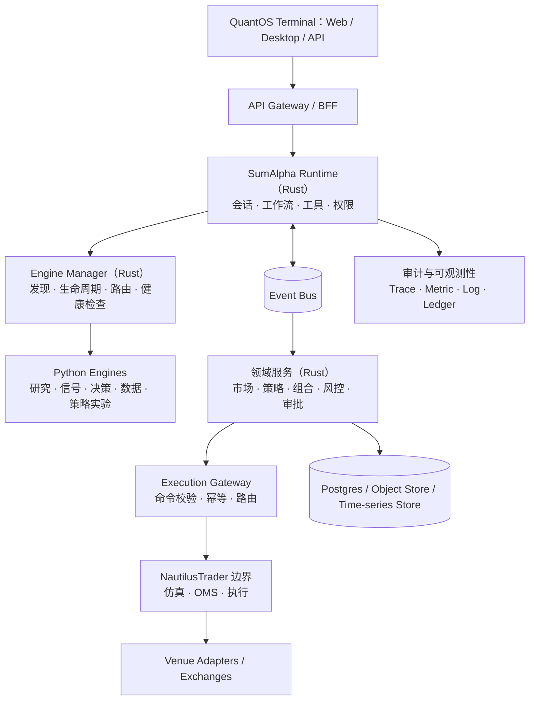
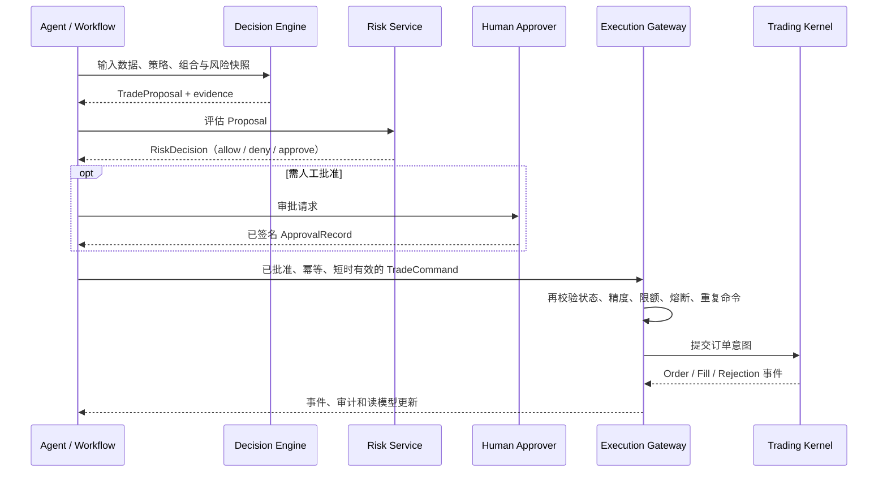

# SumAlpha QuantOS 技术方案

> 版本：1.0  
> 日期：2026-07-21  
> 依据：[SumAlpha-QuantOS-Architecture.md](./SumAlpha-QuantOS-Architecture.md)  
> 状态：实施基线

## 1. 方案概述

SumAlpha QuantOS 是面向专业量化研究与交易团队的 AI 原生平台。平台将研究、策略生产、投资决策、风险审批、订单执行和审计拆分为独立能力，并以可版本化的协议连接。

系统的根本控制原则是：

```text
Agent 提出建议 → 确定性策略审批 → 交易内核执行 → 事件账本留证
```

LLM 和 Agent 只能产生带证据的研究结论、信号或 `TradeProposal`；不得持有交易所凭证、不得直接调用交易所、不得绕过风险控制。所有可执行交易均须由确定性风控生成短时有效、签名且幂等的 `TradeCommand`，再由执行网关提交至交易内核。

首期覆盖加密货币现货与永续合约的研究、回测、纸上交易和影子交易；若后续通过 M5 Gate 并获单独批准，实盘仅能从逐笔人工批准的小额辅助交易开始。该方案不构成投资、法律或合规意见。

### 1.1 当前项目范围、长期路线图与非目标

| 层级 | 统一口径 |
|---|---|
| 当前项目范围 | 一期仅开放单主租户、单主工作区、单优先 venue 和有限订单意图；计划交付到 Paper + Shadow Beta，并完成 Assisted Live 上线评审准备，不默认开启实盘。 |
| 长期路线图 | M5 安全、合规、运营 Gate 通过且获得单独业务批准后，才评估小额逐笔人工审批的 Assisted Live；随后才可评估 Guarded Live、多租户与更多 venue。 |
| 明确非目标 | 移动交易 App、无审批自动实盘、多 venue 智能路由、复杂期权界面、浏览器内量化回测及任何 Agent 直连 venue 的实现。 |

### 1.2 统一术语

| 术语 | 定义 |
|---|---|
| `tenant` | 数据、权限、限额、密钥引用和审计的最高隔离边界；协议/事件始终携带 `tenant_id`，一期只开放一个主租户。 |
| `workspace` | tenant 内组织成员、研究和策略的协作空间；一期只开放一个主工作区，不对用户提供切换能力。 |
| `account` | 隶属 tenant 的模拟或 venue 账本账户，按 workspace 授权可见；不等同登录身份。 |
| `actor` | 发起、审批或执行动作的用户、服务主体或受控自动化身份；用户型 actor 在数据库中默认映射到 Supabase `auth.users.id`。 |
| `environment` | local/test/staging/production 等部署环境。 |
| `mode` | Research、Paper、Shadow、Assisted Live、Guarded Live 等交易运行模式；决定允许动作。 |

## 2. 建设目标与范围

### 2.1 业务目标

| 目标 | 可验证结果 |
|---|---|
| 研究可复现 | 同一数据快照、策略版本和参数可重放并得到一致结论 |
| 策略可治理 | 策略从代码、回测到发布、审批和部署具有不可变版本 |
| 交易可控 | 每笔订单均经过风险、权限、限额、幂等和审批检查 |
| 运营可追溯 | 从用户请求到成交回报可关联数据、模型、提示词、规则和责任主体 |
| 架构可演进 | Rust 核心与 Python AI/量化生态通过稳定协议解耦，可独立升级和替换 |

### 2.2 首期范围

| 纳入 | 不纳入 |
|---|---|
| 加密现货/永续合约；Paper 与 Shadow 模式 | 无控制的全自动实盘 |
| 研究、策略实验、信号、交易建议与审计 | LLM 以自然语言直接下单 |
| 已验证交易所适配的可行性验证 | 承诺全交易所、全订单类型支持 |
| 专业个人、研究团队、交易团队 | 面向大众的投资建议或收益承诺 |

## 3. 总体设计

### 3.1 分层架构



### 3.2 平面划分

| 平面 | 主要组件 | 职责 |
|---|---|---|
| 控制面 | Gateway、Runtime、Engine Manager、Auth、Policy | 身份、授权、工作流、配置、引擎调度、审批与版本发布 |
| 数据面 | Market、Strategy、Portfolio、Risk、Execution | 行情、特征、回测、风险计算、命令和执行回报 |
| 审计面 | 事件账本、对象存储、可观测性服务 | 配置快照、Artifact、审批证据、不可抵赖追踪 |

### 3.3 核心架构约束

- Rust 负责平台运行时、领域模型、协议、权限、事件和交易控制面；Python 仅通过 Engine Protocol 提供受控能力。
- Runtime 不拥有仓位真相、订单状态机、交易规则或交易所密钥。
- 上游工程均以适配器封装，内部领域类型不暴露第三方 SDK 类型。
- 领域事件是事实来源；读模型、缓存和报表均可从事件重建。
- 数据库主存储采用 Supabase 平台的 PostgreSQL；用户身份锚定 `auth.users`，租户业务表默认启用 RLS，主键使用 `gen_random_uuid()`，时间字段统一使用 `timestamptz`。
- 默认拒绝权限、外网访问和实盘能力；生产仅运行签名、审核且已批准的引擎和插件。

## 4. 逻辑组件设计

### 4.1 SumAlpha Runtime

Runtime 是唯一的 Agent 控制面，负责：

- 已认证会话、任务上下文、工作流编排、取消、超时、重试、checkpoint 和恢复；
- 工具与技能注册、权限检查、人工审批挂点、预算和速率控制；
- 上下文组装、记忆检索、Artifact 管理、流式输出和事件触发；
- Trace、审计关联 ID、输入/输出证据和成本记录。

Runtime 不直接执行交易。触发交易相关工作流时，它只能向决策引擎请求 `TradeProposal`，随后调用风控服务。

### 4.2 Engine Manager 与 Python Engines

Engine Manager 将 Python 项目作为可发现、可审计、可限流的能力服务管理。它读取审核后的 manifest，按 capability、租户、数据敏感度、成本、GPU、区域和健康状态路由；同时提供启动、停止、心跳、超时、熔断、重试、并发配额和日志采集。

| Engine | 职责 | 允许输出 | 禁止行为 |
|---|---|---|---|
| Vibe Adapter | 研究工作流、工具、MCP、记忆与研究 UX 的受控吸收边界 | ResearchArtifact、结构化研究事件、受控工具结果、UX 片段 | 作为平台 Runtime、状态源、交易执行器 |
| RD-Agent | 假设生成、实验与候选发现 | ResearchArtifact、证据 | 下单、访问交易密钥 |
| LLMQuant | 特征、因子、模型、信号 | Signal、模型/诊断 Artifact | OMS、交易所访问 |
| TradingAgents | 多 Agent 讨论与投资决策 | TradeProposal、反方观点、证据 | 风控放行、订单提交 |
| OpenBB Adapter | 数据/研究查询适配 | 带血缘的数据响应 | 作为核心领域真相源 |
| Strategy Lab | 自然语言策略生成与验证 | 源码、静态检查和实验 Artifact | 直接部署到生产 |

### 4.2.1 Vibe-Trading 集成与演进策略

Vibe-Trading 在 QuantOS 中的定位是“研究工作流、工具、MCP、记忆与研究 UX 的能力来源”，不是平台 Runtime、状态源或交易执行器。集成方式采用“受控 Fork + `vibe_adapter` 适配层吸收”，确保上游可借鉴、运行时可替换、交易边界不被污染。

| 基线项 | 统一决策 |
|---|---|
| 上游定位 | Vibe-Trading 只提供可复用 workflow/skill/tool/streaming/UX 思路，不承载 QuantOS 会话、权限、审计、策略、订单或仓位真相。 |
| 本地边界 | 所有上游能力经 `vibe_adapter` 进入；Adapter 仅依赖 `quantos-protocol`、Artifact API 与已授权工具接口。 |
| 输出边界 | 只允许返回 ResearchArtifact、结构化研究事件、受控工具结果或 UX 片段；不得产生或提交 `TradeCommand`。 |
| 安全边界 | Vibe-derived 进程不持有 venue/API 密钥，无 Execution Gateway 网络能力，不能访问未授权数据、shell 或文件域。 |
| 同步单位 | 每次同步必须固定 upstream commit/tag，不追踪浮动分支，不以“最新 main”作为生产输入。 |
| 可替换性 | 任一 Vibe-derived 模块必须可被 mock 或自研实现替换，且替换不改变业务协议、审计语义与工作流边界。 |

针对上游更新，统一采用 S0–S3 分级：

| 级别 | 触发条件 | 处理时限 | 允许操作 | 禁止操作 |
|---|---|---|---|---|
| S0 安全响应 | 高危漏洞、密钥泄露、供应链事件影响已使用组件 | 1 个工作日内隔离并修复或回滚 | 禁用 capability、撤销制品、升级或回滚固定 commit | 为保留功能跳过安全或回归 Gate |
| S1 兼容性响应 | API、依赖、许可证、数据条款或协议变化可能破坏 adapter | 5 个工作日内完成影响分析 | 建立兼容分支、更新 adapter、补充迁移与回归用例 | 直接合入主干或修改核心协议迁就上游 |
| S2 计划同步 | 新 tag/release、稳定 bugfix、可验证性能/质量提升 | 按月度评估窗口处理 | capability inventory、选择性 cherry-pick、adapter 重写、shadow benchmark | 全量 merge upstream/main |
| S3 研究借鉴 | 新 workflow、skill、MCP、memory 或 UX 设计思路 | 按季度或按需评审 | ADR、原型、独立实现、实验 fixture | 引入未经评估的运行时依赖 |

每次同步遵循固定流程：冻结候选 commit/tag 与 LICENSE/NOTICE、依赖锁和 diff 统计；对变更执行安全/许可证/API/依赖/UX/性能分类；更新 capability inventory 和副作用清单；只允许“最小 cherry-pick 到 fork”“在 adapter 重写等价逻辑”“仅吸收设计与测试思路”三种吸收方式；在隔离的 `sync/<upstream-sha>` 分支完成实现与验证；通过质量 Gate 后，先以禁用状态或 canary capability 发布，再更新 `UPSTREAM.md`、SBOM、NOTICE 和回滚指针。

常见冲突按以下决策矩阵处理：

| 冲突类型 | 默认决策 | 处理方式 | 放行条件 |
|---|---|---|---|
| API / 类型兼容 | 不污染核心协议 | 在版本化 adapter translator 中兼容，必要时并行保留 vN/vN+1 translator | 新旧 fixture 与 contract test 同时通过 |
| 权限 / 工具越权 | 默认拒绝 | 只映射到 QuantOS 已批准 capability；未映射工具永久禁用 | 负向权限测试证明无法访问 venue、secret、未允许网络域 |
| 依赖 / 运行时冲突 | 进程隔离优先 | 独立 `pyproject.toml`、`uv.lock`、资源限制与镜像构建 | lock 可复现、制品 digest 固定、运行无依赖泄漏 |
| 许可证 / 数据条款 | 法律与供应链 Gate 优先 | 停止升级、保留上一个批准制品或改为自研/替代实现 | 新结论、NOTICE/SBOM、发布范围全部更新 |
| UX / 交互模型 | QuantOS 设计系统优先 | 仅借鉴信息架构与交互意图，在 Terminal 共享组件中重实现 | 不引入上游 CSS/状态管理实现，Web/Desktop 回归通过 |
| 性能改进伴随不明副作用 | 性能不覆盖安全 | 在隔离 benchmark 对比 CPU、内存、P95、失败率 | 相对批准基线无安全退化，关键路径 P95 不变差超过 10% |

同步质量 Gate 为强制门槛：

| 类别 | 强制检查 | 通过标准 |
|---|---|---|
| 可复现性 | 固定 commit/tag、`uv.lock`、制品 digest、SBOM、构建 provenance | 连续 3 次独立构建得到相同依赖 lock 与制品 digest，`UPSTREAM.md` 可完整追溯来源 |
| 供应链 | LICENSE/NOTICE diff、SCA/CVE、secret scan、依赖许可策略 | 无未处理高危漏洞、秘密或禁止许可证；条款变化未决时阻断发布 |
| Adapter 契约 | `GetMetadata`、`Health`、`Execute`、`StreamExecute`、`Cancel`、错误码、deadline、幂等 | 100% contract fixture 通过；未知 capability/版本/输入返回稳定错误码 |
| 负向安全 | secret、venue、shell、文件、未授权网络、跨 tenant 数据 | 负向 fixture 全部被拒并写审计，egress 严格受 manifest allowlist 控制 |
| 功能回归 | workflow、tool、streaming、Artifact、checkpoint、取消、恢复 | 20 个代表性 fixture 与 QuantOS 期望输出一致；取消 ≤2 秒确认；重启无重复 Artifact |
| 性能与可观测性 | 冷启动、P95、CPU/内存、日志、trace、版本与 input hash | 健康响应 P95 <200ms，Execute 受理 P95 <1s，100% 请求带 adapter/upstream version 与 correlation ID |
| 客户端兼容与回滚 | Research 页、错误态、证据链、capability 禁用、旧制品恢复 | Web/Desktop 共享 E2E 通过；故障只暴露受控错误；回滚演练 ≤5 分钟且审计完整 |

Vibe-Trading 的落地路线图分为 V0–V3：V0 建立只读上游副本、受控 fork、`UPSTREAM.md`、capability inventory 和变更监测；V1 实现 `vibe_adapter` skeleton、最小 adapter translator、工具 allowlist 与可重放 fixture；V2 建立 `sync-vibe` 自动化、S0–S3 分级、canary capability 与一键回滚；V3 将通用修复回馈上游，并逐步以 QuantOS-native trait/protocol 替换 fork 内耦合模块，最终实现“可借鉴、可同步、可脱钩”的演进路径。

### 4.3 领域服务

| 服务 | 责任 | 关键输出 |
|---|---|---|
| Market Service | 行情摄取、归一化、质量校验、快照与血缘 | MarketEvent、DataSnapshot |
| Strategy Service | 策略代码、参数、回测、发布物和审批 | StrategyRelease |
| Portfolio Service | 仓位、估值、敞口和 P&L 读模型 | ExposureSnapshot、PortfolioView |
| Risk Service | 预交易/后交易规则、限额、熔断与审批 | RiskDecision |
| Approval Service | 人工审批、签名和职责分离 | ApprovalRecord |
| Execution Gateway | 可执行命令校验、幂等、路由和回报映射 | TradeCommand、Order/Fill 事件 |

## 5. 核心对象与交易闭环

### 5.1 领域对象

| 对象 | 说明 | 属性 |
|---|---|---|
| DataSnapshot | 数据源、时间窗、schema、质量、许可证与哈希 | 不可变 |
| ResearchArtifact | 假设、实验、结果、证据、代码与环境 | 不可变 |
| StrategyRelease | 源码/构建产物哈希、参数、数据、回测、审批与允许的部署目标 | 不可变 |
| Signal | 方向、强度、有效期、模型/策略版本、诊断 | 不可变 |
| TradeProposal | 建议动作、依据、置信度、失效时间与证据 | 不可执行 |
| RiskDecision | allow/deny/approve、命中规则、限额和签名 | 不可变 |
| TradeCommand | 已批准的 venue、标的、数量和订单意图 | 可执行、短时有效 |
| Order / Fill / Position | 来自交易内核的事实与读模型 | 追加式 |

### 5.2 交易流程



订单状态：`Draft Proposal → Risk Evaluated → Human Approved（如需要）→ Command Issued → Submitted → Accepted / Rejected → Partially Filled / Filled / Cancelled / Expired`。所有转换必须含 `causation_id` 和 `correlation_id`。

### 5.3 风控与运行模式

| 模式 | 权限 | 上线条件 |
|---|---|---|
| Research | 研究、回测、报告 | 默认模式 |
| Paper | 模拟订单、虚拟账本 | Alpha 验证 |
| Shadow | 基于真实行情生成建议但不下单 | 实盘前验证 |
| Assisted Live | 每笔交易人工批准 | 首期实盘 |
| Guarded Live | 限额内自动执行 | 稳定性、合规和审计门槛完成后 |

执行网关提交前必须校验策略发布状态、数据新鲜度、账户状态、命令幂等性、价格/数量精度、名义价值、杠杆、仓位集中度、venue 健康、审批签名及全局/账户级 kill switch。kill switch 优先级高于 Agent、策略和排程。`StrategyRelease` 的部署目标按阶段开放：M3/M4 仅允许 `Paper` 或 `Shadow`；只有在 M5 Gate 通过且被单独批准后，才可受控扩展到 `Assisted Live`。这不改变 `TradeProposal → RiskDecision → TradeCommand` 的确定性执行边界。

## 6. 协议、接口与插件

### 6.1 Engine Protocol

统一使用版本化 Protobuf/gRPC 协议。每个引擎实现 `GetMetadata`、`Health`、`Execute`、`StreamExecute` 和 `Cancel`；本地以 Unix Domain Socket 调用，生产环境采用 mTLS gRPC 服务调用。

`ExecuteRequest` 必含：`request_id`、`idempotency_key`、`tenant_id`、`actor`、`workflow_run_id`、`deadline`、`input_schema_version`、`data_snapshot_ref` 与 `policy_context_ref`。所有响应返回 `artifact_refs`、`evidence_refs`、`engine_version`、`input_hash` 与 `correlation_id`。

### 6.2 插件模型

插件用于 venue、数据、通知、工具、认证与模型提供方集成，不承载平台领域真相。

- Rust 插件基于稳定 Plugin SDK trait 和版本化 manifest；其他语言通过 Engine Protocol 或进程/WASI 协议接入。
- manifest 声明 capability、网络域、secret 引用、数据分类、权限和兼容 SDK 版本。
- venue 插件仅由 Execution Gateway 调用；Agent 只可请求建议或受控查询。
- 插件运行在最小权限 sandbox，强制网络 allowlist、速率限制、secret 注入、签名验证和审计。
- 生产禁止动态安装未签名插件；升级必须经过兼容性测试、canary 和回滚演练。

对 Vibe-Trading 这类受控 Fork 集成，还需额外满足：生产制品只能来自锁定依赖的 `engines/vibe-adapter`，`third_party/vibe-trading` 只作只读参考，`forks/vibe-trading` 只作为补丁与可复现构建来源；任何同步均不得为了迁就上游而修改 Runtime、核心协议或执行边界的安全语义。

## 7. 数据、事件与存储

### 7.1 Supabase PostgreSQL 基线

一期数据库采用 Supabase 托管 PostgreSQL，并与 Supabase 生态约束保持一致；它是事务数据、身份映射、审批记录、策略元数据、任务状态和审计索引的主存储。Supabase 提供认证表、连接池、备份与运维基线，但不改变“服务端权限与领域规则是唯一执行权威”的架构原则。

| 主题 | 约束 |
|---|---|
| 身份锚点 | 用户身份以 Supabase `auth.users` 为唯一主锚点；QuantOS 的 actor、成员关系、workspace/account 授权等业务表通过外键或显式映射关联 `auth.users.id`，不重复维护本地密码账户体系。 |
| 主键与引用 | 所有租户业务表默认使用 UUID 主键，数据库默认值统一采用 `gen_random_uuid()`；跨表引用保持同类型 UUID，禁止泄漏 Supabase 内部实现细节到领域协议。 |
| 时间语义 | `created_at`、`updated_at`、`occurred_at`、`expires_at`、`approved_at` 等业务时间字段统一使用 `timestamptz`，以 UTC 语义存储并在服务端完成时区展示转换。 |
| RLS 与隔离 | 凡是承载 tenant/workspace/account 用户可见数据的表，默认启用 RLS 且默认拒绝；策略同时校验 `tenant_id`、成员关系、角色/capability 与运行模式，禁止仅凭前端参数决定数据可见性。 |
| 服务端职责 | Supabase Auth/RLS 提供数据库层防线；BFF/领域服务继续负责 capability、审批、风控、模式控制和跨聚合校验，禁止将交易放行逻辑下沉为单纯 SQL policy。 |
| 变更治理 | schema、索引、RLS policy、触发器、扩展与种子数据以版本化 SQL migration 管理；CI 必须校验迁移漂移、RLS 覆盖、回滚可行性与本地重建能力。 |

| 类别 | 推荐起点 | 主要用途 |
|---|---|---|
| 事务与配置 | Supabase PostgreSQL | 租户、策略元数据、审批、任务、outbox、RLS 策略与身份映射 |
| 事件传递 | Supabase PostgreSQL outbox/inbox + Supabase Realtime（早期默认） | 领域事件、重放、worker 分发、实时订阅 |
| 时序/分析 | Supabase PostgreSQL 受控 schema、物化视图与聚合表（早期默认） | 行情、指标、P&L、延迟分析 |
| 对象存储 | Supabase Storage | 快照、回测、模型、报告和证据 |
| 协调/短缓存 | Supabase Realtime + PostgreSQL advisory lock（早期默认） | worker 唤醒、投影协调、短期状态同步 |
| 密钥 | Supabase Vault 与平台托管 secrets | 短期租约与交易/API/模型密钥引用 |

采用 Supabase PostgreSQL 中的 transactional outbox/inbox、schema registry、死信队列、projection checkpoint 与幂等消费者作为事件传递基线，并以 Supabase Realtime 作为 worker 唤醒和实时订阅通道；早期不在核心方案中引入 Supabase 生态之外的独立事件总线、缓存系统、时序数据库或秘密基础设施。事件 schema 带版本；破坏性变更以新版本事件迁移，不修改历史语义。审计链应能完整回答：谁发起、用哪些数据/模型/提示词、调用何引擎和版本、命中何规则、谁批准、向何 venue 提交何请求及其实际结果。

### 7.2 数据模型与事件协同

- `auth.users` 只保存认证主身份；QuantOS 业务表负责 tenant、workspace、account、actor capability、审批职责分离和模式上下文。
- 事件 outbox/inbox、审计索引、读模型 checkpoint 与任务状态存储在 Supabase PostgreSQL 中，并通过事务边界与领域写操作一起提交；早期默认不依赖独立消息中间件即可完成重放、投影和 worker 分发。
- 若后续出现超出 Supabase PostgreSQL + Supabase Realtime 方案舒适区间的规模化需求，必须通过单独 ADR 与容量评审后再决定是否增加额外基础设施，而不是在一期基础设施阶段预先引入独立技术体系。
- append-only 审计表必须记录 `tenant_id`、`actor_id`、`correlation_id`、`causation_id`，其中用户型 `actor_id` 可追溯到 `auth.users.id`，服务型 actor 则通过显式 service principal 表达。
- 对外接口只暴露 QuantOS 自有协议和 BFF 查询模型，不直接暴露 `auth.users`、RLS policy 名称或 Supabase 自动生成 API 作为产品契约。

## 8. 代码与部署方案

### 8.1 Monorepo 布局

```text
sumalpha-quantos/
├── proto/                 # Engine、trading、events 契约真相源
├── crates/                # Rust core、protocol、runtime、policy、risk、execution 等
├── services/              # gateway、runtime、scheduler、market、risk、execution-gateway
├── engines/               # 独立 uv 锁定的 Python Engines、vibe-adapter 与 SDK
├── plugins/               # venue、data、tools、notification 等插件
├── apps/                  # website、共享 terminal、terminal-desktop
├── packages/              # ui、domain-ui、api-client、platform、config
├── third_party/           # 只读上游副本或 git submodule；固定 commit
├── forks/                 # 受控 fork 与 patch 队列
├── supabase/              # SQL migrations、RLS policies、seed、remote DB fixtures
├── deploy/                # 未来远程部署资产占位目录（当前仅 README）
├── docs/upstream/         # UPSTREAM.md、capability inventory、sync decision records
└── docs/                  # ADR、architecture、runbook、threat-model
```

依赖方向为 `apps → services → domain crates → protocol/core`；`plugins → plugin-sdk + protocol/core`；`engines ↔ generated SDK/proto`。其中 `apps/terminal` 是 Web 与桌面端共享的 React 应用，`apps/terminal-desktop` 仅作为 Tauri 桌面壳，公共 UI、领域页面、类型化 BFF client 和平台适配分别位于 `packages/ui`、`packages/domain-ui`、`packages/api-client`、`packages/platform`。禁止核心依赖具体业务域，禁止 Runtime 依赖 venue 插件，禁止领域服务依赖具体 Python 包。

### 8.2 环境拓扑

| 环境 | 部署方式 | 交易限制 |
|---|---|---|
| 本地开发 | 基于固定 Rust、uv、Node 工具链的本地工作区；Runtime 与 Python sidecar 通过 UDS gRPC，数据库通过 `DATABASE_URL` 连接线上 Supabase PostgreSQL | 仅模拟或 testnet；无真实密钥 |
| 测试 | 临时环境、回放数据、契约与集成测试；使用隔离 Supabase 项目、独立数据库分支或受控 staging `DATABASE_URL` | 禁止真实账户 |
| 生产 | Supabase 托管 PostgreSQL / Storage / Auth / Realtime / Vault + 受控应用运行环境；Runtime 无状态扩缩，重型 Engine 独立 worker pool | 风险/执行区最少 egress |

生产风险/执行区使用网络策略、独立事故响应 Runbook 与 Supabase Vault/托管 secrets 保护敏感凭证。交易所密钥不得出现在 UI、Agent 上下文、日志、构建产物或研究引擎环境中。

### 8.3 产品表面与 Terminal 交付约束

`sumalpha.ai` 是品牌、架构、安全、文档和访问申请入口，不承载交易工作流；`app.sumalpha.ai` 与 QuantOS Terminal 桌面端是同一 Terminal 的两个访问形态。它们共用页面、领域组件、BFF 客户端、路由语义、权限模型和验收用例，服务端始终是状态、鉴权、风控与审计的唯一权威。

桌面端以 Tauri 封装同版本、构建并签名的共享 Terminal 制品；多窗口、系统通知、深链、布局偏好和受控文件操作必须经平台适配接口提供，不得复制业务逻辑。桌面端更新通过签名发布通道完成；离线只允许查看已加密缓存的非敏感只读资料及本地布局，禁止离线创建或签发交易命令。Web 入口以 CSP、受控 Web 部署与 feature flag 灰度发布；任何客户端均不得直连数据库、事件总线、Engine 或 venue。

## 9. 安全、合规与供应链

- 最小权限、默认拒绝：研究引擎无交易凭证，生产外网访问和实盘工具默认关闭。
- 多租户隔离：所有请求、Artifact、数据、限额和密钥引用均携带 `tenant_id`；执行账户与审批主体分离。
- 数据与模型治理：保存数据许可、血缘、快照哈希、提示词、模型版本、代码版本与环境；设置保留和访问策略。
- 第三方治理：固定上游 commit/tag，生成 SBOM，漏洞与 secret 扫描，维护 `THIRD_PARTY_NOTICES.md` 和升级/回滚记录。
- 许可证门槛：NautilusTrader 的 LGPL-3.0、OpenBB 的 AGPL-3.0-only 等须在集成、分发或网络提供前完成专业法律评估；适配层和可替换 provider 是必要设计。
- 上线门槛：实盘前完成目标司法辖区的市场准入、KYC/AML、数据许可、模型治理、安全审计和事故演练。

## 10. 可观测性、SLO 与运维

统一使用 trace、metrics、结构化日志和 append-only audit ledger。关键指标包括：行情新鲜度、队列延迟、Engine 健康、工具失败率、订单/风控拒绝率、撤单与成交延迟、策略漂移、模型成本、数据供应商错误和凭证异常。

首期建议建立以下告警：

- 行情延迟或数据质量降级时，阻断新交易命令并通知值班人员；
- 风控拒绝率、订单拒绝率或执行延迟异常时，自动进入受限模式；
- 引擎连续失败、事件积压或审计写入失败时，暂停相关工作流；
- kill switch 触发、凭证异常或未对账订单出现时，升级为 P1 事件。

## 11. 当前项目范围与长期路线图

下表中的阶段 0–3 是当前项目的交付承诺；阶段 4 仅交付上线评审准备和 testnet 演练，是否开启 Assisted Live 需另行批准；阶段 5 为长期路线图，不纳入本计划排期。

### 11.1 路线图与验收

| 阶段 | 主要交付物 | 验收标准 |
|---|---|---|
| 0. Foundation | Cargo workspace、proto、事件封装、鉴权、审计、本地开发基线、paper-only | CI、SBOM、基础 contract test 通过 |
| 1. Research MVP | Engine Manager、研究/信号/决策适配、策略 Artifact、研究界面 | 同一输入可重放；输出都有证据 |
| 2. Strategy Lab | 生成、静态验证、回测、数据快照、策略发布与审批 | 无 look-ahead；统计/成本检验与人工审核通过 |
| 3. Paper + Shadow | Risk、Trading Protocol、Nautilus 边界、模拟/影子订单与时间线 | 订单状态可重建；kill switch 演练通过 |
| 4. Assisted Live 上线评审准备 | venue 适配、密钥管理、审批签名、告警和值班 Runbook；仅 testnet/演练 | 风险、延迟、对账、事故演练达标，并获单独业务批准才可开启实盘 |
| 5. Guarded Live（长期） | 限额自动执行、多租户隔离、扩缩容、插件认证 | 合规签核、SLO 与独立审计达标；不纳入当前项目计划 |

每阶段均须包含协议兼容性测试、确定性回放测试、故障注入、权限测试、审计抽样与回滚演练。代码发布、策略发布与实盘授权必须相互独立，任何代码发布不得自动激活策略或开通实盘。

## 12. 首批实施任务

1. 建立 Cargo Workspace、`proto/`、`engines/` 与本地开发基线。
2. 评审并冻结 `DataSnapshot`、`StrategyRelease`、`TradeProposal`、`RiskDecision`、`TradeCommand` v1 schema。
3. 实现 Engine SDK、Engine Manager 最小版本和 mock Engine，完成健康、取消、deadline、幂等和流式 contract test。
4. 以只读、无交易副作用方式接入 RD-Agent、LLMQuant 和 TradingAgents。
5. 实现 Artifact/证据存储、数据血缘，以及提示词、模型、代码和环境版本记录。
6. 实现 Paper/Shadow 的订单闭环、事件重放、对账、权限、审计和 kill switch 演练。
7. 在任何实盘功能前，完成第三方许可证、数据条款、合规和安全评审；随后以 Assisted Live 小额人工审批方式上线。

## 13. 架构决策摘要

| 决策 | 结论 |
|---|---|
| 平台核心语言 | Rust；Python 生态通过独立 Engine 接入 |
| 运行时 | 只有一个 SumAlpha Runtime，避免多套会话、权限和工作流系统 |
| 引擎通信 | 统一 gRPC；本地 sidecar + UDS，生产远程服务 + mTLS |
| 交易内核 | 通过 NautilusTrader 独立边界接入，不作为平台骨架 |
| 开源集成 | Fork/适配/参考分层，第三方类型不进入核心领域模型 |
| 风险边界 | Agent 只能提议；确定性规则与人工审批决定是否执行 |
| 状态与审计 | 事件优先、追加式账本、可重建读模型、全链路关联 ID |
