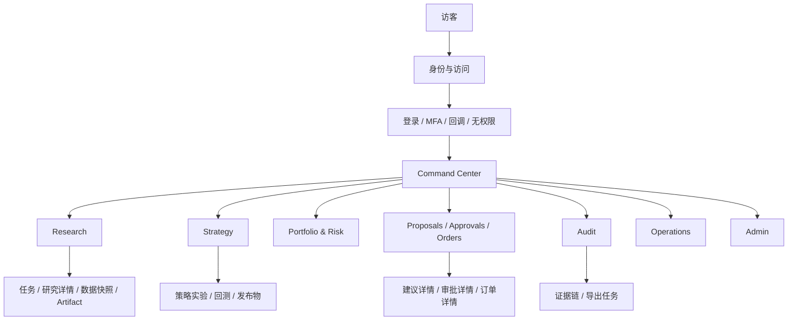
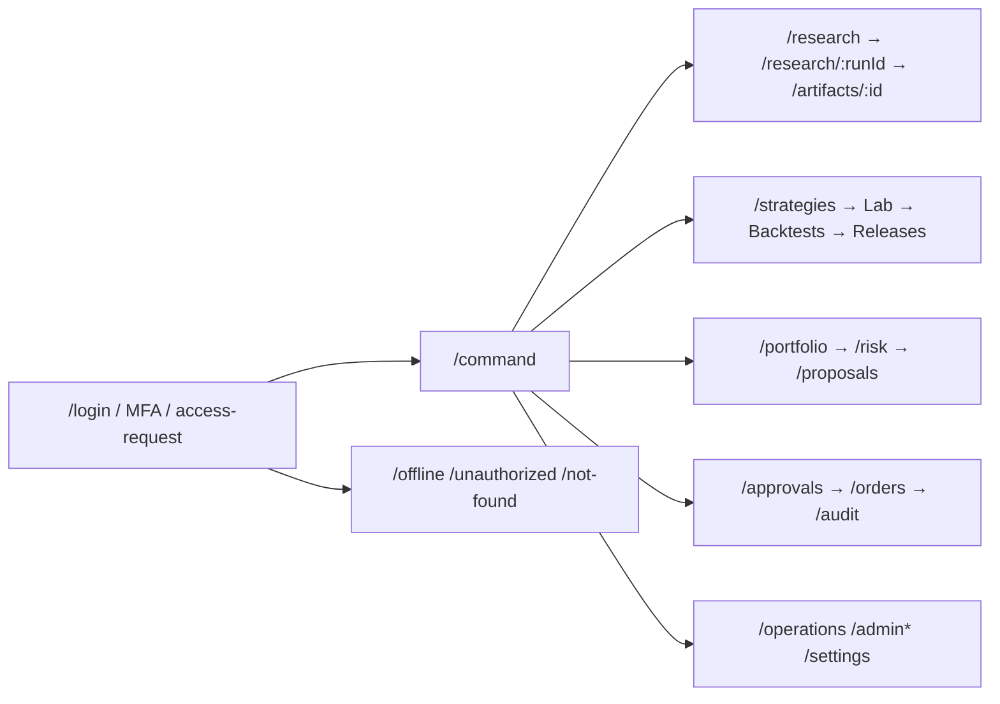
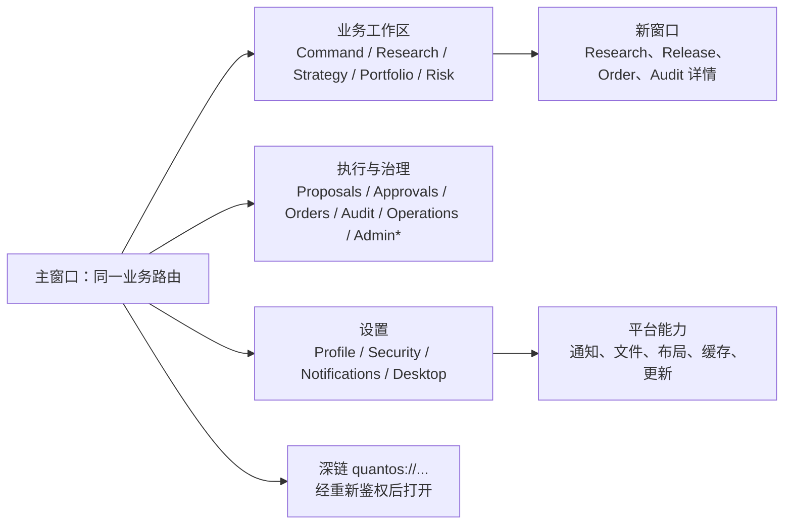
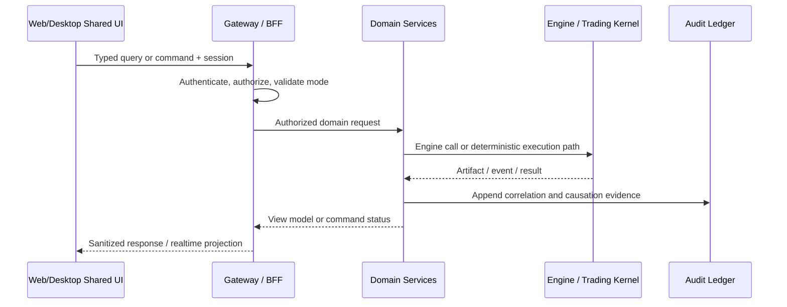

# SumAlpha QuantOS Terminal 全量前端页面设计规格

> 版本：1.0  
> 日期：2026-07-26  
> 适用产品：QuantOS Terminal 桌面端、`app.sumalpha.ai` Terminal 网页版  
> 交付对象：产品、UX/UI、前端、BFF、QA、安全与风控团队  
> 上游依据：[架构](./SumAlpha-QuantOS-Architecture.md)、[技术方案](./SumAlpha-QuantOS-Technical-Solution.md)、[开发计划](./SumAlpha-QuantOS-Development-Plan.md)、[网站与终端设计](./SumAlpha-QuantOS-Web-and-Terminal-Design.md)

## 1. 需求对齐清单

### 1.1 不可突破的产品与安全边界

| 编号 | 已对齐需求 | 前端设计约束 | 验收证据 |
|---|---|---|---|
| A01 | 平台服务专业量化研究与交易团队，而非面向大众的投资建议产品 | 不出现收益承诺、跟单、社区喊单、收益排行榜或“自动赚钱”文案 | 内容审核清单与页面截图 |
| A02 | Agent 只能产出研究结论、Signal 或不可执行的 `TradeProposal` | Proposal 始终标记“不可执行建议”；聊天/研究页没有下单入口 | E2E 权限与 DOM 检查 |
| A03 | 交易必须经过 RiskDecision、必要的人类审批、短时有效且幂等的 TradeCommand、Execution Gateway | 订单入口只消费服务端签发的有效 Command；客户端不能拼装交易命令 | BFF 契约、命令路径测试 |
| A04 | 当前项目仅交付单主租户、单主工作区、单优先 venue、Paper + Shadow Beta | 顶栏显示主工作区但不提供 workspace 切换；仅展示被授权的单一 venue 与有限订单意图 | 路由、菜单和 RBAC 测试 |
| A05 | M3/M4 仅允许部署到 Paper/Shadow；M5 Gate 后才可能 Assisted Live | Strategy Release 的目标选择器按服务端 capability 收敛；未满足 M5 时不显示 Assisted Live 选项 | Feature flag / policy 测试 |
| A06 | 证据、数据快照、版本与审计是领域真相的一部分 | 研究、策略、建议、订单和审批均可跳转至证据链，显示时间、hash、版本和关联 ID | 抽样追溯验收 |
| A07 | 秘密仅由执行边界持有 | 任意 UI、错误、日志、导出和桌面缓存均不得展示 venue/API/模型密钥 | 安全审查与敏感字段测试 |
| A08 | Web 与桌面端是同一 Terminal 的两个入口 | 业务页面、领域组件、BFF client、路由语义、权限和核心测试用例共享；仅平台适配不同 | Monorepo 与双端回归报告 |
| A09 | 桌面端离线仅可查看加密缓存的非敏感资料和布局 | 离线时所有创建、审批、签发、撤单和导出入口禁用；界面明确说明原因 | 断网 E2E 与缓存审计 |
| A10 | 默认拒绝和最小权限 | 后端拒绝优先；前端只做体验层隐藏/禁用。高风险动作要求重新认证/MFA | 鉴权、MFA、越权路由测试 |

### 1.2 角色、对象与权限语言

“普通用户”不是单一权限集。以下角色都属于受登录保护的普通业务用户；管理员是独立角色；访客仅可进入身份与帮助页面。

| 角色 | 核心目标 | 默认可操作范围 | 不可操作范围 |
|---|---|---|---|
| 研究员 | 产生可复现研究和证据 | Research、Data Snapshot、个人草稿 | 发布、风险审批、订单、密钥 |
| 量化开发 | 验证并提交策略发布候选 | Research、Strategy Lab、回测、提交发布审批 | 审批本人发布物、下单、密钥 |
| 交易员 | 监控组合、处理已批准的 Paper/Shadow 命令 | Command、Portfolio、Proposal、Orders | 修改风险策略、审批自身发起的命令 |
| 风控/审批人 | 审核风险、审批/拒绝建议、紧急停止 | Risk、Approvals、Audit、kill switch | 修改策略源码、读取密钥 |
| 运维/SRE | 监控系统与处理运行事件 | Operations、Audit、Runbook | 交易决策、常规下单 |
| 管理员 | 管理成员、策略、受控配置、已批准能力 | Admin、Audit、角色/配置管理 | 绕过风险、审批、审计或查看明文密钥 |
| 访客 | 完成认证或了解访问限制 | 登录、访问申请、支持、状态说明 | 任意 Terminal 业务数据 |

### 1.3 领域对象到 UI 的可见性

| 对象 | 用户可见名称 | 最低展示字段 | 不允许的 UI 误导 |
|---|---|---|---|
| `DataSnapshot` | 数据快照 | 来源、时间窗、质量、许可证、schema、hash | 不能称为“实时真相”或省略时间与质量 |
| `ResearchArtifact` | 研究证据 | 假设、输入、Engine、版本、环境、结果、证据引用 | 不能被视为交易指令 |
| `StrategyRelease` | 策略发布物 | 版本、源码/构建产物 hash、参数、数据、回测、审批、可部署目标 | 未审批或未验证时不能显示为“可执行” |
| `Signal` | 信号 | 方向、强度、时效、来源版本、诊断 | 不能显示为保证收益 |
| `TradeProposal` | 交易建议 | 建议、理由、反方观点、失效时间、证据 | 必须显示“不可执行建议” |
| `RiskDecision` | 风险决定 | allow/deny/approval_required、命中规则、限额影响、签名 | 不能被前端本地修改或伪造 |
| `TradeCommand` | 已批准交易命令 | 账户、标的、数量、有效期、幂等键、当前状态 | 过期或不满足策略时不能提交 |
| `Order / Fill / Position` | 订单/成交/仓位 | 状态、时间、数量、价格、来源、关联 ID | 不能把模拟与实盘混淆 |

## 2. 信息架构、路由与访问控制

### 2.1 全局架构图



### 2.2 URL、桌面深链与菜单地图

Web 基址为 `https://app.sumalpha.ai`。桌面端使用同一路径语义，并注册 `quantos://` 深链；例如 `/orders/o_123` 与 `quantos://orders/o_123` 指向同一受权资源。所有深链都在 BFF 重新鉴权后加载，不能把资源数据放入 URL。

| 一级入口 | 页面 / Web 路由 | 桌面深链 | 权限 | 入口位置 | 说明 |
|---|---|---|---|---|---|
| 身份 | `/login`、`/mfa`、`/auth/callback`、`/access-request` | `quantos://login` | 访客 | 未登录重定向、桌面首次启动 | 无业务数据；支持 SSO 与 MFA |
| 状态 | `/offline`、`/unauthorized`、`/not-found`、`/maintenance` | 同路径 | 访客/已登录 | 自动跳转或错误页 | 统一恢复与支持入口 |
| Command | `/command` | `quantos://command` | 全部登录用户 | 侧栏首项、Logo | 当前任务、风险与异常总览 |
| Research | `/research` | `quantos://research` | 研究员、量化开发；其他按只读授权 | 侧栏 | 任务列表和快速发起 |
| Research 新建 | `/research/new` | `quantos://research/new` | 研究员、量化开发 | Research 主按钮 | 创建受控研究任务 |
| Research 详情 | `/research/:runId` | `quantos://research/:runId` | 资源级授权 | 列表、通知、审计跳转 | 流式过程与证据 |
| Artifact | `/artifacts/:artifactId` | `quantos://artifacts/:artifactId` | 资源级授权 | Research/Strategy/Audit | 不可变产物详情 |
| 数据快照 | `/data-snapshots`、`/data-snapshots/:snapshotId` | 同路径 | 研究员、量化开发、风控；资源级只读 | Research 二级页 | 查询、质量与血缘 |
| Strategy | `/strategies` | `quantos://strategies` | 量化开发；其他按只读授权 | 侧栏 | 策略目录 |
| Strategy Lab | `/strategies/new`、`/strategies/:strategyId/lab` | 同路径 | 量化开发 | 主按钮、策略详情 | 草稿、代码、参数、实验 |
| Backtest | `/backtests/:runId` | 同路径 | 量化开发、风控只读 | Lab 运行结果 | 回测与验证详情 |
| Release | `/releases`、`/releases/:releaseId` | 同路径 | 量化开发；审批人只读/审批 | Strategy 二级页 | 发布物、部署目标和审批 |
| Portfolio | `/portfolio` | `quantos://portfolio` | 交易员、风控、已授权研究员只读 | 侧栏 | 仓位、P&L、敞口 |
| Risk | `/risk`、`/risk/rules/:ruleId` | 同路径 | 风控；交易员只读 | Portfolio 二级导航 | 风险预算、规则、异常 |
| Proposals | `/proposals`、`/proposals/:proposalId` | 同路径 | 交易员、风控、审批人；资源级 | 侧栏二级 / Command | 不可执行建议与风险评估入口 |
| Approvals | `/approvals`、`/approvals/:approvalId` | 同路径 | 审批人、风控 | 侧栏 | 待办、签名、拒绝 |
| Orders | `/orders`、`/orders/:orderId` | 同路径 | 交易员、运维、风控只读 | 侧栏 | Paper/Shadow 订单与成交 |
| Audit | `/audit`、`/audit/:correlationId`、`/exports/:exportId` | 同路径 | 审计员、管理员、资源级授权者 | 侧栏 | 证据链与受控导出 |
| Operations | `/operations`、`/operations/incidents/:incidentId` | 同路径 | 运维/SRE、管理员 | 侧栏 | 健康、告警、Runbook |
| Admin | `/admin/members`、`/admin/policies`、`/admin/capabilities`、`/admin/flags` | 同路径 | 管理员 | 侧栏底部 | 主工作区受控管理 |
| 设置 | `/settings/profile`、`/settings/notifications`、`/settings/security`、`/settings/desktop` | 同路径 | 已登录用户；部分管理员 | Profile 菜单 | 个人偏好与设备安全 |

路由守卫顺序：**会话有效性 → tenant/主工作区上下文 → 角色/capability → 资源级授权 → mode/策略状态 → 页面数据加载**。任一步失败都停止后续请求；403 返回“无权限”，404 不泄露资源是否存在，策略不允许时返回可解释的受限状态。

### 2.3 Web 与桌面端站点地图差异

**网页版站点地图（`app.sumalpha.ai`）**



**桌面端站点地图（QuantOS Terminal）**



桌面端的“新窗口”仅改变视图承载位置；所有页面仍使用同一共享路由、BFF、权限和审计语义。网页端的浏览器标签页不改变同一资源的授权规则。

| 范畴 | `app.sumalpha.ai` | QuantOS Terminal 桌面端 |
|---|---|---|
| 核心业务路由 | 完整支持上述所有业务路由 | 完整支持相同路由与权限 |
| 屏幕适配 | ≥1280px 完整工作区；768–1279px 折叠侧栏与单列详情；<768px 仅状态/只读监控，不显示审批或订单提交动作 | 最小 1180×760；支持多窗口、多显示器、可恢复面板布局 |
| SEO | Terminal 所有业务路由 `noindex, nofollow`；仅登录/访问申请可有受限元数据 | 不适用；桌面深链不对外索引 |
| 分享 | 复制受权深链；接收者重新登录并经 BFF 鉴权 | 系统分享/复制深链；可在新窗口打开 |
| 平台页 | 浏览器权限、下载、会话与缓存说明 | 桌面偏好、窗口、通知、文件访问、离线缓存、更新说明 |

## 3. 全局高保真原型说明与组件规范

### 3.1 App Shell

```text
┌─────────────────────────────────────────────────────────────────────────────────┐
│ [SumAlpha]  Primary workspace · Account ▾ · PAPER ▾ · Fresh · Risk: Normal      │
│                                  Search ⌘K / Ctrl K   Alerts(3)  ?  Avatar       │
├──────────────┬──────────────────────────────────────────────────────────────────┤
│ Command      │ breadcrumb / page title                      Last sync 10:42:08   │
│ Research     ├──────────────────────────────────────────────────────────────────┤
│ Strategy     │                                                                  │
│ Portfolio    │                         page canvas                              │
│ Proposals    │                                                                  │
│ Approvals    │                                                                  │
│ Orders       │                                                                  │
│ Audit        │                                                                  │
│ Operations*  │                                                                  │
│ Admin*       │                                                                  │
├──────────────┴──────────────────────────────────────────────────────────────────┤
│ Connection: live · Data 1.2s · Correlation ID on demand                         │
└─────────────────────────────────────────────────────────────────────────────────┘
```

| 区域 | 组件 | 规则 |
|---|---|---|
| 顶部上下文栏 | 主工作区标识、账户下拉、模式标签、数据新鲜度、风险状态、全局搜索、告警 | 一期工作区为只读标识；账户切换由后端授权；模式标签常驻且不可隐藏；数据陈旧时阻断相关交易动作 |
| 左侧导航 | 图标+文字、未读/待办计数、权限隐藏或禁用、二级展开 | 业务项按领域顺序；Admin/Operations 仅在有权时出现；键盘 `g` 后接页面快捷键可导航 |
| 页面标题栏 | 面包屑、标题、状态、更新时间、页面级主操作 | 仅一个主操作；危险操作永远不设为默认焦点 |
| 右侧详情抽屉 | `EvidenceDrawer`、`ActivityDrawer`、`FilterDrawer` | 不替代可分享的详情路由；关闭不丢失草稿 |
| 底部状态栏 | 连接、实时流、数据延迟、支持入口 | 离线/重连/服务降级始终可见；不得把“已连接”误展示为数据新鲜 |

### 3.2 设计 token 与状态

| Token/组件 | 规范 |
|---|---|
| 色彩 | `surface` 深炭/浅灰；主操作 `brand` 蓝绿；`success` 仅表示已完成；`warning` 表示需关注；`danger` 仅表示拒绝、故障、紧急停止。颜色必须配合图标和文字。 |
| 排版 | 中文正文 14px/20px，表格 13px/18px，页面标题 24px/32px；金融数字采用等宽数字。 |
| 状态标签 | 统一枚举：任务 `Queued/Running/Succeeded/Failed/Cancelled`；风险 `Allowed/Denied/Approval required`；订单 `Submitted/Accepted/Partially filled/Filled/Cancelled/Rejected/Expired`。 |
| 表格 | `DataGrid` 支持列固定、列显隐、服务端筛选/排序、虚拟滚动、URL 同步筛选；导出必须走异步受控任务。 |
| 时间线 | `EvidenceTimeline` 固定显示发生时间、主体、事件名、状态、correlation ID；详情可展开 hash 和原始结构化字段。 |
| 空状态 | 使用“下一步 + 原因”，不使用模糊插画。例如“暂无待处理审批。新的审批请求出现后会显示在这里。” |
| 破坏性操作 | 使用 `DangerConfirmDialog`：对象摘要、影响、不可逆提示、输入确认短语、MFA（若适用）、服务端最终校验。 |

### 3.3 通用展示文案库

以下文案为唯一规范版本；页面仅替换方括号变量，不自行改写安全含义。

| 场景 | 规范文案 |
|---|---|
| Paper 模式 | `PAPER · 模拟账本。不会向交易所提交订单。` |
| Shadow 模式 | `SHADOW · 基于真实行情生成对照结果，不会提交订单。` |
| Assisted Live 不可用 | `Assisted Live 尚未开放。需完成 M5 Gate 并获得单独批准。` |
| 数据陈旧 | `数据已超过允许时效。请刷新数据或等待数据恢复后再继续。` |
| 无权限 | `你没有访问此资源的权限。若认为这是错误，请联系主工作区管理员。` |
| 不可执行建议 | `这是交易建议，不是订单。请先完成确定性风险评估和必要审批。` |
| 命令失效 | `该交易命令已失效，无法提交。请重新进行风险评估。` |
| 网络断开 | `连接已断开。只读缓存仍可用；创建、审批和交易操作已暂停。` |
| 重新认证 | `此操作会影响交易风险。请完成身份验证后继续。` |
| 审批成功 | `审批已记录。系统将继续执行后续确定性校验。` |
| 审批拒绝 | `已拒绝该请求。拒绝理由与规则上下文已写入审计记录。` |
| Kill switch | `紧急停止已启用。系统拒绝新的交易命令，直至由授权人员解除。` |
| 加载失败 | `暂时无法加载此页面。请重试；如果问题持续，请复制关联 ID 联系支持。` |
| 无结果 | `未找到符合当前筛选条件的结果。请调整筛选或清除条件。` |

## 4. 单页面高保真设计与功能规格

页面规格采用同一模板：**定位/权限 → 原型布局与文案 → 功能与数据 → 异常及跨端行为**。所有读写通过 BFF；创建或改变资金风险的操作必须由服务端再次授权和审计。

### P01 身份、访问与恢复页面

| 项目 | 规格 |
|---|---|
| 路由/权限 | `/login`、`/mfa`、`/access-request`、`/unauthorized`、`/offline`；访客与已登录用户均可按状态访问。 |
| 核心价值 | 以最小暴露完成 SSO/MFA、处理会话失效、解释访问限制与离线状态。 |
| 布局/组件 | 居中 480px `AuthCard`：品牌标识、标题、说明、SSO 按钮、错误提示；右侧仅显示“安全、审计、Paper/Shadow”三项事实，不展示市场或客户数据。 |
| 规范文案 | 登录标题：`进入 QuantOS Terminal`；说明：`使用你的组织账户继续。所有受控操作都会记录到审计轨迹。`；访问申请标题：`申请访问 QuantOS Terminal`；无权限使用通用文案；离线使用通用网络断开文案。 |
| 核心功能 | OIDC + PKCE 登录、MFA challenge、会话恢复、访问申请提交、返回原始安全路由。 |
| 辅助功能 | 帮助链接、状态页、复制 support correlation ID、语言切换。 |
| 异常/数据流 | 回调仅交换短期令牌并建立服务端会话；MFA 失败限流且不透露账户存在性；回调错误写认证审计，不在 URL 放 token。桌面端优先系统浏览器/嵌入安全认证流，完成后以深链回到应用。 |

### P02 Command Center

| 项目 | 规格 |
|---|---|
| 路由/权限 | `/command`；所有登录角色，卡片按 capability 过滤。 |
| 核心价值 | 在一个屏幕判断“系统是否可信、今天需要处理什么、下一步应进入哪里”。 |
| 布局/组件 | 12 列网格：顶部 `ModeBanner`；左 8 列 `PriorityQueue`（审批、风险、失败任务）；右 4 列 `HealthSummary`；中部四张 KPI 卡（数据新鲜度、开放风险、订单状态、任务）；底部 `ActivityFeed` 与 `QuickStart`。 |
| 规范文案 | 标题：`Command Center`；副标题：`主工作区的研究、风险与运行状态。`；无待办：`当前没有需要你处理的事项。`；快捷研究：`发起研究`；快捷策略：`创建策略草稿`。 |
| 核心功能 | 聚合授权后的任务、审批、风险、订单与告警；按严重性排序；从卡片跳转到详情；实时增量更新。 |
| 辅助功能 | 时间范围、账户筛选、手动刷新、保存个人布局。 |
| 异常/数据流 | BFF 返回 `CommandCenterView` 投影；任一卡片失败时局部降级并显示“此模块暂不可用”，不阻塞其他模块；数据陈旧时 KPI 显示采样时间而非最新值。桌面端可将高优先级待办弹为系统通知；Web 使用已授权浏览器通知。 |

### P03 Research 列表与新建研究

| 项目 | 规格 |
|---|---|
| 路由/权限 | `/research`、`/research/new`；研究员/量化开发可创建，其他角色按资源只读。 |
| 核心价值 | 将自然语言研究意图转化为具有数据、引擎、证据与成本边界的可复现任务。 |
| 布局/组件 | 列表页为 `ResearchDataGrid` + 右侧筛选器（状态、Engine、数据快照、时间）；新建页为三步 `ResearchComposer`：问题与范围 → 数据快照/Engine → 审核并启动。 |
| 规范文案 | 标题：`Research`；主按钮：`发起研究`；输入标签：`研究问题`；帮助：`描述要验证的问题，不要在此输入交易指令。`；启动按钮：`启动受控研究`；确认提示：`系统将以所选数据快照和 Engine 版本创建可审计任务。` |
| 核心功能 | 创建、筛选、排序、取消未完成任务；选择批准的 Engine capability、数据快照、预算与 deadline；提交后转详情页。 |
| 辅助功能 | 复制为新任务、保存为模板、导出任务摘要（受权）、全文搜索。 |
| 异常/数据流 | 前端 Zod 校验后调用 `CreateResearchRun`；BFF 写任务/审计并返回 `runId`；Engine 不健康时不允许选择并显示原因；超预算/无数据快照/过期数据均阻止提交。桌面端支持受控本地文件“导入为附件候选”，须先上传/扫描并生成 Artifact；Web 使用浏览器文件选择器，规则相同。 |

### P04 Research 详情与 Artifact 详情

| 项目 | 规格 |
|---|---|
| 路由/权限 | `/research/:runId`、`/artifacts/:artifactId`；资源级授权。 |
| 核心价值 | 查看研究过程、流式输出、可验证证据及其可重放输入，而不是把 Agent 文本当作结论。 |
| 布局/组件 | 左 7 列 `RunTimeline` 与流式事件；右 5 列固定 `EvidencePanel`（数据快照、Engine/模型、输入 hash、成本、关联 ID）。Artifact 页采用标题元数据 + 内容预览 + 版本/血缘侧栏。 |
| 规范文案 | 运行中：`研究正在执行。中间输出不代表最终结论。`；成功：`研究已完成。请结合证据与数据质量评估结果。`；失败：`研究未完成。已保留可用的日志和中间产物。`；按钮：`取消任务`、`查看数据快照`、`查看证据链`。 |
| 核心功能 | WebSocket/SSE 流式事件、取消、查看输入/输出/日志、跳转 Artifact/快照/Audit、从完成研究创建策略草稿。 |
| 辅助功能 | 折叠日志、固定证据面板、复制关联 ID、受控导出。 |
| 异常/数据流 | 事件按 sequence 去重；断线重连从 `last_event_id` 补齐；取消只请求服务端，UI 维持“正在取消”直至确认；敏感日志经 BFF 脱敏。离线仅显示已加密缓存的最终摘要和非敏感 Artifact，禁用取消/导出。 |

### P05 数据快照目录与详情

| 项目 | 规格 |
|---|---|
| 路由/权限 | `/data-snapshots`、`/data-snapshots/:snapshotId`；研究员、量化开发、风控；资源级只读。 |
| 核心价值 | 让每个研究和回测的数据来源、时间、质量与许可可见、可复用、可拒绝。 |
| 布局/组件 | 目录 `DataGrid`；详情由 `QualityScoreCard`、时间窗图、字段 schema、血缘时间线、许可证标识组成。 |
| 规范文案 | 标题：`数据快照`；质量合格：`质量检查通过，可用于已授权工作流。`；质量受限：`此快照存在质量限制，不能用于交易相关流程。`；按钮：`用于研究`、`查看血缘`。 |
| 核心功能 | 搜索/筛选、查看质量、复制引用、在允许时作为新研究/回测输入。 |
| 辅助功能 | 对比两个快照、订阅质量告警、下载元数据。 |
| 异常/数据流 | Snapshot 是不可变引用；质量状态由 Market Service 返回且前端不可覆盖；未授权许可证数据仅显示最小元数据。 |

### P06 Strategy 目录与 Strategy Lab

| 项目 | 规格 |
|---|---|
| 路由/权限 | `/strategies`、`/strategies/new`、`/strategies/:strategyId/lab`；量化开发可编辑，其他角色只读。 |
| 核心价值 | 将研究转化为受版本、验证和回测约束的策略候选，而非直接部署。 |
| 布局/组件 | 目录为卡片/表格切换；Lab 为三栏：左 `FileTree`/版本，中央受控 `CodeEditor` 与参数表单，右 `ValidationPanel`/实验队列；底部 `BacktestDrawer`。 |
| 规范文案 | 标题：`Strategy Lab`；提示：`策略草稿不能直接交易。请完成验证、回测和审批。`；按钮：`运行静态检查`、`创建回测`、`提交发布候选`；空状态：`尚未创建策略。你可以从研究证据开始。` |
| 核心功能 | 草稿编辑、参数校验、静态检查、发起回测、比较实验、从研究 Artifact 建立引用、创建发布候选。 |
| 辅助功能 | 自动保存草稿、差异比较、只读分享链接、注释。 |
| 异常/数据流 | 草稿保存带版本和冲突检测；代码/参数通过 BFF 传入隔离验证环境；look-ahead、缺少数据快照、未批准依赖、运行失败均阻断发布候选。桌面端支持受控本地文件导入/导出策略草稿；Web 仅提供服务器侧版本与受权下载。 |

### P07 Backtest 详情与 Strategy Release

| 项目 | 规格 |
|---|---|
| 路由/权限 | `/backtests/:runId`、`/releases`、`/releases/:releaseId`；量化开发、审批人、风控按动作授权。 |
| 核心价值 | 让回测质量和不可变发布物成为策略进入 Paper/Shadow 的硬门槛。 |
| 布局/组件 | Backtest 详情：指标摘要、权益曲线、回撤、成交/成本分析、数据质量/验证结果；Release 页：左发布物版本与 hash，右 `ApprovalTimeline`，底部 `DeploymentTargetSelector`。 |
| 规范文案 | 回测提示：`回测结果不等于可部署策略。`；发布按钮：`创建不可变发布物`；部署提示：`M3/M4 仅允许 Paper 或 Shadow。`；Assisted Live：`Assisted Live 尚未开放。需完成 M5 Gate 并获得单独批准。` |
| 核心功能 | 查看回测、查看验证失败、创建/查看 Release、提交审批、选择允许部署目标、回滚到旧发布物。 |
| 辅助功能 | 比较回测、复制 Release 引用、生成受控报告。 |
| 异常/数据流 | `CreateRelease` 只接受已通过验证的输入；BFF 返回不可变 hash；目标列表由 capability/mode 返回，前端不得硬编码；审批拒绝后 Release 保持可审计但不可部署。 |

### P08 Portfolio 与 Risk

| 项目 | 规格 |
|---|---|
| 路由/权限 | `/portfolio`、`/risk`、`/risk/rules/:ruleId`；交易员/风控为主，其他角色受限只读。 |
| 核心价值 | 以账户、数据时间和风险限额为前提查看仓位、P&L、敞口与规则命中。 |
| 布局/组件 | Portfolio：顶部账户/时间上下文，KPI、权益/P&L 图、仓位 `DataGrid`、敞口热图；Risk：风险预算仪表、规则命中时间线、集中度/杠杆图、规则详情抽屉。 |
| 规范文案 | 标题：`Portfolio & Risk`；时间说明：`所有数值均以数据时间 [time] 为准。`；风险正常：`未发现阻止新命令的风险事件。`；数据陈旧使用通用文案；按钮：`查看风险规则`、`查看关联订单`。 |
| 核心功能 | 账户选择、时间范围、实时/快照切换、仓位与规则过滤、从风险事件跳转 Proposal/Order/Audit；授权风控可发起 kill switch。 |
| 辅助功能 | 保存视图、下载受控报告、图表缩放。 |
| 异常/数据流 | Portfolio/风险为读模型，显示 `as_of`；读模型滞后时标记“延迟”并禁止以该数据执行命令；kill switch 使用 DangerConfirm + MFA + 服务器签名，触发后全局实时广播。 |

### P09 TradeProposal 列表与详情

| 项目 | 规格 |
|---|---|
| 路由/权限 | `/proposals`、`/proposals/:proposalId`；交易员、风控、审批人；资源级授权。 |
| 核心价值 | 审查包含证据、反方观点和失效时间的交易建议，并进入确定性风控评估。 |
| 布局/组件 | 列表以建议状态/有效期/标的筛选；详情顶部固定 `NonExecutableBanner`，主区显示建议、Signal、论证与反方观点，右侧显示数据/策略/组合上下文和证据。 |
| 规范文案 | 横幅：`这是交易建议，不是订单。`；说明：`建议不会直接提交到 venue。请先运行风险评估。`；按钮：`请求风险评估`；失效：`该建议已失效，不能进入风险评估。` |
| 核心功能 | 查看、筛选、查看关联证据、请求风险评估、跳转 RiskDecision；不得提供“下单”按钮。 |
| 辅助功能 | 标注、订阅到期提醒、复制安全链接。 |
| 异常/数据流 | 评估请求带 proposal/version/context hash；过期、数据陈旧、策略未发布、无权限时服务端拒绝；详情实时订阅状态变化。 |

### P10 Approvals 与 RiskDecision 详情

| 项目 | 规格 |
|---|---|
| 路由/权限 | `/approvals`、`/approvals/:approvalId`；审批人、风控。 |
| 核心价值 | 在同一界面做出可解释、可签名、不可自批的风险决策与人工审批。 |
| 布局/组件 | 列表按严重性/过期时间排序；详情上方 `RiskDecisionCard`，左侧规则/限额/组合影响，右侧建议证据，底部固定 `ApprovalActionBar`（批准/拒绝/需要更多信息）。 |
| 规范文案 | 标题：`Approvals`；批准前：`你正在批准一项受控交易动作。系统仍会在提交前执行最终校验。`；拒绝输入：`请说明拒绝理由。该理由将写入审计记录。`；成功/拒绝使用通用文案。 |
| 核心功能 | 审批、拒绝、二次审批、MFA、查看规则命中/限额影响/关联 Proposal，生成或查看 TradeCommand。 |
| 辅助功能 | 委派（若策略允许）、批量只读比较、到期提醒。 |
| 异常/数据流 | 禁止审批本人发起对象；操作前重新拉取 Decision 状态和有效期；MFA token 仅短时使用；并发审批、过期、kill switch、额度变化时 UI 强制刷新并禁用操作。 |

### P11 Orders 与执行详情

| 项目 | 规格 |
|---|---|
| 路由/权限 | `/orders`、`/orders/:orderId`；交易员、运维、风控只读。 |
| 核心价值 | 对 Paper/Shadow 的命令、订单、成交和异常进行可重建的运营观察；后续仅在授权时呈现 Assisted Live。 |
| 布局/组件 | 列表：账户/模式/状态/标的/时间筛选；详情：状态机时间线、订单/成交表、命令摘要、venue 健康、关联 Proposal/RiskDecision/Release。 |
| 规范文案 | Paper：`PAPER · 此订单仅记录在模拟账本中。`；Shadow：`SHADOW · 此结果用于对照，不会提交订单。`；撤单：`请求撤销订单`；不可撤：`当前状态不支持撤单。` |
| 核心功能 | 查看、筛选、订阅订单事件、对有权且可撤订单发起撤单请求、跳转对账/审计。 |
| 辅助功能 | 列布局、导出受控订单报表、保存筛选。 |
| 异常/数据流 | 提交/撤单均仅发送服务端验证过的 command reference；UI 显示幂等键但不允许编辑；状态按事件顺序更新并去重；venue 不健康/kill switch 时显示原因，不提供绕过动作。 |

### P12 Audit Explorer 与导出任务

| 项目 | 规格 |
|---|---|
| 路由/权限 | `/audit`、`/audit/:correlationId`、`/exports/:exportId`；审计员、管理员、资源级授权者。 |
| 核心价值 | 用一个 correlation ID 或领域对象在五分钟内还原从输入到结果的完整证据链。 |
| 布局/组件 | 顶部全局检索；左侧筛选（对象、主体、时间、事件）；中央 `EvidenceTimeline`；右侧原始元数据/哈希面板；导出使用异步 `ExportJobDrawer`。 |
| 规范文案 | 标题：`Audit Explorer`；搜索占位：`输入 correlation ID、订单、策略或研究任务`；空状态：`选择一个记录以查看可验证的证据链。`；导出：`导出将按你的权限范围生成，并记录到审计轨迹。` |
| 核心功能 | 关联检索、时间线展开、跳转原对象、创建受控导出、查看导出状态。 |
| 辅助功能 | 固定筛选、复制引用、红action 摘要。 |
| 异常/数据流 | 原始事件按字段脱敏；导出在服务端异步生成、短时签名 URL、记录主体/范围/时间；无权对象在检索中不返回存在性。 |

### P13 Operations 与 Incident 详情

| 项目 | 规格 |
|---|---|
| 路由/权限 | `/operations`、`/operations/incidents/:incidentId`；运维/SRE、管理员。 |
| 核心价值 | 让运行人员发现并处理 Engine、事件、数据和执行链路的健康问题，而不把运维工具变成交易控制后门。 |
| 布局/组件 | 顶部服务健康条；四组指标（Engine、数据、队列、执行）；告警列表；Incident 详情为时间线、影响范围、Runbook、操作记录。 |
| 规范文案 | 标题：`Operations`；降级：`服务处于降级状态。受影响的工作流已按策略限制。`；Runbook：`按照已批准 Runbook 执行。所有操作都会被记录。`；重试：`请求受控重试`。 |
| 核心功能 | 查看健康/延迟/死信队列/告警；确认告警；按 Runbook 发起受控重试/重启请求；跳转受影响对象。 |
| 辅助功能 | 时间范围、告警订阅、事件注释。 |
| 异常/数据流 | 所有动作执行后端允许的 Runbook action；不能在 UI 中直接运行任意命令；服务健康降级实时广播，交易相关限制同步给 Command/Orders。 |

### P14 Admin 管理与治理

| 项目 | 规格 |
|---|---|
| 路由/权限 | `/admin/members`、`/admin/policies`、`/admin/capabilities`、`/admin/flags`；管理员。 |
| 核心价值 | 管理主工作区成员、角色、受控策略、批准的 Engine/插件能力及功能开关，同时保持职责分离与审计。 |
| 布局/组件 | 二级 tab：成员与角色、策略与限额、能力批准、功能开关；每项均为 `DataGrid + DetailDrawer + VersionTimeline`。 |
| 规范文案 | 标题：`Administration`；成员：`角色决定可见范围，不会授予绕过风险控制的权限。`；能力批准：`仅已签名并通过审核的能力可用于生产工作流。`；开关：`功能开关不会自动授予实盘权限。` |
| 核心功能 | 邀请/停用成员、分配角色、查看/提交受控策略变更、批准能力、灰度 feature flag。 |
| 辅助功能 | 导出成员清单、筛选审计、查看版本差异。 |
| 异常/数据流 | 高风险配置使用双人审批/MFA（按策略）；禁止删除最后一个管理员；变更生成版本、审计和生效时间；一期只显示 Primary workspace，不提供工作区创建/切换。 |

### P15 Profile、安全与通知设置

| 项目 | 规格 |
|---|---|
| 路由/权限 | `/settings/profile`、`/settings/notifications`、`/settings/security`；已登录用户。 |
| 核心价值 | 管理个人显示偏好、通知、会话与 MFA，不影响领域权限或交易风险规则。 |
| 布局/组件 | `SettingsNav` + 表单区；通知矩阵按告警严重性/渠道；安全区显示会话、MFA 状态、可信设备。 |
| 规范文案 | 通知说明：`通知不会替代 Terminal 中的风险状态。`；MFA：`MFA 是审批和高风险模式操作的必需条件。`；会话移除：`此设备将被退出登录。` |
| 核心功能 | 修改个人资料、语言/时区/主题、通知授权、查看/移除会话、设置 MFA。 |
| 辅助功能 | 快捷键说明、无障碍选项。 |
| 异常/数据流 | 浏览器通知必须通过用户手势申请；拒绝后仅显示设置说明，不循环弹窗；安全变更需要近期登录并写审计。 |

### P16 Desktop Control Center（桌面端专属）

| 项目 | 规格 |
|---|---|
| 路由/权限 | `/settings/desktop`；桌面端已登录用户。Web 访问时显示受限说明与下载链接。 |
| 核心价值 | 管理桌面壳的通知、窗口、受控文件访问、离线只读缓存与更新状态，不引入桌面专属业务逻辑。 |
| 布局/组件 | 卡片：通知、窗口与显示器、文件访问、离线缓存、更新；每张卡显示权限状态、最后操作、主按钮和安全说明。 |
| 规范文案 | 标题：`Desktop settings`；缓存：`离线缓存仅包含加密的非敏感只读资料。离线时不能创建、审批或提交交易命令。`；更新：`更新将在验证签名后安装。`；文件：`文件导入前会经过上传、扫描和审计。` |
| 核心功能 | 请求系统通知、配置启动/窗口恢复、管理布局、选择允许的本地文件、清除离线缓存、检查/应用签名更新。 |
| 辅助功能 | 显示快捷键、诊断包生成（不含秘密）、打开日志位置。 |
| 异常/数据流 | Tauri adapter 返回 capability 状态；平台权限拒绝仅影响该能力；缓存清除需要确认；本地文件不直接被 Engine 使用，必须先上传/扫描/生成 Artifact。多窗口只共享认证后的 UI 状态，不共享未保存敏感草稿。 |

### P17 Web Browser Capability 页面（网页版专属）

| 项目 | 规格 |
|---|---|
| 路由/权限 | `/settings/browser`；网页版已登录用户。桌面端不显示。 |
| 核心价值 | 透明说明浏览器通知、下载、存储、深链和响应式限制，避免浏览器权限成为隐性依赖。 |
| 布局/组件 | 权限状态列表、响应式预览说明、已授权下载记录、复制深链控件、浏览器兼容性提示。 |
| 规范文案 | 标题：`Browser settings`；通知：`允许通知后，我们只会推送你有权查看的高优先级事件。`；移动端：`此尺寸仅支持查看状态和只读资料。请使用桌面浏览器或 QuantOS Terminal 完成受控操作。`；分享：`链接不会包含数据。接收者必须重新登录并通过授权检查。` |
| 核心功能 | 申请/撤回浏览器通知、查看下载记录、复制受权深链、查看会话与存储说明。 |
| 辅助功能 | 显示快捷键、主题、语言、支持浏览器检测。 |
| 异常/数据流 | 浏览器 API 不可用时降级为页面内通知；业务页均 `noindex`，SEO 仅适用于官网；小屏幕隐藏所有高风险主操作并保留只读上下文。 |

## 5. 功能需求清单与数据流

### 5.1 核心功能优先级

| 编号 | 功能 | 页面 | 优先级 | 服务端前提 | 验收 |
|---|---|---|---|---|---|
| F01 | 认证、MFA、路由与资源授权 | P01、全局 | P0 | OIDC、RBAC、capability | 越权页面不泄露对象存在性 |
| F02 | 研究任务、流式输出、Artifact/快照证据 | P03–P05 | P0 | Runtime、Engine Manager、Artifact/Data API | 同一输入可追溯与可重放 |
| F03 | 策略草稿、回测、Release 与审批候选 | P06–P07 | P0 | Strategy、Backtest、Approval API | 未验证/未审批不可部署 |
| F04 | 组合、风险决定、审批与 kill switch | P08–P10 | P0 | Portfolio、Risk、Policy、Approval | Agent/前端不能绕过规则 |
| F05 | Paper/Shadow 订单、成交、对账与证据 | P11–P12 | P0 | Execution Gateway、OMS、Audit | 订单全链路可重建 |
| F06 | 运行健康与受控 Runbook | P13 | P1 | Telemetry、Incident API | 无任意命令执行路径 |
| F07 | 成员、策略、能力、开关治理 | P14 | P1 | Auth、Policy、Engine registry | 变更全量审计、职责分离 |
| F08 | 桌面平台能力 | P16 | P1 | Tauri platform adapter | 仅平台能力差异，不分叉业务 |
| F09 | 浏览器响应式与权限 | P17、全局 | P1 | Browser adapter、BFF | 小屏不出现高风险操作 |

### 5.2 关键数据流



前端状态只保存 UI 草稿、布局和查询缓存；不保存领域真相、权限决策、交易凭证或可执行命令。所有写操作携带幂等键；BFF 返回 `correlation_id`，页面在失败提示和 Audit 跳转中可见该 ID。

## 6. 交互、异常与跨端验收规范

### 6.1 高风险动作统一流程

1. 页面展示对象、账户、模式、限额影响、数据时间、有效期与证据链接。
2. 用户点击明确动词按钮，例如“请求风险评估”“提交审批”“批准并签名”“请求撤销订单”。
3. 前端重新获取对象版本与可操作性；若版本、时效、风险或 mode 改变，停止并提示刷新。
4. 需要时调用 MFA；BFF 做最终权限、幂等、策略与状态校验并写审计。
5. UI 显示不可伪造的服务端结果、时间线和 correlation ID；绝不乐观假设订单/审批成功。

### 6.2 错误规范

| 错误类别 | 前端行为 | 禁止行为 |
|---|---|---|
| 401 | 清理内存态，跳转登录，保留安全 return path | 不将原始 token/对象写入 URL 或 local storage |
| 403 | 显示无权限文案与返回入口 | 不提示资源是否存在或请求管理员密码绕过 |
| 404 | 显示“未找到或无权访问此资源” | 不区分真实不存在与未授权 |
| 409 | 显示“对象已更新，请刷新后重试”，保留草稿 | 不自动覆盖服务端版本 |
| 422 | 在字段旁显示服务端可公开的校验原因 | 不只显示“未知错误” |
| 429 | 显示等待时间与队列状态 | 不无限自动重试 |
| 5xx/流中断 | 局部重试、保留已加载数据、显示 correlation ID | 不伪造成功或丢弃未保存草稿 |
| 离线 | 强制只读模式、显示缓存时间 | 不允许写入本地队列后假装已提交 |

### 6.3 跨端验收矩阵

| 维度 | Web | Desktop |
|---|---|---|
| 业务功能 | 所有 P02–P15 共享实现、共享 BFF 契约和 E2E 用例 | 同上 |
| 通知 | 用户手势授权；拒绝后页面内告警 | 原生通知；可按系统设置关闭 |
| 文件 | 浏览器选择/下载；上传后统一扫描 | 系统文件选择/保存；上传后统一扫描，禁止直接传给 Engine |
| 窗口 | 单窗口/标签页，URL 恢复 | 多窗口/多显示器；同一路由可打开新窗口，布局本地加密保存 |
| 离线 | 提示网络断开，默认不提供领域缓存 | 加密只读缓存；不可创建、审批、签发、撤单或导出 |
| 更新 | Web 灰度、刷新获得新版本 | 同 release manifest，签名自动更新与可控重启 |
| 可访问性 | 键盘、读屏、响应式、缩放至 200% | 同 Web，另验证原生菜单、焦点、多窗口和快捷键 |
| 安全 | CSP、CSRF、HttpOnly Cookie、`noindex` | 签名制品、最小 Tauri capability、禁止本地业务旁路 |

## 7. UI 与前端交付物清单

| 交付物 | UI 设计团队输出 | 前端团队输出 | 验收人 |
|---|---|---|---|
| 信息架构 | 本文第 2 节站点地图、导航层级、空状态 | 路由表、守卫、中英文路由测试 | 产品 + 架构 |
| 高保真页面 | P01–P17 的 Figma 页面：默认、加载、空、错误、无权、离线、危险确认状态 | 共享组件实现与 Storybook | UX + 前端 |
| 组件库 | token、组件状态、交互与可访问性注释 | `packages/ui` 与 `packages/domain-ui` | Design System owner |
| 文案 | 第 3.3 节与各页面规范；变量字典 | i18n key、文案测试、禁用词检查 | 产品 + 合规 |
| BFF 契约 | 页面字段、权限/错误状态、实时事件需求 | OpenAPI/Protobuf client、Query key、MSW mock | BFF + 前端 |
| 跨端 | P16/P17 的平台状态与降级稿 | `packages/platform` Web/Tauri adapters、双端 E2E | 前端 + 安全 |
| 安全与审计 | 高风险流、MFA、受控导出、敏感字段红线 | 安全测试、审计事件验证、CSP/签名报告 | 安全 + 风控 |

## 8. 设计交付完成标准

- [ ] P01–P17 均具备默认、加载、空、错误、无权限、数据陈旧及离线/断线状态设计稿。
- [ ] 所有高风险动作包含对象摘要、影响、重新认证、服务端最终校验和审计反馈。
- [ ] `TradeProposal` 在任何页面均不会出现“下单”或等效执行入口。
- [ ] M3/M4 页面不会显示 Assisted Live 可选目标；该能力只在 M5 Gate 后由服务端策略返回。
- [ ] Web 与桌面端共享页面/组件/BFF 契约与核心 E2E；平台差异只存在于 `packages/platform`。
- [ ] 小屏 Web 不提供审批、签发、撤单、策略发布等高风险操作；桌面离线不提供任何写操作。
- [ ] 从任意订单、策略、研究任务、审批或告警都能跳转到授权范围内的 Audit 证据链。
- [ ] UI、前端、安全和风控负责人完成交付评审并把遗留项进入对应 M0–M5 backlog。
