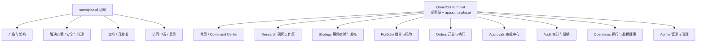
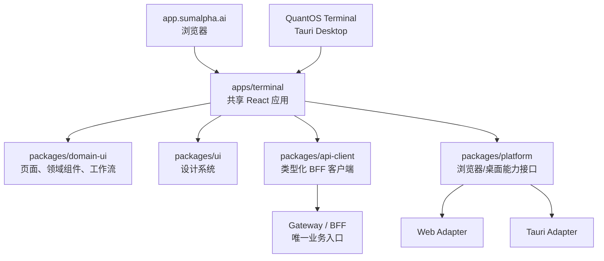
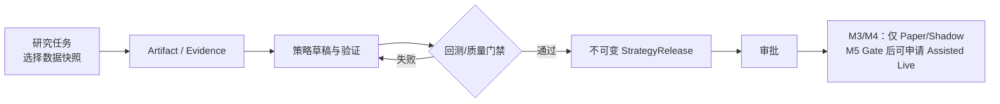
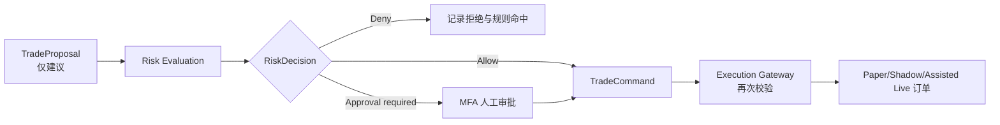

# SumAlpha QuantOS 网站与终端设计方案

> 版本：1.0  
> 日期：2026-07-22  
> 依据：[架构](./SumAlpha-QuantOS-Architecture.md)、[技术方案](./SumAlpha-QuantOS-Technical-Solution.md)、[开发计划](./SumAlpha-QuantOS-Development-Plan.md)  
> 目标：建立面向专业量化团队的品牌官网、QuantOS Terminal 桌面端及其网页版 `app.sumalpha.ai`；Agent 始终只能提出建议，不能绕过确定性风控与审批执行交易。

## 1. 产品边界与设计原则

SumAlpha QuantOS 包含三个产品表面。Terminal 桌面端与 `app.sumalpha.ai` 不是两套业务产品，而是同一 QuantOS Terminal 的两个受支持访问形态：共享领域能力、页面和权限模型，只在平台能力与交付封装上存在差异。

| 表面 | 用户 | 目的 | 交易权限 |
|---|---|---|---|
| SumAlpha 官网 | 潜在客户、合作方、开发者、候选用户 | 阐释产品、建立信任、申请访问、阅读文档 | 无 |
| QuantOS Terminal（桌面端） | 高频使用的研究员、量化开发、交易员、风控/审批人、管理员 | 多窗口、高信息密度、系统通知和受控的专业工作流 | 受角色、模式和审批严格限制 |
| `app.sumalpha.ai`（Terminal 网页版） | 同上；特别适合快速访问、协作、只读审计和受管设备 | 与桌面端相同的核心研究、治理与交易工作流 | 与桌面端完全一致；由服务端策略决定 |

### 1.1 共同设计原则

- **证据优先。** 信号、建议、订单与结论均显示数据快照、策略/模型版本、运行时间、证据与关联 ID。
- **安全先于便捷。** 页面永不展示交易密钥；实盘操作不可仅靠聊天或单次点击完成；危险动作需清晰确认与二次校验。
- **工作流而非聊天机器人。** 对话是研究入口，但核心界面是任务、Artifact、策略、风险、订单与审计的结构化工作区。
- **渐进式披露。** 默认展示关键状态和异常；可展开查看原始事件、规则命中、日志和完整证据链。
- **模式始终可见。** 全局明确标识 Research、Paper、Shadow、Assisted Live；颜色和文本不能被隐藏，避免环境混淆。
- **共享核心、平台增强。** Web 与桌面端共用业务页面、领域组件、状态管理、API 客户端、路由语义与权限判断；桌面端只通过受控适配层增加系统能力，禁止复制页面或业务逻辑。
- **专业桌面优先，网页完整可用。** 两个 Terminal 形态均支持宽屏、多列、键盘快捷键、实时数据和高信息密度；官网优先支持移动端阅读与快速访问申请。
- **可访问且可国际化。** 采用 WCAG 2.2 AA 为基线，支持中英文、时区、数值格式和可配置深浅主题。

### 1.2 当前项目范围、长期路线图与统一术语

| 项目 | 统一口径 |
|---|---|
| 当前项目范围 | 一期仅开放单主租户、单主工作区、单优先 venue 和有限订单意图；交付 Paper + Shadow Beta，并完成 Assisted Live 上线评审准备。 |
| 长期路线图 | 仅在 M5 安全、合规、运营 Gate 通过并得到单独业务批准后，评估小额逐笔人工审批的 Assisted Live；Guarded Live、多租户与更多 venue 是更后续的路线。 |
| `tenant` | 数据、权限、限额、密钥引用和审计的最高隔离边界；API/事件始终携带 `tenant_id`，一期不开放多租户产品能力。 |
| `workspace` | tenant 内组织研究、策略和成员的协作空间；一期只有一个主工作区，页面展示其名称但不提供切换器。 |
| `account` | 隶属 tenant 的模拟或 venue 账本账户，不等同登录用户。 |
| `actor` | 发起、审批或执行动作的用户、服务主体或受控自动化身份。 |
| `environment` / `mode` | environment 是部署环境；mode 是 Research、Paper、Shadow、Assisted Live、Guarded Live 等交易运行模式。 |

## 2. 信息架构



Terminal 的导航按「研究 → 策略 → 建议 → 风险/审批 → 订单 → 审计」的真实领域流程组织，避免用 Engine 或底层服务名称作为用户导航。

## 3. 技术栈

### 3.1 前端与客户端

| 层 | 选择 | 使用方式与理由 |
|---|---|---|
| 官网 | Next.js（React + TypeScript） | 服务端渲染、静态生成、SEO、内容页面和访问申请流程 |
| Terminal 共享应用 | React + TypeScript + Next.js App Router | `app.sumalpha.ai` 的网页应用，同时提供供桌面壳加载的同一应用包；BFF 驱动登录态、路由和页面骨架 |
| 富交互状态 | TanStack Query + Zustand | Query 管理服务端缓存和失效；Zustand 仅存 UI 状态、布局与临时草稿，领域真相不落浏览器 |
| 表格与虚拟化 | TanStack Table + TanStack Virtual | 订单、事件、策略、审计等高密度大列表与筛选 |
| 图表 | Apache ECharts + Lightweight Charts | ECharts 用于风险、P&L、归因和运营指标；Lightweight Charts 用于行情/K 线与订单标记 |
| 实时代码 | WebSocket / Server-Sent Events | 行情、订单、任务流式输出、告警；由 Gateway/BFF 聚合，不直连内部 Event Bus |
| 表单与校验 | React Hook Form + Zod | 强类型表单、草稿和前端输入校验；后端仍为权威校验方 |
| UI 基础 | Tailwind CSS + Radix UI + 自建 QuantOS Design System | 快速实现可访问基础组件，同时保持品牌、状态和交易控件的一致性 |
| 文案与国际化 | next-intl | 中英文界面、时区/货币/数字格式化和文案治理 |
| Terminal 桌面封装 | Tauri 2 + Rust | 在共享 Web 应用外提供窗口、多显示器布局、系统通知、深链和安全本地能力；不包含业务页面或交易密钥 |

不建议使用 Electron、浏览器持久化领域状态或让任何客户端直连交易所/Engine。桌面端可在 M2 启动壳层验证，但只能复用网页端已稳定的共享功能；桌面专属特性不得成为核心交易工作流的唯一入口。

### 3.2 后端接入与接口形态

| 接口层 | 技术与职责 | 约束 |
|---|---|---|
| API Gateway / BFF | Rust（axum）服务；认证、会话、聚合查询、命令入口、WebSocket/SSE 推送 | 浏览器只访问 Gateway；不得暴露数据库、NATS、gRPC Engine 或 venue API |
| 外部 API | REST/JSON（查询、资源、命令）+ OpenAPI；实时流使用 WebSocket/SSE | 命令使用 `Idempotency-Key`、版本和 correlation ID；响应返回可追溯引用 |
| 内部协议 | Protobuf/gRPC | 与 Engine Manager、Python Engine 和内部服务保持架构文档定义的稳定边界 |
| 事件适配 | Gateway 订阅经授权的领域事件，投影为用户级实时频道 | 事件需要 tenant、RBAC、数据脱敏和速率限制；前端不可订阅原始总线 |

推荐在 `proto/` 保持领域事实契约，在 `apps/terminal` 由 OpenAPI/Protobuf 代码生成类型化客户端。BFF 可增加面向页面的 Query Model，但不得重新定义订单、风险或策略的领域语义。

### 3.3 工程、质量与安全

| 范畴 | 实施基线 |
|---|---|
| Monorepo | `apps/website`、`apps/terminal`（共享 React 应用）、`apps/terminal-desktop`（Tauri 壳）、`packages/ui`、`packages/domain-ui`、`packages/api-client`、`packages/platform`、`packages/config` 与既有 Rust/Python 目录并列 |
| 测试 | Vitest 单元测试、React Testing Library 组件测试、Playwright 端到端与关键视觉回归；接口契约测试由 BFF 集成环境完成 |
| 可观测性 | 前端 Sentry/OTel 捕获错误与性能；所有请求携带/显示 correlation ID；敏感字段脱敏 |
| 身份 | OIDC/OAuth 2.1 + PKCE；MFA（管理员、审批人和 Assisted Live 强制）；短期 token、服务端会话与设备管理 |
| 授权 | 后端 RBAC + capability/策略检查为权威；前端仅据此隐藏或禁用 UI，不作为安全边界 |
| 发布 | 官网静态/边缘发布；`app.sumalpha.ai` 以受控 Web 部署和 feature flag 灰度；桌面端从同一 release manifest 打包、签名和自动更新；前端制品使用 CSP、SRI 与依赖扫描 |

### 3.4 同一 Terminal 的 Web / Desktop 复用设计

以共享应用而非“网页版 + 桌面端两套前端”实施，目标是让功能、权限、风控提示和审计语义在两个形态中保持一致。



| 层 | 必须共享 | 允许差异 |
|---|---|---|
| 领域工作流 | Research、Strategy、Risk、Approvals、Orders、Audit 的页面、状态机展示、输入校验、权限解释和错误处理 | 无 |
| 组件与设计 | 设计 token、表格、图表、状态标签、确认对话框、可访问性规则 | 仅因窗口尺寸做响应式布局 |
| 数据与状态 | 类型化 BFF client、Query key、缓存失效、URL 路由语义、feature flag | 桌面端可保存本地布局偏好；不得保存领域真相或密钥 |
| 平台能力 | 通过 `PlatformCapabilities` 接口调用 | Web：浏览器通知/下载；桌面：系统通知、多窗口、深链、受控文件选择 |
| 发布与更新 | 同一版本号、API 兼容窗口、验收用例和 release manifest | Web 灰度发布；桌面端签名安装包与自动更新通道 |

实施规则：

1. 所有业务功能先在 `apps/terminal` 的共享代码中实现并通过浏览器端到端测试；桌面端只封装该应用。
2. 不允许以 `isDesktop` 分叉 Research、风险、审批、订单或审计业务逻辑；需要平台差异时只能在 `packages/platform` 新增受测适配器。
3. 任何 Terminal 功能的验收用例、权限矩阵和 BFF 契约必须同时覆盖 Web 与桌面端；桌面附加能力另有补充用例。
4. 服务端是状态与权限的唯一权威。两个客户端共用同一登录、RBAC、命令幂等、审计和 feature flag 决策。
5. 桌面端封装同一 release manifest 中构建并签名的 Terminal 制品，经签名更新通道更新；离线仅可查看已加密缓存的非敏感只读资料和本地布局，不得创建或签发交易命令。Web 入口以 CSP、受控部署和 feature flag 灰度发布。

## 4. 官网设计

### 4.1 站点导航与页面

| 页面 | 主要内容 | 主行动 | 首期 |
|---|---|---|---|
| 首页 | 品牌主张、核心闭环、产品预览、目标用户、风险边界 | 申请访问、查看 Terminal | 是 |
| 产品 | Research、Strategy Governance、Risk & Execution、Audit 四项能力 | 了解工作流 | 是 |
| 架构与安全 | Agent/风控边界、事件审计、权限、数据与供应链治理 | 阅读架构、联系团队 | 是 |
| 使用场景 | 研究团队、量化开发、交易与风控协作 | 申请演示 | 是 |
| 文档中心 | 架构、SDK、API、部署、Runbook、变更日志 | 阅读文档 | 是 |
| 开发者 | Engine/Plugin 接入、协议概念、示例与版本支持策略 | 获取 Sandbox | M2 后 |
| 状态页 | 服务状态、历史事件与维护通知 | 订阅通知 | M4 后 |
| 访问申请 | 团队信息、用途、市场、预期模式、同意条款 | 提交申请 | 是 |
| 登录 | SSO/OIDC、MFA、支持入口 | 进入 Terminal | 是 |

### 4.2 首页内容结构

1. **首屏：** “AI-native operating system for quantitative research and trading”，配合「提议—审批—执行—留证」的可视化链路；CTA 为“申请访问”和“查看架构”。
2. **信任层：** 明确承诺“Agent 不直接下单”“默认 Paper/Shadow”“全链路审计”，避免任何收益宣称。
3. **能力层：** 研究、策略治理、风险/审批、订单/审计四个卡片，均链接到具体产品页。
4. **工作流层：** 展示从 DataSnapshot 到 StrategyRelease、TradeProposal、RiskDecision、TradeCommand 的版本化对象关系。
5. **面向团队：** 研究员、量化开发、交易员、风控负责人如何在同一证据链上协作。
6. **开发者与治理：** Engine Protocol、插件边界、数据许可、第三方治理与文档入口。
7. **访问申请：** 清晰说明适用对象、当前支持范围与非目标。

### 4.3 官网视觉语言

- 品牌调性为“严谨的机构级软件”，避免投机币圈的荧光、价格闪烁和收益海报。
- 默认深色专业主题：炭黑/墨蓝背景、低饱和蓝绿色作为主操作色；风险与运行模式使用语义色并始终附文字。
- 展示真实的领域对象、证据链、审计和审批，不使用无法核验的“AI 自动赚钱”表达。
- 支持浅色主题；正文、表格、图表和状态标识需满足 WCAG 对比度要求。

## 5. QuantOS Terminal 页面与功能

本节页面和领域功能由桌面端与 `app.sumalpha.ai` 共同提供。除下文明确列出的平台增强能力外，两个入口必须保持功能对等、相同的风险边界与同一后端审计语义。

### 5.1 全局框架

```text
┌─────────────────────────────────────────────────────────────────────────────┐
│ Workspace: Primary  Environment: PAPER ▾  Global search ⌘K  Alerts  Help  Profile │
├──────────────┬──────────────────────────────────────────────────────────────┤
│ Command      │ Context bar: account · data freshness · risk posture · time  │
│ Research     ├──────────────────────────────────────────────────────────────┤
│ Strategy     │                                                              │
│ Portfolio    │                    当前工作区内容                              │
│ Orders       │                                                              │
│ Approvals    │                                                              │
│ Audit        │                                                              │
│ Operations   │                                                              │
│ Admin*       │                                                              │
└──────────────┴──────────────────────────────────────────────────────────────┘
```

全局顶部必须持久显示：当前主工作区、账户、运行模式、数据新鲜度、风险状态和连接状态。一期不提供 workspace 切换；`PAPER`、`SHADOW`、`ASSISTED LIVE` 使用不同语义色和文字；切换到更高风险模式须重新认证并记录审计。

| 能力 | `app.sumalpha.ai` | QuantOS Terminal 桌面端 | 设计约束 |
|---|---|---|---|
| 核心研究、策略、风险、审批、订单、审计 | 完整支持 | 完整支持 | 功能、权限和验收用例必须一致 |
| 实时推送与通知 | WebSocket/SSE、浏览器通知（经授权） | 同一实时流、原生系统通知 | 消息内容与权限过滤一致 |
| 窗口与布局 | 单浏览器窗口、响应式多栏布局 | 多窗口、多显示器、可恢复布局 | 布局仅为用户偏好，不改变领域状态 |
| 文件与导出 | 受控浏览器下载、短时链接 | 受控原生保存对话框、可选系统文件关联 | 均由 BFF 生成、授权和审计导出 |
| 深链与会话恢复 | URL 路由与服务端会话 | 同一 URL 语义 + 系统深链 | 任一链接可跨入口打开；受限资源仍需重新授权 |

### 5.2 页面清单

| 页面 | 主要用户 | 功能 | 关键组件 / 数据 |
|---|---|---|---|
| Command Center | 全部角色 | 当日摘要、异常、待处理审批、任务、风险/订单状态、快捷入口 | 风险状态、数据新鲜度、任务队列、P&L、告警、事件流 |
| Research Workspace | 研究员、量化开发 | 发起/取消研究、选择数据快照和 Engine、浏览流式输出与 Artifact、保存研究包 | 对话/任务双栏、输入上下文、证据面板、Artifact 版本、成本/时长 |
| Research Detail | 研究员、审计员 | 查看假设、实验、引用数据、模型/提示词、日志与可重放入口 | 输入 hash、Engine 版本、evidence refs、correlation ID |
| Strategy Lab | 量化开发 | 策略草稿、源码/参数、静态检查、回测、对比实验、发布候选 | 编辑器、实验队列、回测曲线、交易成本、数据质量告警 |
| Strategy Release | 量化开发、审批人 | 查看不可变发布物、提交审批、控制按阶段开放的部署目标、回滚到旧发布物 | 源码/构建产物 hash、数据快照、回测、审批记录、目标模式 |
| Portfolio & Risk | 交易员、风控 | 组合、仓位、敞口、P&L、限额、规则命中、压力/集中度视图 | 实时/快照切换、风险预算、数据时间、风险事件 |
| Proposals | 交易员、风控 | 浏览 TradeProposal、证据、反方观点、失效时间；请求风险评估 | 不可执行建议卡、理由、Signal、证据、状态时间线 |
| Approvals | 审批人、风控 | 审批/拒绝、查看完整风险影响、填写理由、双人审批 | RiskDecision、限额变化、签名、MFA、审批审计 |
| Orders & Execution | 交易员、运维 | Paper/Shadow 订单、状态机、撤单请求、成交和执行异常 | Order/Fill 时间线、幂等键、venue 状态、关联策略/Proposal |
| Audit Explorer | 审计员、管理员 | 以订单、策略、任务或 correlation ID 还原全链路证据 | 事件图谱、导出、不可变 Artifact、访问审计 |
| Operations | SRE、管理员 | Engine 健康、队列、数据质量、事件延迟、告警、Runbook | 服务拓扑、延迟、错误率、死信队列、事件确认 |
| Admin | 管理员 | 成员、角色、工作区、数据/Engine/插件批准、限额、feature flag | RBAC、capability、审计、审批策略、配置版本 |

`TradeProposal` 页面必须明确显示“不可执行建议”。执行入口仅存在于具有对应权限的 Approvals/Orders 工作流，且只显示已通过 RiskDecision、未过期、幂等且满足当前模式要求的 TradeCommand。

### 5.3 关键工作流

#### A. 研究到策略发布



界面要求：每一步都可返回上游对象；实验失败也保留结果与原因；发布操作显示将被冻结的版本清单；未审批发布物不得出现于执行选择器。M3/M4 的部署目标选择器只显示 Paper/Shadow；M5 Gate 通过且后端授予权限后才显示 Assisted Live，并展示额外审批与额度提示。

#### B. 建议到订单



界面要求：拒绝和审批均显示命中规则、限额影响及可引用理由；命令签发后显示有效期与状态；过期、数据陈旧、风险状态变化或 kill switch 触发时，立即禁用提交并显示原因。

#### C. 事件与审计回溯

用户可从任一订单、策略、研究任务或告警点击“查看证据链”，进入 Audit Explorer。时间线应依序显示：主体、输入、数据快照、Engine 版本、输出 Artifact、风险规则、审批、命令、订单回报和后续对账；每项均可查看关联 ID、时间戳、哈希和保留策略。

## 6. 角色与权限体验

| 角色 | 默认可见 | 可执行操作 | 明确禁止 |
|---|---|---|---|
| 研究员 | Research、Artifact、已授权市场数据 | 发起研究、创建策略草稿 | 发布策略、审批、下单、读取密钥 |
| 量化开发 | 研究、策略、受限组合视图 | 回测、提交发布候选 | 自己审批自己发布物、下单、读取密钥 |
| 交易员 | Command、组合、Proposal、Orders | 请求风险评估、Paper 操作、提交已批准命令 | 修改风险规则、审批自己发起的命令 |
| 风控/审批人 | Risk、Proposals、Approvals、Audit | 审批/拒绝、调整已授权限额、触发 kill switch | 修改策略源码、读取交易密钥 |
| 运维/SRE | Operations、Audit、状态页 | 处理告警、受控重启、执行 Runbook | 交易决策、常规下单 |
| 管理员 | Admin、Audit | 成员/角色、主工作区受控配置与插件批准 | 绕过审批/风控、查看明文密钥 |

前端应采用“可见但不可用 + 原因说明”处理多数受权限限制的领域功能，以帮助协作；涉及密钥、受限审计和高风险操作时则完全不返回内容。所有高风险操作都需要后端二次授权，UI 状态不可被视为安全控制。

## 7. 设计系统与交互规范

### 7.1 组件体系

| 类别 | 必备组件 |
|---|---|
| 导航 | App shell、侧栏、主工作区标识、面包屑、全局命令面板；多工作区能力启用后再引入选择器 |
| 数据展示 | 高密度表格、时间线、状态标签、指标卡、可筛选图表、空状态与骨架屏 |
| 领域组件 | 数据快照标记、Artifact 卡、策略发布卡、风险规则命中列表、订单状态机、审批签名面板、审计证据链 |
| 输入 | 策略/研究表单、参数编辑器、受控代码编辑器、日期与数据范围、可访问的确认对话框 |
| 风险控制 | 环境横幅、危险操作确认、MFA challenge、双人审批、有效期倒计时、kill switch 控件 |
| 反馈 | 流式任务进度、Toast、告警抽屉、错误恢复提示、导出任务状态 |

### 7.2 状态规范

- 统一枚举而非自由文本：任务 `queued/running/succeeded/failed/cancelled`；订单 `submitted/accepted/partially_filled/filled/cancelled/rejected/expired`；风险 `allow/deny/approval_required`。
- 每个状态必须具备文本、图标、语义色和屏幕阅读器标签，不能仅用颜色传达。
- 高风险操作采用明确动词：“提交审批”“签发命令”“提交 Paper 订单”“触发 Kill Switch”；避免“确认”“继续”等模糊文案。
- 金融数值必须显示币种、精度、时区和数据时间；P&L、收益率和估算值须标注计算口径。

## 8. 安全与合规的前端要求

- 浏览器不得存储 venue API key、长期 token、原始交易凭证或完整敏感审计事件；不将敏感信息写入 URL、前端日志、错误监控或分析工具。
- 使用 CSP、CSRF 防护、HttpOnly/Secure/SameSite cookie、严格 CORS、内容消毒和依赖供应链扫描。
- 任何会产生 `TradeCommand` 或审批签名的操作需重新认证/MFA，并显示账户、模式、限额、标的、数量、有效期与影响摘要。
- 高风险模式切换需显式确认、后端审计和短期会话；进入 Assisted Live 时应显示不可关闭的模式提示。
- 下载审计、数据或报告时应用后端细粒度授权、水印/导出审计、过期链接和数据分类策略。

## 9. 分阶段页面交付

| 阶段 | 对应开发计划 | `app.sumalpha.ai` + Terminal 共享交付 | 桌面端增量交付 | 官网交付 | 验收重点 |
|---|---|---|---|---|---|
| M0–M1 | W1–W6 | 登录壳、环境横幅、App shell、基础错误/状态页 | Tauri 壳 PoC、深链/通知接口，不复制页面 | 首页、产品、架构与安全、访问申请、登录 | 设计系统、认证、模式标识、无敏感泄露 |
| M2 | W7–W12 | Research、Research Detail、Artifact/证据、任务流 | 打包共享应用，系统通知和布局偏好 | 文档中心、开发者预告 | 研究重放、Engine 版本、证据可见；Web/Desktop 同用例通过 |
| M3 | W13–W16 | Strategy Lab、Release、回测与审批申请 | 多窗口查看与受控导出 | 策略治理能力页 | 不可变发布物、未审批不可部署 |
| M4 | W17–W24 | Command、Portfolio/Risk、Proposals、Orders、Approvals、Audit、Operations | 多显示器布局恢复、原生告警 | 状态页、Paper/Shadow 使用说明 | 风控状态、订单链路、审计重建、演练告警 |
| M5 | W25–W32 | Assisted Live 受控入口、MFA、双人审批、运营与值班视图 | 签名更新、设备管理与桌面专属恢复测试 | 合规/状态更新（经审核后发布） | 高风险流程、testnet、权限与审计 |

## 10. 页面验收标准

| 页面/能力 | 关键验收标准 |
|---|---|
| 官网 | Lighthouse 性能、可访问性、SEO、最佳实践均达到团队门槛；没有收益承诺或错误的交易能力表述；访问申请有防滥用与隐私告知 |
| 登录与工作区 | OIDC + MFA 正常；越权路由不返回受限数据；工作区、账户和模式切换均写审计 |
| Research | 可选择 DataSnapshot；任务进度支持流式/取消；所有结果显示版本、输入 hash 和证据；失败可定位且不丢失 Artifact |
| Strategy | 回测必须选择/产生数据快照；发布页显示不可变内容；未过验证或审批的策略不能部署 |
| Risk/Approvals | 显示规则命中、限额影响、有效期和审批理由；双人审批/MFA 场景不能被前端绕过 |
| Orders | 仅展示后端授权数据；每笔订单可关联 Proposal、RiskDecision、TradeCommand 与 Fill；撤单操作可审计 |
| Audit | 从抽样订单/策略/研究任务可在 5 分钟内还原完整证据链；导出记录主体、范围和时间 |
| Operations | 实时显示健康、延迟、数据新鲜度和告警；告警可链接 Runbook，且无交易密钥/敏感载荷泄露 |

## 11. 关键非目标与后续方向

首期不建设移动交易 App、社交跟单、面向大众的推荐流、无审批自动实盘、多 venue 智能路由、复杂期权界面或在浏览器内运行 Python/量化回测。网页与桌面端是同一 Terminal 的首期交付，桌面端仅增加已规划的平台能力；M5 Gate 通过且获得单独批准后，才可评估 Assisted Live。策略市场、更多 venue、更多桌面生产力能力和经治理的 Guarded Live 均是长期方向，每一项需单独进行风险、数据和合规评审。
